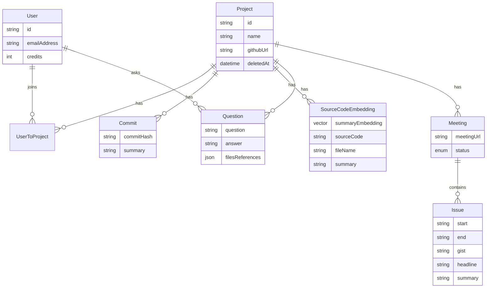
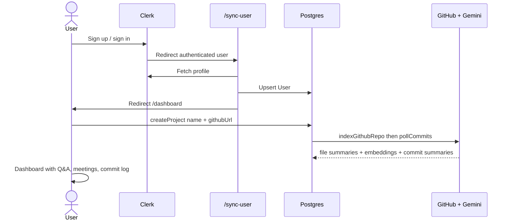
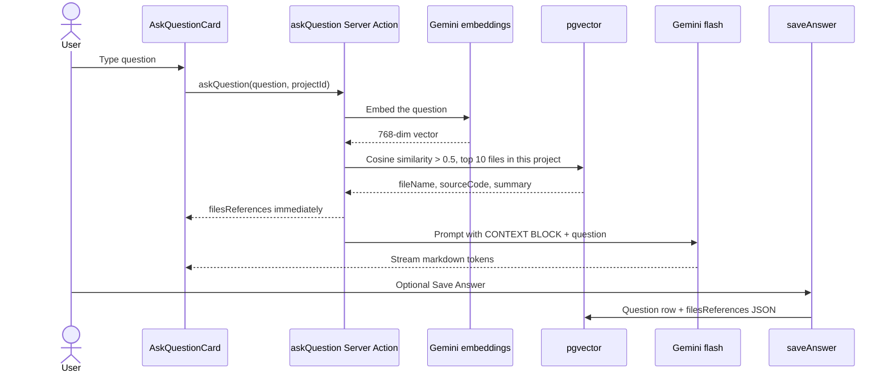
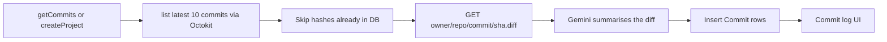
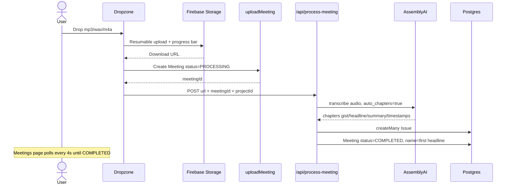
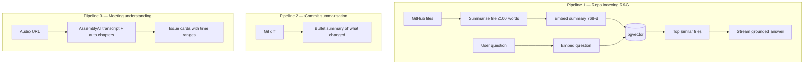

# BranchMind — Interview Presentation Notes

A student-level walkthrough of the project: what it is, why it exists, how it is built, and how to explain it in an interview.

---

## 1. One-line pitch

**BranchMind is a full-stack AI product that turns a GitHub repository into a searchable knowledge base, and turns team meetings into structured action items.**

In simpler words: you paste a GitHub URL, the app reads the code, and then you can ask questions like “where is login handled?” and get an answer with the actual files. You can also upload a meeting recording and get AI-generated chapter summaries.

This is not a chatbot wrapped around a UI. It is a real product with auth, a database, file storage, background-ish jobs, vector search, and three separate AI pipelines.

---

## 2. The problem we are solving

Joining a codebase is slow. Three things make it worse:

1. **Commit messages are often useless.** “fix stuff”, “wip”, “update”. A teammate cannot tell what actually changed without opening the diff.
2. **Codebases are too large to read linearly.** A new intern cannot grep their way to understanding “how does auth work?” They need a guide who has already read the repo.
3. **Meetings produce no durable knowledge.** A 40-minute standup recording sits in Drive. Nobody rewatches it. Action items disappear.

Existing tools each solve one slice:

| Tool | What it does | What it misses |
| --- | --- | --- |
| GitHub | Hosts code and diffs | No natural-language Q&A over the repo |
| ChatGPT / Gemini chat | Answers questions | Has no *your* repo unless you paste files |
| Otter / Fireflies | Transcribes meetings | Not tied to the project the meeting was about |
| Sourcegraph / Copilot | Code search / IDE help | Not a team product with meetings + commit history in one place |

BranchMind puts **repo understanding + commit memory + meeting memory** in one project workspace that a team can share.

---

## 3. Who it is for

- Interns / new hires onboarding onto a repo
- Small teams that want a shared “ask the codebase” history
- Anyone who wants AI summaries of recent commits without reading every diff
- Teams that record standups / planning calls and want chapters + issues extracted automatically

---

## 4. What the product actually does (features)

A signed-in user can:

1. **Create a project** by giving it a name and a GitHub URL (optional GitHub token for private repos).
2. **See AI-summarized commits** for that repo (latest 10, then new ones as they appear).
3. **Ask a question** about the codebase. The answer streams in markdown. Matching source files are shown as tabs with syntax highlighting. The Q&A can be saved.
4. **Browse saved questions** on the Q&A page (team knowledge base).
5. **Upload a meeting audio file** (mp3 / wav / m4a, up to 50 MB). The app transcribes it and splits it into chapter-style “issues”.
6. **Invite teammates** with a join link. They land in the same project.
7. **Archive a project** (soft delete — it disappears from the list but is not hard-deleted).

The sidebar also has a Billing item. The `User` model has a `credits` field defaulting to 150. Billing UI is not fully built yet — that is the SaaS hook for later (charge credits for indexing / questions / meeting minutes).

---

## 5. Tech stack

This started from **Create T3 App** (Next.js + TypeScript + tRPC + Prisma + Tailwind) and then grew into an AI product.

```text
┌─────────────────────────────────────────────────────────────┐
│                         CLIENT                              │
│  Next.js 15 App Router · React 19 · Tailwind · shadcn/ui    │
│  TanStack Query · tRPC React · Clerk components             │
└────────────────────────────┬────────────────────────────────┘
                             │ tRPC (typed RPC) + Server Actions
┌────────────────────────────▼────────────────────────────────┐
│                         SERVER                              │
│  Next.js Route Handlers · tRPC routers · Clerk middleware   │
│  Prisma ORM · Zod validation · Vercel AI SDK streaming      │
└──────┬──────────┬──────────┬──────────┬──────────┬──────────┘
       │          │          │          │          │
       ▼          ▼          ▼          ▼          ▼
   PostgreSQL   Gemini    GitHub     AssemblyAI   Firebase
   + pgvector   (LLM +    (Octokit   (speech →    Storage
                embed)    + LangChain chapters)   (audio files)
                          loader)
```

### Stack table (say this in interviews)

| Layer | Choice | Role |
| --- | --- | --- |
| Framework | Next.js 15 (App Router), React 19 | UI + API in one app. Server Components, Server Actions, Route Handlers. |
| Language | TypeScript | End-to-end types from DB → API → UI. |
| API | tRPC + SuperJSON | Typed procedures instead of hand-written REST. Dates/JSON survive the wire. |
| Client data | TanStack Query | Caching, refetch, polling meeting status every 4 seconds. |
| Auth | Clerk | Sign-in / sign-up, session, `UserButton`, middleware protection. |
| Database | PostgreSQL + Prisma | Relational data (users, projects, commits, questions, meetings). |
| Vectors | `pgvector` (`vector(768)`) | Semantic search in the same database. No extra vector DB. |
| LLM | Google Gemini (`gemini-2.5-flash`, `gemini-1.5-flash`) | Commit summaries, file summaries, Q&A generation. |
| Embeddings | Gemini `text-embedding-004` | 768-dim vectors for RAG. |
| Repo ingest | LangChain `GithubRepoLoader` | Recursively load files from GitHub. |
| GitHub API | Octokit | List commits. Axios for `.diff` files. |
| Speech | AssemblyAI (`auto_chapters: true`) | Transcript + chapter headlines / gists / summaries. |
| File storage | Firebase Storage | Meeting audio upload with progress %. |
| Validation | Zod | Input schemas on tRPC and the meeting API. |
| UI | Tailwind + shadcn/Radix | Sidebar, dialogs, cards, dropzone, markdown, syntax highlighter. |
| Env safety | `@t3-oss/env-nextjs` | Fail at boot if `DATABASE_URL` is missing. |

External services we depend on:

- **Clerk** — identity
- **Google AI** — generation + embeddings
- **GitHub** — source of truth for code and commits
- **AssemblyAI** — speech understanding
- **Firebase** — blob storage for audio
- **PostgreSQL** — system of record + vector index

That combination is why this can be marketed as a **full-stack AI product**: frontend, backend, auth, storage, third-party AI APIs, and a retrieval system, not just a prompt demo.

---

## 6. High-level architecture

```mermaid
flowchart TB
    subgraph User["User"]
        Browser[Browser]
    end

    subgraph App["BranchMind Next.js app"]
        MW[Clerk middleware]
        UI[Protected pages]
        tRPC[tRPC projectRouter]
        SA[Server Action askQuestion]
        API["POST /api/process-meeting"]
        Sync[/sync-user]
        Join[/join/:projectId]
    end

    subgraph Data["Data plane"]
        PG[(PostgreSQL + pgvector)]
        FB[Firebase Storage]
    end

    subgraph AI["AI / external APIs"]
        Gemini[Gemini LLM + embeddings]
        GH[GitHub API]
        AA[AssemblyAI]
    end

    Browser --> MW --> UI
    UI --> tRPC
    UI --> SA
    UI --> API
    UI --> Sync
    UI --> Join

    tRPC --> PG
    tRPC --> GH
    tRPC --> Gemini
    SA --> Gemini
    SA --> PG
    API --> AA
    API --> PG
    UI --> FB
```

Everything that is not `/sign-in` or `/sign-up` is behind Clerk. After login, `/sync-user` upserts the Clerk user into our `User` table, then redirects to `/dashboard`.

---

## 7. Data model (why it looks like this)



Design notes you can defend:

- **`UserToProject` is a join table** with `@@unique([userId, projectId])`. Many users can share one project. That is how invite/join works without copying the repo index.
- **`deletedAt` on Project** is soft delete. Archive hides the project (`deletedAt: null` filter) without wiping embeddings, commits, or meetings. Safer, reversible.
- **`SourceCodeEmbedding.summaryEmbedding` is `Unsupported("vector(768)")`**. Prisma does not have a first-class vector type, so we store the vector with raw SQL after insert. The rest of the row is still Prisma-managed.
- **We embed the *summary*, not the raw file.** Search is “which file is *about* this?” then we still return the source code for the LLM and the UI.
- **`Question.filesReferences` is JSON.** We snapshot the retrieved files at answer time so a saved Q&A stays reproducible even if the index later changes.
- **`Meeting.status` is `PROCESSING | COMPLETED`.** The UI polls until chapters exist.
- **`User.credits`** is the billing seed. Default 150. Not wired to deductions yet — mention it as the monetization path.

`User.id` is the Clerk `userId`. We do not invent a second identity.

---

## 8. User flows (start to finish)

### 8.1 Sign up → first project



On create:

1. Insert `Project` and a `UserToProject` row for the creator.
2. **Index the repo** (load files → summarize each → embed summary → store).
3. **Poll commits** (latest 10 hashes → fetch diffs → summarize → store).

Both happen in the same mutation, so when create returns, the project is already useful. Tradeoff: create can be slow on a large repo (see design choices).

### 8.2 Ask the codebase (RAG)

This is the core AI feature.



Retrieval SQL (cosine similarity via pgvector):

```sql
SELECT "fileName", "sourceCode", "summary",
  1 - ("summaryEmbedding" <=> $query::vector) AS similarity
FROM "SourceCodeEmbedding"
WHERE 1 - ("summaryEmbedding" <=> $query::vector) > 0.5
  AND "projectId" = $projectId
ORDER BY similarity DESC
LIMIT 10
```

`<=>` is cosine distance. `1 - distance` is similarity. Threshold `0.5` drops weak matches. Limit `10` caps prompt size.

The prompt is **grounded**: “If the context does not provide the answer, say you don’t know. Do not invent anything not in the context.” That is how we reduce hallucination for an interviewer who will ask “how do you stop the model from making up APIs?”

Answers stream with Vercel AI SDK (`streamText` + `createStreamableValue` / `readStreamableValue`) so the dialog fills in token by token instead of waiting for the full completion.

### 8.3 Commit intelligence



`getCommits` also **kicks off a background poll** (`pollCommits(...).then().catch(...)`) and immediately returns existing rows. Opening the dashboard refreshes summaries without a cron job. New commits appear on later visits.

`Promise.allSettled` is used so one failed diff/summary does not drop the whole batch.

### 8.4 Meeting intelligence



`maxDuration = 300` on that route exists because transcription is slow. On Vercel, serverless functions otherwise die around 10 seconds. This is a real production constraint, good to mention.

### 8.5 Team invite

Invite copies `{origin}/join/{projectId}`. The join page:

1. Ensures the Clerk user exists in our `User` table.
2. Inserts `UserToProject` (unique constraint → “already in project” is a no-op).
3. Redirects to dashboard.

The new member sees the **same embeddings, commits, questions, meetings**. We do not re-index. That is the point of modeling Project as a shared resource.

---

## 9. The three AI pipelines (this is the “full-stack AI product” story)

Interviewers hear “we used AI” and assume one ChatGPT call. BranchMind has three pipelines with different models and jobs.



| Pipeline | Input | Model / API | Output stored |
| --- | --- | --- | --- |
| Indexing | Source file (first 10k chars) | Gemini 2.5 Flash + `text-embedding-004` | `summary`, `sourceCode`, `summaryEmbedding` |
| Q&A | Question + retrieved files | Embed question, then Gemini 1.5 Flash stream | Optional `Question` row |
| Commits | `.diff` text | Gemini 2.5 Flash | `Commit.summary` |
| Meetings | Audio URL | AssemblyAI + auto chapters | `Issue` rows |

Why different tools:

- **Gemini for text.** Cheap, fast, good at code and diffs. Embeddings are the same vendor so one API key.
- **AssemblyAI for audio.** LLMs are not a speech-to-text engine. Chapter detection (`gist`, `headline`, `summary`, start/end) is a product feature of the transcription API. Using the right specialist model is a better design than “dump a transcript into Gemini and hope”.

Retry policy on Gemini calls: 3 attempts, **exponential backoff** (1s, 2s, 4s) on rate-limit errors, plus a 2s delay before each call to stay under free-tier limits. That is production thinking, not a tutorial `await model.generateContent`.

---

## 10. System design choices — and why they were the right call for this project

This section is the one interviewers care about. For each choice: **what we picked, what we did not pick, why.**

### 10.1 One Next.js app instead of split frontend/backend

**Picked:** Monolith on Next.js App Router.

**Not picked:** React SPA + Express, or Python FastAPI + separate UI.

**Why:** One deploy, one TypeScript codebase, Server Actions for streaming RAG, Route Handlers for long meeting jobs, React Query on the client. For a student product and for Vercel, this is faster to ship and easier to demo. A split stack would add CORS, duplicate types, and two deploys without helping the core RAG problem.

### 10.2 tRPC instead of REST / GraphQL

**Picked:** tRPC procedures (`createProject`, `getCommits`, `saveAnswer`, …) with Zod inputs.

**Why:** The UI calls `api.project.getMeetings.useQuery` and TypeScript already knows the shape, including `issues`. No OpenAPI file, no codegen step. Auth is a `protectedProcedure` middleware — if Clerk session is missing, every mutation fails the same way.

REST would have been fine, but we would hand-write URLs and response types. GraphQL is heavier than this app needs.

Meeting processing is **not** tRPC. It is a Route Handler because we need `maxDuration = 300` and a fire-and-forget POST from the client after upload. That is a good example of “use the right interface for the job”.

### 10.3 Clerk instead of NextAuth / homemade JWT

Create T3 App ships with NextAuth in the README, but this app uses **Clerk**.

**Why:** Hosted sign-in UI, social logins, session in middleware, `UserButton`. We only sync profile fields into Postgres. Identity is not a feature we wanted to build.

Tradeoff: vendor lock-in and a third-party dependency on the critical path. For a product demo and a small team, that is the correct trade.

### 10.4 PostgreSQL + pgvector instead of Pinecone / Chroma / Weaviate

This is the most important data-plane choice.

**Picked:** Same Postgres that holds users and projects, with the `vector` extension. Embedding written with `$executeRaw`, search with `$queryRaw`.

**Why it is optimal here:**

- One database to backup, migrate, and reason about.
- `projectId` filter is a normal SQL `WHERE`. Metadata filtering in a separate vector DB is extra glue.
- Transactions: we insert the row, then set the vector. Relational integrity stays with Prisma.
- Cost and ops: no second cloud bill, no another dashboard.
- 768 dimensions match `text-embedding-004`. We are not pretending to need a billion-scale ANN service.

**When we would switch:** millions of files, p95 search in the low milliseconds, or multi-tenant isolation that Postgres cannot give us cheaply. Then Pinecone / pgvector + IVFFlat/HNSW tuning / a dedicated search service. For repo-sized indexes (hundreds to a few thousand files per project), exact / Postgres cosine search is enough.

### 10.5 Embed summaries, not raw source

Naive RAG: chunk every file into 500-token pieces, embed all chunks.

**We did:** For each file, ask Gemini for a **≤100 word purpose summary**, embed *that*, store full `sourceCode` next to it.

**Why:**

- A question like “where is Stripe billed?” matches a summary “handles checkout and Stripe webhooks” better than a random 40-line chunk of imports.
- Fewer embedding calls (one per file, not N chunks).
- Prompt context still includes **real code**, because we retrieve `sourceCode` after the similarity search.
- Summaries are truncated input (10k chars) so huge generated files do not blow the context window during indexing.

**Tradeoff:** Fine-grained “what does line 412 do?” may miss if the summary is too coarse. Chunking + hybrid search (keyword + vector) would be the next upgrade. For onboarding-style questions, file-level retrieval is the right granularity.

### 10.6 Grounded RAG, not “chat with the whole internet”

The Q&A prompt wraps retrieved files in `START CONTEXT BLOCK` / `END OF CONTEXT BLOCK` and forbids answering from outside that block.

**Why:** A code assistant that invents a function that does not exist is worse than “I don’t know”. Showing **code references** in the UI makes the answer auditable. That is how you sell trust, not just fluency.

Similarity threshold `0.5` is a precision knob. If nothing is similar, context is empty and the model should refuse.

### 10.7 Streaming answers (AI SDK RSC)

**Picked:** `streamText` + streamable values from a Server Action.

**Why:** RAG + generation can take several seconds. A spinner for the whole answer feels broken. Streaming is the expected UX for AI products (ChatGPT, Copilot). Server Actions keep the Gemini key on the server.

### 10.8 LangChain only as a loader, not as an agent framework

We use `@langchain/community` **GithubRepoLoader** (recursive, ignore lockfiles, concurrency 5, optional token).

We do **not** use LangChain agents, chains, or their vector stores.

**Why:** Loaders are a solved, boring problem (ignore `package-lock.json`, walk the tree). Orchestration for RAG is ~40 lines of our own SQL + prompt. Owning that loop is easier to explain and debug in an interview than a LangChain abstraction.

### 10.9 Lazy commit polling instead of webhooks / cron

**Picked:** When someone loads commits, also poll GitHub for new hashes.

**Why:** Zero infra (no GitHub App webhook endpoint, no cron). Good enough for a dashboard that people open during work.

**Tradeoff:** No live updates if nobody opens the app. Duplicate work if many users refresh. Next step for a real SaaS: GitHub App + webhook `push` events + a queue.

We only keep **10 latest** commits per poll. That bounds Gemini cost.

### 10.10 Firebase Storage for audio, not Postgres or the Next.js server

Audio files are tens of megabytes. Putting them in Postgres is wrong. Uploading through the Next.js server would hit body-size and timeout limits.

Client uploads to Firebase with `uploadBytesResumable` and a circular progress bar. The app stores the **download URL**. AssemblyAI fetches that URL itself. Our server never pipes the bytes.

### 10.11 AssemblyAI auto-chapters vs “LLM, please summarise this transcript”

Chapters give `start`, `end`, `gist`, `headline`, `summary` — which map 1:1 to the `Issue` model and the meeting UI cards.

That is structured extraction from the speech vendor, not a second prompt we have to maintain. The meeting page becomes a list of issues, not a wall of transcript text.

### 10.12 Soft delete, unique membership, saved Q&A as snapshots

- Archive = `deletedAt`, not `DELETE FROM`.
- Membership uniqueness prevents double-join errors.
- Saving an answer stores the retrieved files. The Q&A page is a **team wiki generated from RAG**, not just chat logs.

### 10.13 Resilience: `allSettled`, retries, polling UI

- Indexing uses `Promise.allSettled` so one bad file does not fail the project.
- Gemini wrappers retry rate limits.
- Meetings page `refetchInterval: 4000` until `COMPLETED`.
- Unprocessed commits are filtered by existing `commitHash`.

These are the difference between a demo that works on a 5-file repo and a product that survives GitHub + Gemini + AssemblyAI all being flaky.

### 10.14 Credits field even without billing

SaaS AI products are metered: indexing tokens, questions, audio minutes. Putting `credits` on `User` early means the data model is ready. The sidebar Billing link is the product story; implementation can come after the three AI loops are solid.

---

## 11. Request path inside the codebase (for “walk me through the code”)

Know these files by name.

| Concern | File |
| --- | --- |
| Schema | `prisma/schema.prisma` |
| tRPC context, Clerk-protected procedures | `src/server/api/trpc.ts` |
| All project APIs | `src/server/api/routers/proejct.ts` |
| Repo load + embed | `src/lib/github-loader.ts` |
| Commit poll + diffs | `src/lib/github.ts` |
| Gemini summarise / embed | `src/lib/gemini.ts` |
| RAG + streaming | `src/app/(protected)/dashboard/actions.ts` |
| Meeting transcription | `src/lib/assembly.ts`, `src/app/api/process-meeting/route.ts` |
| Audio upload | `src/lib/firebase.ts` |
| Auth gate | `src/middleware.ts` |
| User sync | `src/app/sync-user/page.tsx` |
| Selected project in localStorage | `src/hooks/use-project.ts` |

App routes:

| Path | Purpose |
| --- | --- |
| `/sign-in`, `/sign-up` | Clerk |
| `/sync-user` | Upsert user, go to dashboard |
| `/create` | Link a GitHub repo |
| `/dashboard` | Ask, upload meeting, commit log, invite, archive |
| `/qa` | Saved questions |
| `/meetings`, `/meetings/[meetingId]` | List + chapter issues |
| `/join/[projectId]` | Accept invite |
| `/api/trpc/*` | tRPC |
| `/api/process-meeting` | Long-running transcription |

---

## 12. End-to-end story you can tell in 90 seconds

> BranchMind is an AI workspace for a GitHub project. You connect a repo. We crawl the files with LangChain, ask Gemini to summarise each file, and store a 768-dimension embedding in Postgres with pgvector. When you ask a question, we embed the question, find the closest files with cosine similarity, and stream a grounded Gemini answer plus the source code. In parallel we pull recent commits, fetch the diffs, and store AI summaries so the dashboard is a readable history. You can also drop a meeting recording into Firebase; AssemblyAI transcribes it with auto-chapters and we save those as issues. Auth is Clerk, the API is tRPC, the UI is Next.js. So it is a full product: identity, relational data, vector search, object storage, and three AI pipelines — not a single prompt in a notebook.

---

## 13. How to market it as a full-stack AI product

Use this framing:

1. **Full stack:** Auth, multi-tenant-ish projects (shared via join table), CRUD, file uploads, background-length jobs, typed API, production DB.
2. **AI-native, not AI-sprinkled:** The product does not work without models. Indexing, commit log, Q&A, and meetings are all model-backed.
3. **Retrieval, not only generation:** We built a RAG system (embed → search → cite → generate). That is the industry pattern behind Copilot Chat / Notion AI / Glean.
4. **Multimodal-ish:** Text (code, diffs, questions) and **audio** (meetings). Two modalities, one project.
5. **Human-in-the-loop:** Save answer, show file tabs, show chapter timestamps. The user can verify.
6. **SaaS shape:** Credits, team invites, archive, per-project isolation of vectors.

Avoid saying “ChatGPT clone”. Say **“RAG over a customer’s GitHub repo, plus meeting intelligence, in a team workspace.”**

---

## 14. Likely interview questions and tight answers

**Why not fine-tune a model on the repo?**  
Fine-tuning is slow, expensive, and goes stale every commit. RAG keeps the source of truth in Git + Postgres and updates by re-indexing. For factual code questions, retrieval beats weights.

**Why cosine similarity on summaries?**  
We want semantic match (“authentication” vs `src/lib/session.ts`) not only keyword match. Summaries are a compact semantic fingerprint of each file.

**How do you isolate tenants?**  
Every embedding/commit/question/meeting row has `projectId`. Search SQL always filters `projectId`. Users only see projects they have a `UserToProject` row for.

**What if Gemini is down?**  
Indexing/Q&A/commits fail that path; meetings still work (AssemblyAI). Retries cover rate limits. `allSettled` covers partial indexing. Honest answer: we do not have a second-model fallback yet.

**How would you scale indexing?**  
Move `indexGithubRepo` off the request onto a queue (Inngest / BullMQ). Parallelise embedding with a concurrency limit. Incremental index on `git clone` + hash of file contents so unchanged files are skipped. Add an IVFFlat/HNSW index on `summaryEmbedding` when row count grows.

**Security?**  
Clerk `auth.protect()` on all non-public routes. tRPC `protectedProcedure`. Meeting API checks `userId`. GitHub token is optional and used server-side for private clones. Gemini key is server-only. Meeting URLs are Firebase download URLs — in a production hardening pass we would use signed URLs and authz checks that the meeting belongs to a project the user is in.

**Biggest bottleneck today?**  
Create-project is synchronous: load entire repo, summarise file-by-file with 2s delays. That is correct for a prototype and the first thing to move to a job queue.

**Why T3?**  
Typed vertical slice: Prisma schema → tRPC → React Query hook. Fewer bugs at the API boundary, which matters when payloads include embeddings metadata and JSON file references.

---

## 15. Honest limitations (saying these makes you look senior)

- Create project can time out on large repos (synchronous index).
- Branch is hardcoded to `main`.
- Billing page is not implemented; credits are unused.
- `getCommits` is not a real worker; it depends on someone opening the dashboard.
- Meeting `process-meeting` is triggered from the client; if the tab closes, processing might not finish (should be a server queue).
- Similarity search has no ANN index yet (fine at current size).
- Q&A does not keep multi-turn chat history in the model context (each question is standalone; saved questions are a log, not a thread).
- `postRouter` is leftover T3 scaffolding.
- Indexing is sequential per file (rate-limit friendly, not throughput friendly).

If asked “what would you build next?”: job queue, incremental indexing, hybrid search, credit metering, GitHub webhooks, conversation memory, and authorization checks on meeting/project IDs in every procedure.

---

## 16. Demo script (if they ask you to show it)

1. Sign in (Clerk).
2. Create project → paste a public GitHub URL → wait for index.
3. Dashboard: scroll commit log, point at an AI summary vs the raw message.
4. Ask: “Which file should I edit to change the homepage?” Show streaming answer + file tabs.
5. Save answer → open Q&A page.
6. Upload a short mp3 → Meetings → Processing badge → issues with timestamps.
7. Invite link → explain join table, no re-index.

---

## 17. Mental model to close with

```text
GitHub repo  ──index──►  vectors + summaries   ──ask──►  grounded answers
     │                         │
     └──commits──► AI diff summaries          team workspace (Clerk + join links)
                          │
Meeting audio ──store──► Firebase URL ──transcribe──► chapter issues
```

**Point of the project:** make a GitHub project understandable in natural language, keep that understanding in a database, and attach meeting memory to the same workspace.

**Stack:** T3 (Next.js, tRPC, Prisma, Tailwind) + Clerk + Postgres/pgvector + Gemini + LangChain loader + Octokit + AssemblyAI + Firebase.

**Why the design is right for the problem:** one database for relational + vector data, RAG on file summaries, streaming grounded generation, specialist speech API for meetings, and a team-scoped project model — the smallest architecture that is still a real AI product.
