# Production GenAI Systems

**A Detailed Engineering Guide**

RAG · Fine-Tuning · Evals · Observability · Caching · Feedback Loops · Guardrails

---

## Table of Contents

- [0. Introduction: From Prototype to Production](#0-introduction-from-prototype-to-production)
  - [The prototype-to-production journey](#the-prototype-to-production-journey)
  - [How this guide is organized](#how-this-guide-is-organized)
- [1. RAG — Giving the Model the Right Knowledge](#1-rag--giving-the-model-the-right-knowledge)
  - [1.1 What is RAG, and why do LLMs need it?](#11-what-is-rag-and-why-do-llms-need-it)
  - [1.2 How RAG works: the two pipelines](#12-how-rag-works-the-two-pipelines)
  - [1.3 Core concepts](#13-core-concepts)
  - [1.4 Common RAG failures](#14-common-rag-failures)
  - [1.5 RAG design checklist](#15-rag-design-checklist)
  - [1.6 A worked example: tracing one query end to end](#16-a-worked-example-tracing-one-query-end-to-end)
  - [1.7 Advanced RAG patterns](#17-advanced-rag-patterns)
- [2. Fine-Tuning — Teaching the Model How to Behave](#2-fine-tuning--teaching-the-model-how-to-behave)
  - [2.1 What is fine-tuning?](#21-what-is-fine-tuning)
  - [2.2 When to use fine-tuning](#22-when-to-use-fine-tuning)
  - [2.3 RAG vs. fine-tuning](#23-rag-vs-fine-tuning)
  - [2.4 LoRA and parameter-efficient fine-tuning (PEFT)](#24-lora-and-parameter-efficient-fine-tuning-peft)
  - [2.5 The most common mistake](#25-the-most-common-mistake)
  - [2.6 The fine-tuning lifecycle](#26-the-fine-tuning-lifecycle)
- [3. Evals — Testing AI Systems](#3-evals--testing-ai-systems)
  - [3.1 Why AI systems need a different kind of testing](#31-why-ai-systems-need-a-different-kind-of-testing)
  - [3.2 Core vocabulary](#32-core-vocabulary)
  - [3.3 Types of graders](#33-types-of-graders)
  - [3.4 Capability evals vs. regression evals](#34-capability-evals-vs-regression-evals)
  - [3.5 Non-determinism: pass@k vs pass^k](#35-non-determinism-passk-vs-passk)
  - [3.6 Designing a good eval suite](#36-designing-a-good-eval-suite)
  - [3.7 Evals in CI/CD](#37-evals-in-cicd)
  - [3.8 Building your first eval suite: a step-by-step walkthrough](#38-building-your-first-eval-suite-a-step-by-step-walkthrough)
  - [3.9 Sample size and statistical noise](#39-sample-size-and-statistical-noise)
- [4. Observability — Understanding What Happened](#4-observability--understanding-what-happened)
  - [4.1 Evals vs. observability](#41-evals-vs-observability)
  - [4.2 Anatomy of a trace](#42-anatomy-of-a-trace)
  - [4.3 What to capture at each stage](#43-what-to-capture-at-each-stage)
  - [4.4 Why percentiles, not averages](#44-why-percentiles-not-averages)
  - [4.5 Why versioning matters as much as metrics](#45-why-versioning-matters-as-much-as-metrics)
  - [4.6 Tracing standards and tooling](#46-tracing-standards-and-tooling)
  - [4.7 Alerting philosophy](#47-alerting-philosophy)
- [5. Caching — Making AI Faster and Cheaper](#5-caching--making-ai-faster-and-cheaper)
  - [5.1 Why caching matters](#51-why-caching-matters)
  - [5.2 Caching layers](#52-caching-layers)
  - [5.3 Exact vs. semantic caching](#53-exact-vs-semantic-caching)
  - [5.4 The hard part: invalidation](#54-the-hard-part-invalidation)
  - [5.5 Where caching sits in the request path](#55-where-caching-sits-in-the-request-path)
  - [5.6 Measuring cache effectiveness](#56-measuring-cache-effectiveness)
- [6. User Feedback Loops — Learning From Production](#6-user-feedback-loops--learning-from-production)
  - [6.1 Why offline evals aren't enough](#61-why-offline-evals-arent-enough)
  - [6.2 Sources of user signal](#62-sources-of-user-signal)
  - [6.3 Feedback is not ground truth](#63-feedback-is-not-ground-truth)
  - [6.4 The feedback loop](#64-the-feedback-loop)
  - [6.5 Converting feedback into permanent knowledge](#65-converting-feedback-into-permanent-knowledge)
  - [6.6 Explicit vs. implicit signals](#66-explicit-vs-implicit-signals)
  - [6.7 Designing feedback capture that people actually use](#67-designing-feedback-capture-that-people-actually-use)
- [7. Guardrails — Controlling AI Behavior](#7-guardrails--controlling-ai-behavior)
  - [7.1 Why guardrails exist](#71-why-guardrails-exist)
  - [7.2 Input guardrails](#72-input-guardrails)
  - [7.3 Output guardrails](#73-output-guardrails)
  - [7.4 Business rules and humans in the loop](#74-business-rules-and-humans-in-the-loop)
  - [7.5 Defense in depth](#75-defense-in-depth)
  - [7.6 Guardrail failure modes: over-blocking and under-blocking](#76-guardrail-failure-modes-over-blocking-and-under-blocking)
  - [7.7 A layered guardrail checklist](#77-a-layered-guardrail-checklist)
- [8. How Everything Fits Together](#8-how-everything-fits-together)
  - [8.1 The request path](#81-the-request-path)
  - [8.2 The improvement path](#82-the-improvement-path)
  - [8.3 Where caching sits](#83-where-caching-sits)
  - [8.4 A maturity model for production GenAI systems](#84-a-maturity-model-for-production-genai-systems)
- [9. The Production Feedback Loop](#9-the-production-feedback-loop)
- [10. The One-Minute Summary](#10-the-one-minute-summary)
- [Appendix A: Master Checklist](#appendix-a-master-checklist)
- [Appendix B: Glossary](#appendix-b-glossary)

---

## 0. Introduction: From Prototype to Production

It takes about an afternoon to wire a prompt to a language model and get something impressive on screen. It takes months, sometimes years, to turn that same demo into a system that a business can depend on. This guide is about the gap between those two things — the engineering discipline that sits between a clever prompt and a production-grade AI application.

The core insight is deceptively simple: **a large language model is a component, not a system.** The model is powerful, but it is also non-deterministic, stateless, unaware of anything outside its training data and context window, and incapable of enforcing rules on its own. Everything that makes an AI application trustworthy — accuracy, freshness, safety, cost control, speed, and the ability to improve over time — has to be built **around** the model, not inside it.

### The prototype-to-production journey

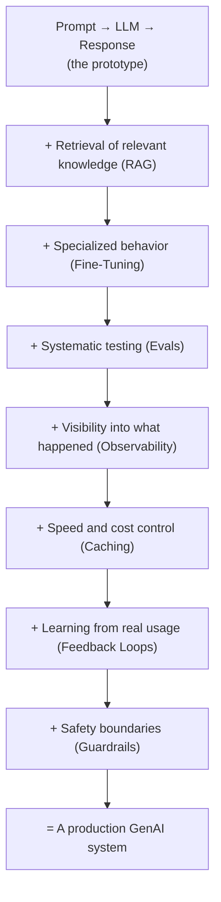

Each of the seven capabilities above solves a distinct failure mode of the naive prompt-to-response pipeline. None of them is optional once real users and real money are involved, though the depth to which you implement each one should scale with the stakes of the application. A weekend hackathon project might get away with a single guardrail and no eval suite. A system that issues refunds, gives medical or legal information, or represents a company publicly cannot.

### How this guide is organized

Each of the following sections takes one capability from the original one-page study guide and expands it into a full treatment: the underlying problem, how the mechanism works, the key design decisions, common failure modes, and practical guidance for building it well. A final set of sections shows how the seven pieces fit together into one continuously improving system, and closes with a compact summary and glossary you can use for quick review.

> **Key takeaway:** Production AI engineering is not about making the model smarter. It is about building reliable, observable, and correctable infrastructure around a fundamentally probabilistic component.

---

## 1. RAG — Giving the Model the Right Knowledge

### 1.1 What is RAG, and why do LLMs need it?

**Retrieval-Augmented Generation (RAG)** is the practice of fetching relevant information from an external knowledge source and inserting it into the model's context window before asking it to answer. It exists because of three unavoidable limitations of any language model, no matter how large:

- **Knowledge cutoff** — the model only knows what existed in its training data up to a certain date. It cannot know about yesterday's product update, this morning's price change, or a document created five minutes ago.
- **No access to private data** — a model trained on public internet text has never seen your company's internal wiki, your customer's account history, or your product's proprietary specifications.
- **A finite context window** — even if you could paste your entire knowledge base into the prompt, it would not fit, and even if it fit, burying the model in irrelevant text degrades the quality of its answer.

RAG addresses all three by treating the model's knowledge base as **external and swappable** rather than baked into its weights. Instead of asking "does the model already know this?", RAG asks "can we find the three or four passages that answer this question, and hand them to the model just before it responds?" This reframes an entire class of problems from a machine-learning problem into a **search and retrieval problem** — which is a much better-understood, more debuggable, and more controllable discipline.

### 1.2 How RAG works: the two pipelines

A RAG system is really two separate pipelines that share a data store: an **offline indexing pipeline** that runs whenever documents change, and an **online query pipeline** that runs on every user request.

#### The indexing pipeline (offline, runs when content changes)

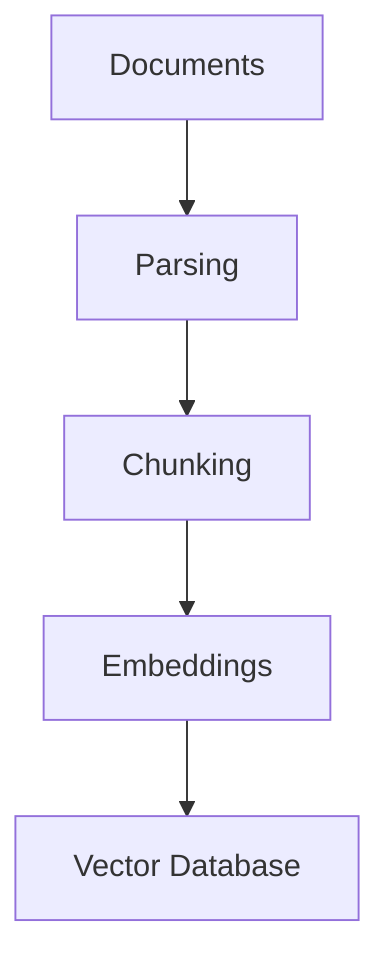

#### The query pipeline (online, runs on every request)

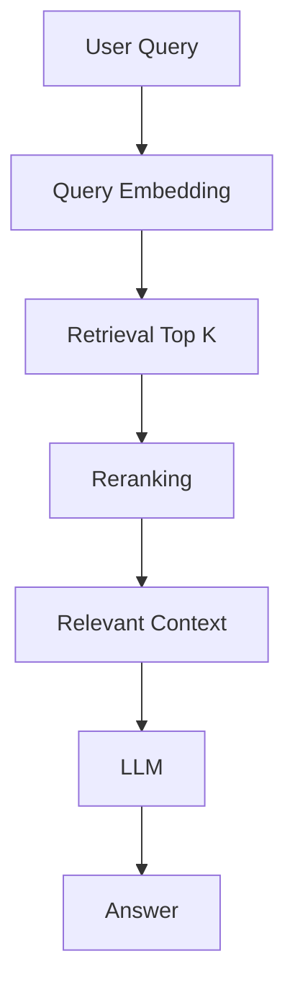

It is worth internalizing that these are different pipelines with different failure modes and different operational cadences. A bug in parsing or chunking silently corrupts your knowledge base and will not show up until someone asks a question that depends on the corrupted section. A bug in retrieval or reranking shows up immediately, on every affected query, which paradoxically makes it easier to catch.

### 1.3 Core concepts

#### Parsing

Before anything can be chunked or embedded, source documents (PDFs, HTML pages, Word documents, Confluence pages, spreadsheets, transcripts) have to be converted into clean, structured text. Parsing quality is one of the most underestimated sources of RAG failure: a PDF parser that garbles a table into an unreadable wall of numbers, or that drops headers and footers into the middle of body text, poisons every downstream chunk derived from that page. Good parsers preserve structure (headings, lists, tables) as metadata rather than flattening everything into a single text blob.

#### Chunking

Chunking is the process of splitting documents into smaller pieces that can be independently embedded and retrieved. The chunk size is a genuine trade-off, not a parameter to set once and forget:

| Chunk size | Pros | Cons |
|---|---|---|
| Small (e.g. 100–200 tokens) | Precise retrieval; less irrelevant text per chunk | Loses surrounding context; may split an idea across chunks |
| Large (e.g. 800–1500 tokens) | Preserves context and nuance around an idea | Dilutes the embedding's focus; retrieves more noise per hit |
| Overlapping windows | Reduces the chance an idea is cut exactly at a chunk boundary | Increases storage and duplicate retrieval |

A common, effective default is to chunk along **natural document structure** (sections, paragraphs, list items) rather than a fixed token count, with a modest overlap (10–20%) between adjacent chunks, and to attach the parent section heading to each chunk as metadata so the model still has context even from a small chunk.

#### Embeddings

An embedding model converts a chunk of text into a vector of numbers — typically a few hundred to a few thousand dimensions — positioned in a high-dimensional space such that semantically similar text ends up close together. "Refund policy for damaged goods" and "What happens if my order arrives broken?" produce vectors that are close, even though they share almost no words. This is what allows retrieval to work on **meaning** rather than exact keyword matches.

#### Vector databases

A vector database stores these embeddings alongside the original text and metadata, and is optimized to answer the question "which stored vectors are closest to this query vector?" at low latency, even across millions of chunks. Under the hood this typically relies on **approximate nearest-neighbor (ANN)** indexing structures (such as HNSW graphs or IVF indexes) that trade a small amount of recall for a large speed-up over brute-force comparison.

#### Hybrid search

Pure semantic (embedding) search is excellent at capturing meaning but sometimes fails on exact strings that matter — product SKUs, error codes, legal citations, or acronyms the embedding model has never seen. Hybrid search combines semantic similarity with traditional keyword search (such as BM25) and merges the two ranked lists, so an exact match on `Error 0x8007045D` is not lost simply because it doesn't embed distinctively.

#### Reranking

The initial retrieval step ("top K") typically over-fetches — for example pulling the top 20–50 candidate chunks using a fast but approximate similarity search — and then hands them to a slower, more accurate reranking model that scores each candidate specifically against the query before selecting the final 3–8 to send to the LLM.

Rerankers are usually **cross-encoders**: rather than comparing two independently computed vectors, they read the query and the candidate together, which is more expensive per item but substantially more accurate at judging true relevance.

#### Metadata filtering

Retrieval quality often has less to do with vector math and more to do with scoping the search space correctly **before** similarity is even computed. Metadata filters restrict retrieval by attributes such as document type, department, geography, product line, access permissions, or version, so that a query from a customer in the EU doesn't retrieve a US-only policy document, and a request for the current pricing sheet doesn't surface last year's superseded version.

### 1.4 Common RAG failures

| Failure mode | What it looks like | Typical fix |
|---|---|---|
| Correct document not retrieved | The answer exists in the knowledge base but never appears in the top-K results | Improve chunking, add hybrid search, expand K, or fix metadata filters that are excluding it |
| Wrong document ranked first | The right document is retrieved but outranked by a more superficially similar one | Add a reranking stage; tune embedding model choice |
| Stale documents | The knowledge base contains an outdated version of a policy or price | Automate re-indexing on document change; add "last updated" metadata and surface it |
| Poor chunking | Answers are cut off mid-sentence or missing the qualifying clause two sentences later | Chunk along structure, not fixed length; add overlap |
| Too much context | The right passage is buried among five irrelevant ones and the model gets confused or dilutes its answer | Retrieve fewer, higher-quality chunks; rerank aggressively |
| Hallucination despite correct context | The right passage is present but the model still states something not supported by it | Prompt the model explicitly to answer only from context; add output guardrails / citation checks |

### 1.5 RAG design checklist

- Does the parser preserve tables, headings, and structure rather than flattening everything?
- Is chunk size chosen deliberately, with a documented rationale, rather than left at a library default?
- Is there a hybrid (semantic + keyword) retrieval path for exact-match-sensitive content?
- Is there a reranking stage between initial retrieval and the final context sent to the LLM?
- Are metadata filters enforced **before** similarity search, especially for access control?
- Is there an automated process to detect and re-index stale or changed documents?
- Is retrieval quality measured separately from end-to-end answer quality (see [Evals, Section 3](#3-evals--testing-ai-systems))?

> **Key takeaway:** RAG is primarily a knowledge problem, not a model-training problem. If the model is giving wrong answers because it lacks current or private information, the fix is almost always better retrieval — not a bigger model or a fine-tuning run.

### 1.6 A worked example: tracing one query end to end

It helps to walk through a single concrete query and see exactly where each concept from this section applies. Imagine a customer support assistant for an outdoor gear retailer, and a user asks: *"Can I return a tent I bought two months ago if I only used it once?"*

1. **Parsing** had already converted the company's return-policy PDF into structured text months earlier, preserving the table that lists return windows by product category.
2. **Chunking** had split that document along its headings, so the "Outdoor Equipment" section — including the 90-day return window and the "like-new condition" clause — became its own chunk, with the parent heading attached as metadata.
3. At query time, the user's question is embedded and **hybrid search** runs: semantic search alone might over-weight the word "tent" and pull in a product spec sheet, while the keyword component helps surface the word "return" prominently, keeping the actual policy chunk in the candidate set.
4. The initial retrieval step pulls the top 20 candidates by similarity, including some irrelevant chunks about tent care instructions and warranty registration.
5. A **reranking** model reads the user's question alongside each of the 20 candidates and re-scores them for true relevance, promoting the return-policy chunk with the 90-day window to the top and discarding the warranty-registration chunk entirely.
6. **Metadata filtering** had already scoped the search to the customer's region, so a similar but different return policy used in another country was excluded before similarity was even computed.
7. The top 3 reranked chunks are assembled into context and sent to the LLM along with the user's question, and the model is instructed (via the system prompt, an output guardrail concern covered in [Section 7](#7-guardrails--controlling-ai-behavior)) to answer only from the supplied context and to state the specific day-count and condition requirement rather than a vague summary.

If any one of these steps had failed silently — a chunking boundary that split the return window from its condition clause, a missing reranker that let the warranty chunk outrank the policy chunk, a metadata filter that let the wrong country's policy through — the final answer would have been wrong even though every other part of the pipeline worked perfectly. This is why RAG failures are diagnosed **stage by stage** rather than treated as one monolithic "the answer was wrong" event.

### 1.7 Advanced RAG patterns

The pipeline described above is the standard baseline. As systems mature, several extensions are commonly layered on top of it to address specific weaknesses.

#### Query rewriting and expansion

Users rarely phrase questions the way source documents phrase their answers. Query rewriting uses the LLM itself, **before retrieval**, to reformulate a terse or ambiguous user question into one or more retrieval-friendly queries — expanding abbreviations, resolving pronouns using conversation history, or generating several paraphrases to widen the retrieval net.

#### HyDE (Hypothetical Document Embeddings)

Instead of embedding the user's question directly, HyDE asks the model to first draft a hypothetical answer to the question, and embeds that hypothetical answer instead. Because the hypothetical answer is written in the same style and vocabulary as real source documents, its embedding often lands closer to the actual relevant chunk than the embedding of the original, differently-phrased question would.

#### Multi-hop retrieval

Some questions cannot be answered from a single chunk — "Is the warranty on the product I bought last March still valid?" may require first retrieving the purchase date, then separately retrieving the warranty term for that product category, and then combining both. Multi-hop retrieval architectures run retrieval iteratively, using the result of one retrieval step to formulate the next query, rather than retrieving once and stopping.

#### Agentic RAG

Rather than a fixed retrieve-then-generate pipeline, an agentic approach lets the model decide, at each step, whether it has enough information to answer or whether it should issue another retrieval call, call a different tool, or ask a clarifying question. This adds flexibility and cost, and makes evaluation ([Section 3](#3-evals--testing-ai-systems)) and observability ([Section 4](#4-observability--understanding-what-happened)) considerably more important, since the number of possible execution paths grows substantially.

#### Graph RAG

For knowledge that is fundamentally relational — organizational hierarchies, product dependency graphs, citation networks — representing the knowledge base as a graph of entities and relationships, and retrieving relevant subgraphs, can outperform pure chunk-based vector retrieval, which struggles to capture the kind of multi-hop, structural reasoning that a graph traversal handles naturally.

---

## 2. Fine-Tuning — Teaching the Model How to Behave

### 2.1 What is fine-tuning?

Fine-tuning takes a pretrained model — one that has already learned general language, reasoning, and world knowledge from a massive, broad training run — and continues training it on a smaller, curated set of task-specific examples. The pretrained weights are not thrown away; they are nudged. The result is a model that keeps its general capabilities but shifts its default behavior toward the patterns demonstrated in the fine-tuning data.

This is a fundamentally different lever from RAG. **RAG changes what information is available to the model at answer time; it does not touch the model's weights at all.** Fine-tuning changes the weights themselves, and therefore the model's default behavior, tone, and output patterns — even without any retrieved context in the prompt.

### 2.2 When to use fine-tuning

- **Classification and extraction** — teaching the model to reliably map inputs to a fixed label set or a specific structured extraction pattern.
- **Specific output formats** — enforcing a consistent JSON schema, a house citation style, or a rigid report template far more reliably than prompting alone.
- **Consistent style and tone** — a brand voice, a customer-support persona, or a terse internal-tools tone that would otherwise require a very long system prompt.
- **Domain-specific behavior** — adapting to jargon-heavy fields (legal, medical, financial) where the base model's general-purpose instincts are subtly wrong.
- **Specialized, narrow tasks** — a single well-defined job performed at very high volume, where a smaller fine-tuned model can match a larger general model's accuracy at a fraction of the cost and latency.

### 2.3 RAG vs. fine-tuning

| Aspect | RAG | Fine-Tuning |
|---|---|---|
| What changes | Context / knowledge available at answer time | The model's underlying behavior and weights |
| Knowledge freshness | Easy — update the documents | Difficult — requires retraining |
| Private / internal knowledge | Good fit | Expensive to maintain and keep current |
| Style / tone / format control | Limited (relies on prompting) | Strong and reliable |
| Classification / extraction | Possible, but relies on the prompt each time | Often the better and cheaper long-term fit |
| Cost profile | Lower ongoing cost; pay for retrieval and larger prompts | Higher upfront and maintenance cost; training runs and versioning |
| Explainability | High — you can show which document produced the answer | Lower — behavior is embedded in weights, harder to trace |

In practice, the two are **complementary rather than competing**: many production systems fine-tune a model for consistent structure and tone, and simultaneously use RAG to keep the model's factual grounding current. Fine-tuning answers *"how should the model behave and respond,"* while RAG answers *"what should the model know right now."*

### 2.4 LoRA and parameter-efficient fine-tuning (PEFT)

Full fine-tuning updates every parameter in the model, which for large models means enormous compute and memory costs, and a separate multi-gigabyte (or larger) copy of the entire model for every fine-tuned variant.

**LoRA (Low-Rank Adaptation)** and other PEFT techniques instead freeze the original pretrained weights entirely and train a small number of additional "adapter" parameters that are inserted alongside the frozen layers.

- Because the base model is frozen, training requires far less GPU memory and far fewer updated parameters — often less than 1% of the full model.
- Multiple LoRA adapters can be trained cheaply for different tasks and swapped in and out of the same frozen base model at inference time.
- The resulting adapter files are small (often megabytes rather than gigabytes), which makes storing, versioning, and deploying many task-specific variants practical.

The trade-off is that PEFT methods sometimes cannot match full fine-tuning on tasks that require deep, broad shifts in the model's behavior — but for the vast majority of production use cases (format enforcement, tone, narrow classification) they get very close at a fraction of the cost, which is why they have become the default approach outside of frontier model labs.

### 2.5 The most common mistake

> **Common mistake:** Fine-tuning a model simply because it doesn't know some frequently changing piece of information. This is solving a knowledge-freshness problem with a behavior-change tool. Retraining every time a price, policy, or fact changes is slow, expensive, and creates a maintenance treadmill. Use RAG for anything that changes on a timescale shorter than your retraining cadence, and reserve fine-tuning for behavior that should stay stable regardless of what's happening in the world.

A useful diagnostic question before starting any fine-tuning project: **"If I updated a document tomorrow, would I want the model's answer to change immediately?"** If yes, that is a RAG problem. If the answer should stay the same regardless of any document, and what you actually want to change is tone, structure, or task competence, that is a fine-tuning problem.

### 2.6 The fine-tuning lifecycle

Fine-tuning is a project with its own lifecycle, distinct from and slower-moving than the day-to-day iteration loop of prompt engineering or RAG tuning.

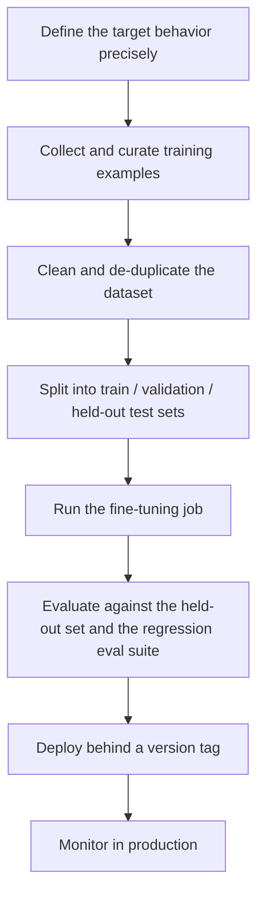

#### Data quality is the real bottleneck

In almost every practical fine-tuning project, the limiting factor is not compute or algorithm choice — it is the **quality and representativeness of the training examples**. A few hundred carefully curated, correctly labeled examples that closely resemble real production traffic routinely outperform tens of thousands of noisy, synthetic, or off-distribution examples. Common data-quality problems include:

- inconsistent labeling between annotators
- examples that don't reflect the actual difficulty distribution of production queries
- silent duplication that causes the model to overfit a handful of patterns rather than generalizing

#### Preference tuning: RLHF and DPO

Beyond supervised fine-tuning on input-output pairs, preference-based methods such as **Reinforcement Learning from Human Feedback (RLHF)** and the simpler **Direct Preference Optimization (DPO)** train a model using pairs of outputs ranked by preference ("response A is better than response B") rather than a single correct answer.

These are typically used by model providers to shape broad behavior like helpfulness and harmlessness, but the same underlying idea — training from comparative judgments rather than absolute labels — is increasingly available to application teams doing targeted fine-tuning for tone or style, especially when "correctness" is inherently a matter of degree rather than a binary label.

#### Versioning fine-tuned models

Every fine-tuned model or adapter should be versioned as rigorously as application code: tagged with the exact training data snapshot, base model version, and hyperparameters used to produce it. Without this, a quality regression discovered weeks later cannot be traced back to a specific training run, and rolling back to a previous behavior becomes guesswork rather than a clean revert.

---

## 3. Evals — Testing AI Systems

### 3.1 Why AI systems need a different kind of testing

Traditional software has unit tests: given a fixed input, assert a fixed output, and the test either passes or fails deterministically. AI systems break this model in three ways:

1. **Outputs are variable** — the same prompt can produce different phrasing on different runs.
2. **Outputs are often subjective** — there may be many acceptable answers to "summarize this contract" and no single correct string to assert against.
3. **Behavior is frequently multi-step** — an agent might call several tools, retrieve documents, and reason across turns before producing a final answer, so there are many places a trajectory could go right or wrong along the way.

Evaluations ("evals") are the discipline built to handle this: instead of asserting exact string equality, evals define what a successful **outcome** looks like and use a **grader** — which might be code, a model, or a human — to judge whether that outcome was achieved.

### 3.2 Core vocabulary

The following terms form a consistent vocabulary for talking precisely about evaluation, and map directly onto how a well-built evaluation harness is structured.

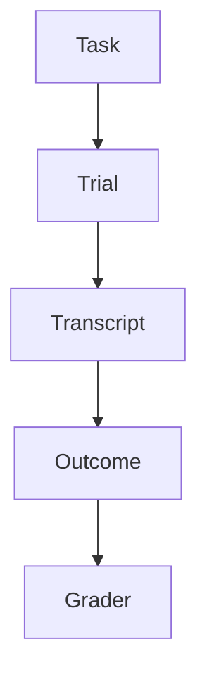

| Term | Definition |
|---|---|
| **Task** | A defined test case: specific inputs plus explicit success criteria. |
| **Trial** | One single execution of a task by the system being evaluated. |
| **Transcript** | The full record of what happened during a trial — inputs, model outputs, tool calls, retrieved documents, intermediate reasoning. |
| **Outcome** | What actually happened to the underlying environment or state as a result of the trial (e.g., was a record actually updated, was a ticket actually created). |
| **Grader** | The mechanism — code, model, or human — that determines whether the outcome met the task's success criteria. |
| **Evaluation Harness** | The infrastructure that runs the task, captures the transcript, applies the grader, and produces a result. |
| **Evaluation Suite** | A collection of tasks that together test a specific capability or behavior. |

Notice the distinction between **transcript** and **outcome**: the transcript is the story of what happened (a log), while the outcome is the resulting state of the world. A transcript might show the model confidently claiming it cancelled a subscription, while the outcome shows the subscription is still active — a gap that a naive "did the model say the right thing" grader would miss entirely, and that only outcome-based grading catches.

### 3.3 Types of graders

#### Code-based graders

Deterministic checks, used whenever the success criteria can be expressed as a programmatic assertion.

- Exact match
- Regex pattern match
- Database or application state checks
- API response validation
- Schema / type validation

**Pros:** fast, cheap, perfectly reproducible, and trivial to run in CI.

**Cons:** too rigid for tasks with many valid phrasings or genuinely subjective quality dimensions — a code grader cannot tell you whether a summary was well-written.

#### Model-based graders ("LLM as judge")

An LLM is prompted to assess the output against a rubric or reference answer.

- Rubric scoring against explicit criteria
- Natural-language assertions (e.g., "the response must not promise a refund")
- Pairwise comparison between two candidate outputs
- Reference-based evaluation against a known-good answer

**Pros:** flexible, can assess nuanced qualities like tone, helpfulness, or faithfulness to context.

**Cons:** can be inconsistent between runs, can be biased (e.g., favoring longer or more confidently-worded answers), and needs its own validation.

#### Human graders

Best reserved for expert judgment, genuinely difficult subjective cases, and — critically — for periodically validating that model-based graders agree with human judgment. Expensive and hard to scale, which is why human grading is typically used to **calibrate and spot-check** rather than to grade every trial.

> **On grader choice:** These three grader types are complementary, not competing. A mature eval suite typically uses code-based graders for anything mechanically checkable, model-based graders for nuanced quality judgments at scale, and human review to validate and calibrate the model-based graders on a sample.

### 3.4 Capability evals vs. regression evals

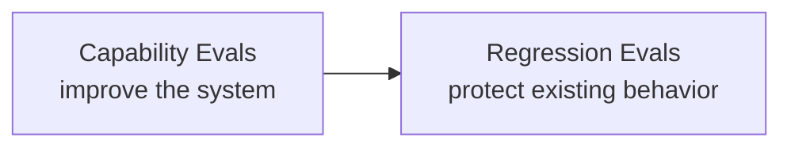

| | Capability evals | Regression evals |
|---|---|---|
| **Question answered** | What can the system do? | Did something that used to work break? |
| **Task difficulty** | Deliberately hard — should still have headroom for improvement | Should be reliably solvable — pass rate should be very high |
| **When it's useful** | When deciding whether a change is an improvement | On every deploy, to catch unintended damage |
| **Target pass rate** | Often well below 100% by design | Should approach 100%; any drop is a signal |

Maintaining both is important because they serve opposite purposes: a suite made entirely of hard capability tasks will have a naturally low and noisy pass rate, making it useless for catching regressions (a 2-point drop is lost in the noise). A suite made entirely of easy regression tasks will plateau at 100% and stop giving you any signal about whether the system is actually getting better.

### 3.5 Non-determinism: pass@k vs pass^k

Because LLMs can behave differently across trials of the same task, a single pass/fail result is not always the right unit of measurement. Two related but very different metrics capture this:

| Metric | Meaning | Answers the question |
|---|---|---|
| **pass@k** | At least one of *k* attempts succeeds | Can the system *eventually* solve this, given several tries? |
| **pass^k** | All *k* attempts succeed | Can the system *reliably* solve this every time? |

**Worked example** — a task with an 80% single-trial success probability, evaluated across 5 trials:

| Metric | Calculation | Result |
|---|---|---|
| pass@5 | \(1 - (1 - 0.8)^5 = 1 - 0.2^5\) | ≈ 99.68% |
| pass^5 | \(0.8^5\) | ≈ 32.77% |

The gap between 99.68% and 32.77% for the exact same underlying system is the point: a task that the system can "eventually" solve most of the time can still be highly unreliable if you need it to succeed every single time — which matters enormously for autonomous or unattended workflows where there is no human in the loop to catch and retry a failure.

### 3.6 Designing a good eval suite

It is tempting to try to build a comprehensive, hundred-task suite before shipping anything. In practice, starting small and realistic beats starting comprehensive and synthetic. A reasonable starting point is roughly **20–50 realistic tasks**, ideally derived from actual failures observed in the system (or a closely related prior system) rather than invented from imagination.

#### Properties of a good task

- **Clear** — the success criteria are unambiguous, not left to interpretation.
- **Solvable** — a well-functioning system should actually be able to pass it.
- **Reproducible** — running it twice under the same conditions gives consistent grading.
- **Representative** — it reflects a real usage pattern, not an edge case invented for its own sake.
- **Easy to grade** — the simpler the grading mechanism required, the more trustworthy and maintainable the eval.

#### Test both directions

It's natural to focus a suite entirely on "the system should do X." Equally important, and frequently neglected, is testing **"the system should NOT do X"** — for example, that a support agent doesn't offer a refund it isn't authorized to give, or that a RAG system says "I don't know" rather than fabricating an answer when no relevant document exists.

A suite skewed entirely toward positive cases can silently reward a system that over-triggers — for instance, one that retrieves and cites documents even when it shouldn't, or that takes an action when it should have asked for confirmation.

#### Grade outcomes, not rigid step sequences

When testing multi-step or agentic behavior, it is tempting to grade the exact sequence of steps taken. This is usually the wrong level of rigidity — there are often multiple valid paths to a correct outcome, and a step-sequence grader will fail a system for using a different — possibly better — approach. Wherever possible, grade the **outcome** (was the ticket correctly resolved, was the correct data returned) rather than requiring an exact trajectory.

### 3.7 Evals in CI/CD

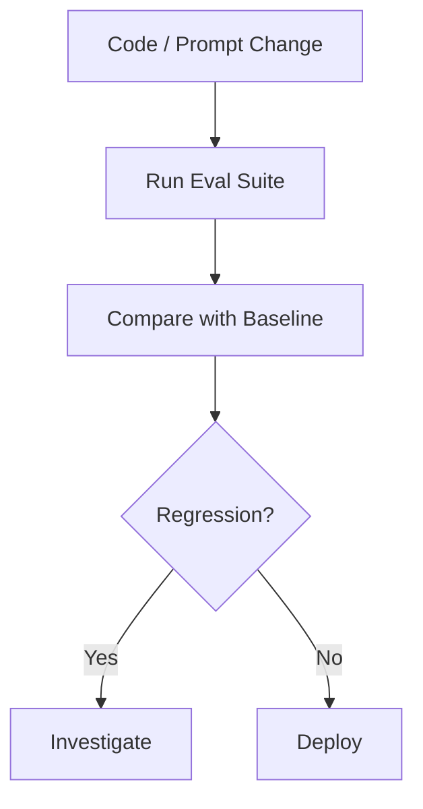

Wiring evals into continuous integration turns eval scores into a **gate**, the same way unit tests gate a traditional software deploy. Every prompt change, model upgrade, or retrieval-pipeline tweak runs against the full regression suite and is compared to the last known-good baseline before it reaches production. This is what converts AI quality from a subjective, after-the-fact judgment call ("it feels like the bot got worse") into a measurable engineering process with a paper trail.

> **Key takeaway:** Evals are how you know whether the system works and whether a change made it better or worse. Without them, every improvement is a guess and every regression is invisible until a customer notices.

### 3.8 Building your first eval suite: a step-by-step walkthrough

1. **Mine real failures first.** Pull the last few weeks of production transcripts, support escalations, and negative feedback, and read through them personally before writing a single task. Synthetic tasks invented from imagination tend to test what you assume is hard rather than what is actually hard.
2. **Write down the success criteria in plain language before choosing a grader.** If you cannot state in one sentence what "success" means for a task, the task is not ready to be automated yet.
3. **Choose the cheapest grader that can honestly judge the task.** Default to code-based checks; escalate to model-based grading only when the success criteria are genuinely subjective; reserve human review for calibration and the hardest edge cases.
4. **Start with 20–50 tasks**, weighted toward the failure patterns you actually observed, and make sure both "should do X" and "should not do X" cases are represented.
5. **Run the suite against the current production system** to establish a baseline pass rate before making any changes — you cannot detect improvement or regression without a starting point.
6. **Wire the suite into CI** so it runs automatically on every prompt, model, or retrieval change, and treat a regression-suite failure as a build-blocking event, the same as a failing unit test.
7. **Revisit and prune the suite periodically.** Tasks that no longer discriminate between good and bad system versions (because every version now passes them trivially) should be retired to keep the suite fast and meaningful, and replaced with newly discovered failure cases.

### 3.9 Sample size and statistical noise

Because of non-determinism, a single trial's pass or fail result is a noisy estimate of the system's true underlying success rate, and a suite that is too small will produce eval scores that bounce around from run to run for reasons that have nothing to do with real changes in system quality.

As a practical rule of thumb, differences smaller than a few percentage points on a suite of only a few dozen tasks are often within the range of ordinary sampling noise, especially at temperature settings above zero. Two practical responses are common:

- Run each task **multiple times and average**, rather than relying on one trial per task.
- Treat headline pass-rate changes with appropriate skepticism until they are large enough, or consistent enough across repeated runs, to be distinguishable from noise.

---

## 4. Observability — Understanding What Happened

### 4.1 Evals vs. observability

Evals and observability are often confused because they both involve looking at how the system performed, but they answer different questions at different times.

- **Evals** run against a controlled, curated set of tasks, typically before or during a deploy, and answer: *did it work?*
- **Observability** runs against real, live production traffic, continuously, and answers a harder and more open-ended question: *why did it work, or why did it fail, for this specific real request?*

### 4.2 Anatomy of a trace

A production request typically flows through several distinct stages, and a well-instrumented system captures data at every one of them:

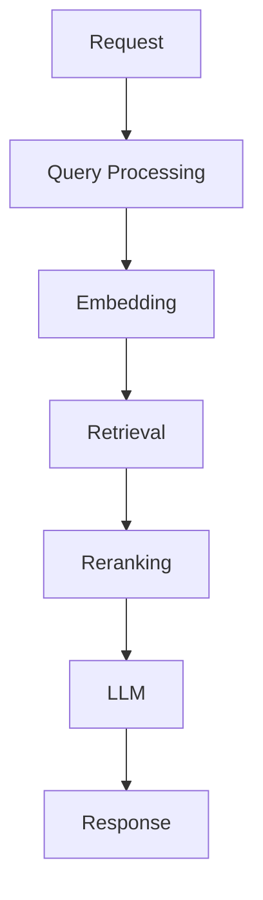

### 4.3 What to capture at each stage

#### Performance signals

- **Latency percentiles** — p50 (typical case), p95, and p99 (the tail — where the worst experiences live)
- **Throughput** — requests handled per unit time, especially under load

#### Cost signals

- Input tokens and output tokens per request
- Cost per request, aggregated by feature, customer, or model version

#### Quality signals

- Eval scores tied to production samples
- User feedback (see [Section 6](#6-user-feedback-loops--learning-from-production))
- Task completion / success rate

#### RAG-specific signals

- Which documents were retrieved for each query
- Similarity / relevance scores returned by retrieval and reranking
- Total context size sent to the model

#### Also worth tracking

- Errors and exceptions at every stage of the pipeline
- Model version, prompt version, and retrieval/index version in use for each request
- Every tool or external API call made, along with its result

### 4.4 Why percentiles, not averages

A common mistake is reporting only average latency or average cost. **Averages hide the experience of your worst-off users.** If p50 latency is 800ms but p99 is 9 seconds, roughly 1 in 100 requests is experiencing something close to a timeout — and those users are disproportionately likely to churn, complain, or lose trust in the system, even though the average number looks perfectly healthy on a dashboard.

### 4.5 Why versioning matters as much as metrics

Every trace should be tagged with the exact **model version**, **prompt version**, and **retrieval/index version** that produced it. Without this, a quality regression is nearly impossible to diagnose after the fact — you can see that something got worse, but you cannot correlate it with the change that caused it.

#### Worked example: diagnosing a quality drop

Suppose an eval or user-feedback dashboard shows that answer quality dropped from 90% to 75% over the past week. Observability is what lets an engineer work through the possibilities systematically rather than guessing:

- **Did retrieval change?** Compare retrieved-document logs and similarity scores before and after.
- **Did the prompt change?** Check prompt version tags against the timeline of the drop.
- **Did the model change?** Check model version — including silent provider-side updates.
- **Did the underlying data become stale?** Check document last-updated timestamps against the drop.
- **Did latency increase, causing timeouts or truncated responses?** Check p95/p99 trends.
- **Did an external API or tool the system depends on start failing or degrading?** Check error rates and tool-call logs.

Each of these has a distinct, checkable signature in a well-instrumented trace. Without that instrumentation, all six are indistinguishable from the outside — the only symptom you have is "it got worse," and every root cause requires expensive guesswork to isolate.

> **Key takeaway:** The goal of observability is to make an AI system **debuggable rather than mysterious** — to turn "the bot seems worse lately" into a specific, falsifiable, and fixable claim about one stage of the pipeline.

### 4.6 Tracing standards and tooling

Rather than inventing a bespoke logging format, most production systems build their tracing on top of established distributed-tracing conventions such as **OpenTelemetry**, extended with GenAI-specific span attributes (prompt id, token counts, retrieved-document ids, model name). This has two practical advantages:

1. It lets AI request traces show up in the same tracing infrastructure already used for the rest of the application (databases, queues, downstream services), so an engineer investigating a slow request doesn't need to context-switch between an "AI observability tool" and a "regular APM tool" to see the whole picture.
2. It makes traces portable across the growing ecosystem of LLM observability platforms rather than locking the data into one vendor's proprietary format.

### 4.7 Alerting philosophy

Collecting metrics is only useful if the right people are notified when something goes wrong, **before** a customer has to report it. A few principles keep AI-system alerting effective rather than noisy:

- Alert on **trends and thresholds relative to a rolling baseline**, not fixed absolute numbers — a system's normal cost or latency profile shifts over time as traffic grows, and a fixed threshold either goes stale or never fires.
- Separate **"the system is down or erroring"** alerts (should page someone immediately) from **"quality has drifted"** alerts (should generate a ticket for investigation, not wake anyone up at 3am).
- Alert on the **tail (p95/p99)**, not just the average, since average-based alerting can stay quiet while a meaningful fraction of users have a badly degraded experience.
- Tie quality alerts back to the eval suite and feedback pipeline described in [Sections 3](#3-evals--testing-ai-systems) and [6](#6-user-feedback-loops--learning-from-production), so an alert comes with an obvious next step (run the regression suite, check recent version tags) rather than just a number that changed.

---

## 5. Caching — Making AI Faster and Cheaper

### 5.1 Why caching matters

LLM calls are expensive relative to nearly any other operation in a typical web application: they cost real money per token, and they take hundreds of milliseconds to several seconds to complete, compared to the single-digit milliseconds of a database lookup. Any work that has already been done — an embedding already computed, a document already retrieved, a response already generated for an equivalent request — is a candidate for reuse rather than repetition.

### 5.2 Caching layers

Caching can be applied at nearly every stage of the pipeline, and a mature system typically layers several of these together:

| Layer | What it avoids re-doing | Typical hit-rate driver |
|---|---|---|
| **Embedding caching** | Recomputing embeddings for documents or queries that haven't changed | Stable document sets; repeated or similar queries |
| **Retrieval caching** | Re-running vector search for a repeated or near-identical query | High query repetition (e.g., FAQ-style traffic) |
| **Response caching** | Regenerating an LLM response for an equivalent request | Common, templated, or high-traffic requests |
| **API / tool-result caching** | Re-calling an external API when the result is still fresh | Data that changes slower than it is requested |

### 5.3 Exact vs. semantic caching

#### Exact caching

The simplest form: hash the exact request (or exact query text plus relevant parameters) and, on a match, return the previously computed response directly. Fast, simple, and completely safe as long as the underlying context hasn't changed — but its hit rate is limited to genuinely identical requests.

#### Semantic caching

A more powerful but riskier form: use embedding similarity to detect that a differently-worded request has the same intent as a previously answered one, and reuse that answer. "What's your return policy?" and "Can I send this back if I don't like it?" might be judged semantically equivalent.

This dramatically raises the potential hit rate, but introduces a genuine risk of **false positives** — two questions that are similar in wording but subtly different in what they're actually asking ("What's your return policy for electronics?" vs. "...for perishable goods?") can be conflated if the similarity threshold is too loose.

### 5.4 The hard part: invalidation

> **Not the right question:** "Can we cache this?" — almost anything can technically be cached.
>
> **The right question:** "When does this cached value become invalid?" This is where the real engineering work lives.

Every cache layer needs an **explicit invalidation strategy**, not just a storage mechanism. Some practical patterns:

- **Time-to-live (TTL)** — expire entries after a fixed duration appropriate to how quickly the underlying data changes (seconds for stock prices, days for a static FAQ).
- **Event-driven invalidation** — explicitly purge or refresh cache entries when the source document, price, or record they depend on is updated, rather than waiting for a TTL to lapse.
- **Version tagging** — key cache entries by the version of the model, prompt, or index that produced them, so a prompt or model upgrade doesn't silently serve stale answers generated under the old configuration.
- **Scope-aware keys** — make sure cache keys include everything that could legitimately change the answer (user permissions, locale, account tier) so a cached response is never served to a user for whom it is factually wrong or represents a data leak.

That last point is worth dwelling on: an incorrectly scoped cache is not just a correctness bug, it can be a **security problem** — for example, caching a response that includes account-specific information and then serving that cached response to a different user who happens to phrase their request similarly. Caching layers that touch personalized or sensitive content need the same access-control discipline as the underlying data itself.

> **Key takeaway:** Caching can reduce latency and cost dramatically, but a stale or incorrectly scoped cache can silently create correctness and security problems that are far more expensive than the latency it saved. Freshness has to be designed for explicitly — it is not a side effect you get for free.

### 5.5 Where caching sits in the request path

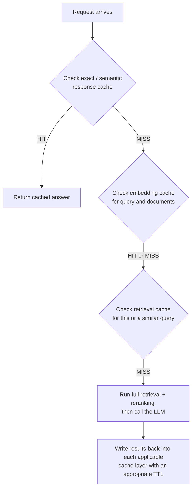

Each layer is checked from cheapest/fastest to most expensive, and a miss at one layer doesn't necessarily mean a miss at the next — a response cache miss can still benefit from a warm embedding cache, for instance, even though the final answer has to be freshly generated.

### 5.6 Measuring cache effectiveness

A cache that isn't measured is a cache you cannot tune. The key metrics to track per layer:

| Metric | What it tells you |
|---|---|
| **Hit rate** | What fraction of requests are served from cache rather than recomputed |
| **Cost saved** | Dollar value of avoided LLM calls, embedding calls, or API calls |
| **Latency saved** | How much faster cached responses are than a full pipeline run |
| **Staleness incidents** | How often a cached value was later found to be incorrect or outdated |
| **Semantic cache false-positive rate** | How often a semantically "similar" cached answer was actually wrong for the new query |

That last metric deserves special attention for semantic caching specifically: teams that adopt semantic caching for its higher hit rate should track false positives just as carefully as hit rate, since a cache that answers confidently but wrongly is worse for user trust than simply taking the extra latency to compute a fresh answer.

---

## 6. User Feedback Loops — Learning From Production

### 6.1 Why offline evals aren't enough

No matter how carefully an eval suite is constructed, it cannot anticipate every way real users will phrase requests, combine tasks, or push at the edges of a system's intended use. Offline evals test the questions you thought to ask; production traffic tests the questions you didn't. User feedback loops exist to capture that gap and feed it back into the system.

### 6.2 Sources of user signal

- **Explicit ratings** — thumbs up / thumbs down, star ratings, or similar direct feedback controls
- **Corrections** — a user editing or rewriting what the system produced
- **Retries** — a user immediately re-asking the same or a rephrased question, often a sign the first answer didn't land
- **Escalations** — a user asking to speak to a human, or requesting an override of an automated decision
- **Abandoned workflows** — a user starting a task and leaving before completion, often a silent signal of friction or failure

### 6.3 Feedback is not ground truth

It is tempting to treat a thumbs-down as a direct label of "the model was wrong." In practice, a single piece of negative feedback is ambiguous and can indicate several very different underlying problems:

- The answer itself was factually wrong
- The retrieval step surfaced the wrong document, even though the model reasoned correctly from it
- The answer was correct but incomplete — missing information the user needed
- The experience around the answer was frustrating (bad UX), independent of answer quality
- The user misunderstood what the system could do, or asked something out of scope

This ambiguity means raw feedback counts ("we got 40 thumbs-down this week") are a **starting point for investigation, not a finished metric**. Treating them as a finished metric leads teams to chase the wrong fixes — for example, retraining a model when the real problem was a missing document in the retrieval index.

### 6.4 The feedback loop

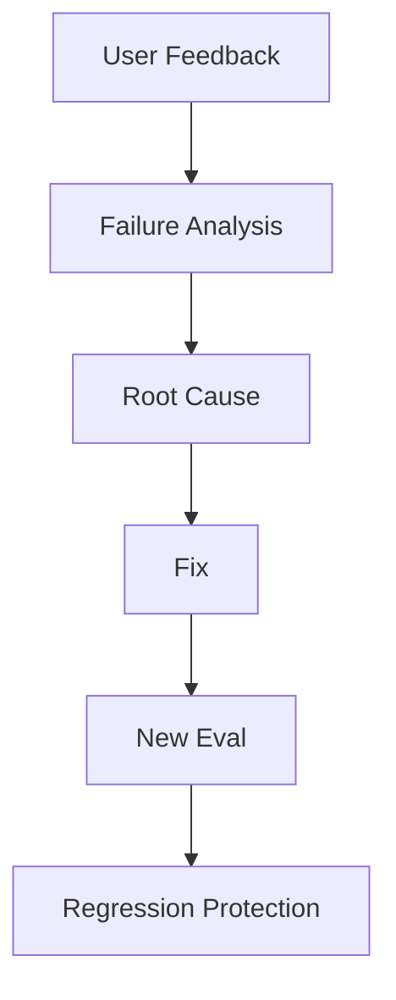

The critical final step — creating a new eval from a real failure — is what separates teams that merely collect feedback from teams that actually improve. Anthropic's framing of this is worth restating directly: production feedback is particularly valuable for discovering unexpected problems that no one thought to test for in advance, but it is also **sparse** (most users don't leave feedback at all) and **biased toward severe failures** (people are far more likely to react to something egregiously wrong than to quietly note something that was merely mediocre).

Because of that bias, feedback should be treated as a rich source of **leads for investigation**, not as a representative sample of overall system quality — a system can have a low volume of feedback and still be performing poorly for a large, silent majority of users who simply didn't bother to react.

### 6.5 Converting feedback into permanent knowledge

The single most important discipline in this loop is this: **every meaningful failure discovered through user feedback should become a new task in the regression eval suite.** Fixing the individual complaint helps one user. Turning that complaint into a permanent eval protects every future user from the same regression, and ensures that whatever fix was made cannot silently be undone by a later change.

> **Key takeaway:** The best systems don't just collect feedback — they convert important feedback into permanent engineering knowledge, in the form of new evals that guard against the same failure recurring.

### 6.6 Explicit vs. implicit signals

| | Explicit signals | Implicit signals |
|---|---|---|
| **Examples** | Thumbs up/down, star ratings, written complaints | Retries, session abandonment, escalation to a human, time-on-task |
| **Volume** | Low — most users never click a feedback button | High — every session generates implicit signal automatically |
| **Clarity** | High intent, but ambiguous reason (see [6.3](#63-feedback-is-not-ground-truth)) | Ambiguous intent, but doesn't rely on user effort |
| **Bias** | Skews toward users who are unusually satisfied or unusually frustrated | Skews toward whatever behavior is easiest to instrument, not necessarily what matters most |

Because explicit and implicit signals have different and largely uncorrelated biases, mature systems track **both** rather than relying on one. A system with plenty of positive thumbs-up ratings but a high silent abandonment rate on a particular workflow is telling you two different, both-important things — that the users who do bother to rate are satisfied, and that some other set of users are quietly giving up before finishing at all.

### 6.7 Designing feedback capture that people actually use

- Make giving feedback take **one click or tap**, not a form.
- Ask for a reason only after the initial rating, and make it optional — a mandatory follow-up form suppresses the raw volume of feedback you get in the first place.
- Show, at least occasionally, that feedback led to a visible change. Users who never see any effect of their feedback stop giving it.
- Capture feedback **close to the moment of the experience**, not in a separate, delayed survey — recall of exactly what went wrong fades within minutes.

---

## 7. Guardrails — Controlling AI Behavior

### 7.1 Why guardrails exist

A language model will do its best to comply with whatever it is asked, including requests that are malicious, unauthorized, malformed, or simply outside the bounds of what the application should allow. Guardrails are the deterministic and semi-deterministic checks placed around the model to enforce boundaries the model itself cannot be relied on to enforce consistently on its own.

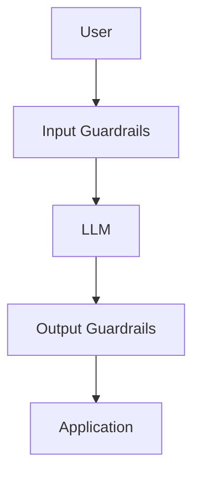

### 7.2 Input guardrails

Applied **before** the request ever reaches the model:

- **Prompt injection detection** — identifying attempts to override the system's instructions embedded within user input or retrieved content
- **PII detection** — flagging or redacting personally identifiable information before it is sent to the model or logged
- **Input validation** — rejecting malformed, oversized, or structurally invalid requests
- **Authentication** — confirming the identity of the caller
- **Authorization** — confirming the caller is permitted to make this specific request

### 7.3 Output guardrails

Applied **after** the model responds, before that response reaches the user or triggers any downstream action:

- **Schema validation** — confirming structured output actually conforms to the expected format before it's parsed downstream
- **PII / sensitive-data checks** — catching information that shouldn't be disclosed, even if the model wasn't explicitly asked to disclose it
- **Content safety and policy validation** — checking for disallowed, unsafe, or off-brand content
- **Toxicity / harm detection** — an additional layer beyond whatever safety training the model itself has

### 7.4 Business rules and humans in the loop

The most important principle in this entire section is that **important business logic should never depend solely on the language model's judgment.** A model can be extremely good at proposing a reasonable action and still be the wrong component to trust with unilaterally executing it, especially for high-stakes or hard-to-reverse actions.

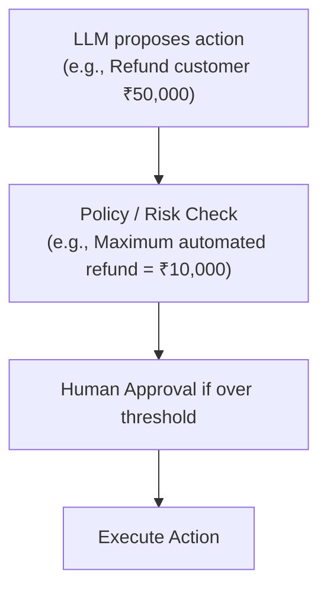

In this example, the deterministic business rule — a hard-coded maximum automated refund amount — sits entirely **outside** the model and cannot be reasoned around, argued with, or accidentally overridden by a clever prompt. If the model's proposed action exceeds the threshold, the system routes to a human rather than executing automatically, regardless of how confident or persuasive the model's proposed justification is.

> **Key principle:** The model can propose. The application decides. Keeping this separation explicit — rather than letting the model's own output double as the final authorization — is what keeps a single bad generation from becoming a costly, irreversible real-world action.

### 7.5 Defense in depth

No single guardrail is perfectly reliable — a classifier meant to catch prompt injection will miss some attempts, and a schema validator will not catch a schema-conformant but factually wrong answer. Robust systems therefore **layer several independent checks** rather than relying on any one of them, on the same principle used in traditional security engineering: an attacker (or an unlucky generation) that slips past one layer should still be caught by another before it can cause harm.

### 7.6 Guardrail failure modes: over-blocking and under-blocking

| Failure mode | What it looks like | Consequence |
|---|---|---|
| **Under-blocking** | A guardrail misses a genuine violation — an injection attempt succeeds, or PII slips through | Direct harm: data leak, unauthorized action, unsafe content reaching a user |
| **Over-blocking** | A guardrail flags legitimate requests as violations — a customer's genuine refund request gets blocked as suspicious | Indirect harm: frustrated users, lost trust, support burden, and pressure to loosen guardrails carelessly |

Over-blocking deserves as much design attention as under-blocking. A guardrail so aggressive that it degrades the experience for the overwhelming majority of legitimate users creates pressure — often from frustrated product teams, not just users — to disable or loosen it, which can leave the system less safe than a more carefully tuned, slightly more permissive guardrail would have been.

Guardrail thresholds, like retrieval and grading thresholds elsewhere in this guide, should be evaluated against both a **"should block"** and a **"should allow"** test set (echoing the same should-do / should-not-do principle from [Section 3.6](#36-designing-a-good-eval-suite)), and tuned deliberately rather than set once at a maximally conservative default and never revisited.

### 7.7 A layered guardrail checklist

- Is every user input checked for injection attempts before it reaches the model, including text retrieved via RAG (which is also user-influenceable in many systems)?
- Is PII detected and handled appropriately on both the input and output sides?
- Is structured output validated against a schema before anything downstream parses it?
- Are irreversible or high-value actions gated by a deterministic rule and, where appropriate, human approval — never solely by the model's own stated intention?
- Are authentication and authorization enforced at the application layer, not assumed from the model's understanding of the conversation?
- Is guardrail performance itself measured against both should-block and should-allow test cases, so over-blocking is caught as deliberately as under-blocking?

---

## 8. How Everything Fits Together

Each of the previous seven capabilities was presented in isolation, but none of them exists in isolation in a real system. This section is the synthesis: what a full production request path looks like end to end, and how a discovered problem flows back around into a better system over time.

### 8.1 The request path

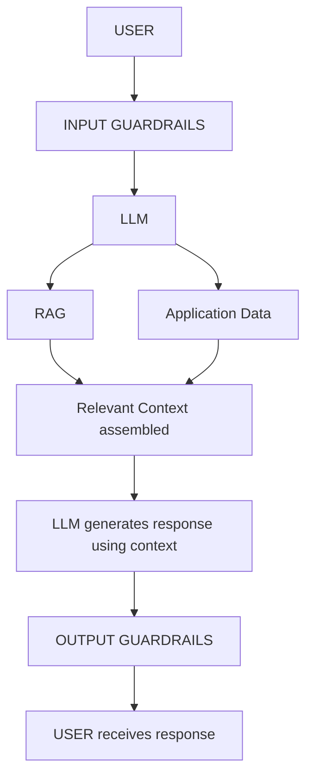

Notice that the LLM appears twice in this path in a meaningful sense: once to potentially decide what to retrieve or which tools to call, and again to synthesize the final answer once relevant context and application data have been assembled. Both guardrail layers wrap the entire LLM interaction, not just the final output — the input side of the very first arrow, and the output side of the very last one.

### 8.2 The improvement path

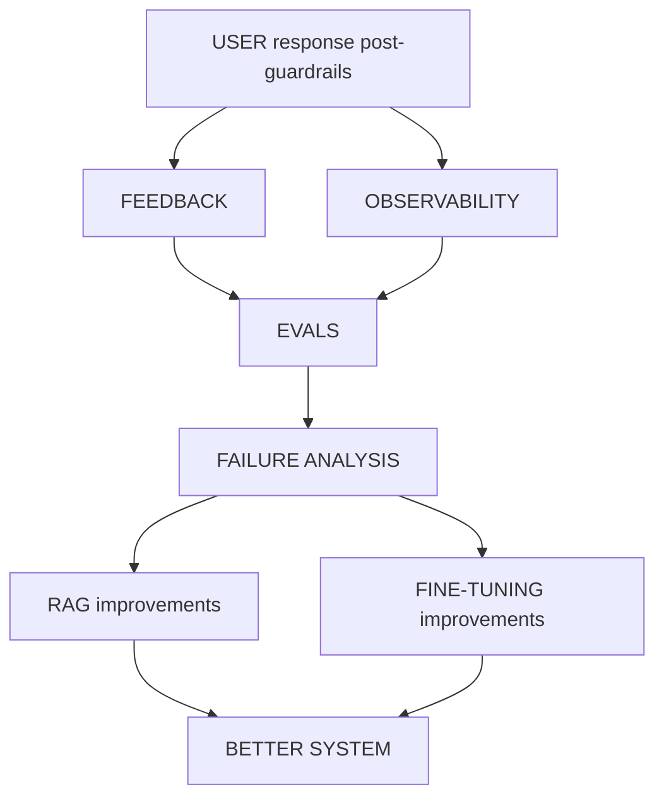

Feedback and observability are gathered continuously and in parallel — one from explicit user signals, the other from passive instrumentation of every request. Both feed into the eval suite, either directly (a bad trace becomes a new regression task) or indirectly (an observability-driven root-cause investigation reveals a pattern worth codifying as an eval). Once a failure's root cause is understood, the fix lands in one of the two model-facing levers covered earlier — improving what the model retrieves and knows (RAG) or improving how the model behaves (fine-tuning) — or, just as often, in tightening a guardrail or fixing an application bug that had nothing to do with the model at all.

### 8.3 Where caching sits

Caching is deliberately drawn as operating **across** the expensive components rather than as a single stage in either diagram above.

- Embedding caching sits inside the retrieval step.
- Response caching sits around the final LLM call.
- Retrieval caching sits between the query and the vector database.

It is a **cross-cutting optimization layer**, not a pipeline stage with its own place in the sequence — which is exactly why it is easy to bolt on incrementally to an already-working system, one layer at a time, without redesigning the request path.

### 8.4 A maturity model for production GenAI systems

Not every team needs to implement every capability in this guide at full depth on day one. The following maturity model is a useful way to reason about sequencing investment as a system grows from prototype to critical infrastructure.

| Level | Characteristics | Typical focus |
|---|---|---|
| **0 — Prototype** | A prompt wired directly to a model; no retrieval, no evals, manual testing by eyeballing outputs | Prove the concept works at all |
| **1 — Grounded** | Basic RAG in place; a handful of manual smoke tests; minimal logging | Get answers that are actually correct and current |
| **2 — Measured** | A real eval suite with capability and regression tasks; basic observability (latency, cost, errors) | Know whether changes help or hurt before shipping them |
| **3 — Guarded** | Input/output guardrails; business-rule enforcement for high-stakes actions; caching for cost and latency | Make the system safe and affordable to run at scale |
| **4 — Self-improving** | User feedback systematically converted into new evals; full tracing tied to versioned prompts/models/indexes; fine-tuning used deliberately where it beats prompting | Close the loop so the system gets measurably better over time without heroic manual effort |

Most teams do not move through these levels strictly in order — a team might add basic guardrails very early for legal reasons while still lacking a mature eval suite. The model is useful as a diagnostic: if a system feels fragile or its quality is a mystery, checking which level's capabilities are missing is usually more productive than reaching for a bigger or newer model.

---

## 9. The Production Feedback Loop

Zoomed all the way out, a mature GenAI system settles into a single repeating cycle. This is the organizing loop that everything in this guide ultimately serves:

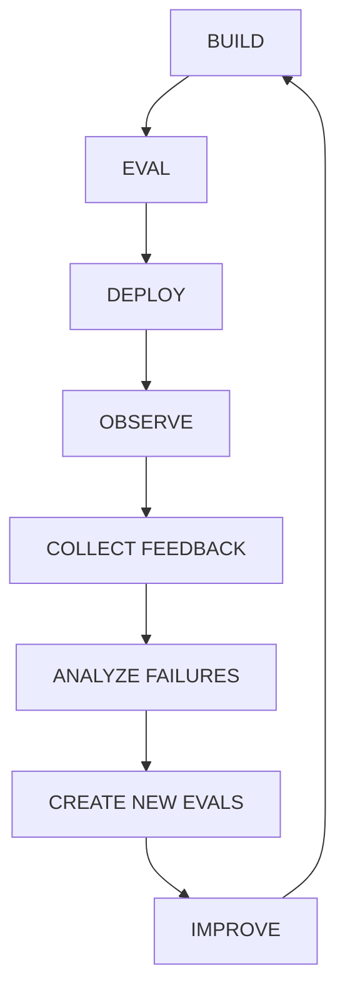

This loop is the real difference between an LLM demo and a production AI system. A demo stops at **"BUILD"** — it shows that the model can do the thing once, under favorable conditions, with an operator who knows what to type. A production system treats that same starting point as only the first lap of an ongoing cycle.

The model itself is only one component of this loop, and often not even the component that changes most often. The engineering system built around the model — the retrieval pipeline, the eval suite, the observability instrumentation, the caching layers, the feedback pipeline, and the guardrails — is what actually determines whether the resulting application is reliable, measurable, safe, scalable, and capable of continuous improvement rather than continuous, undetected decay.

> **The core relationship:** Production failures → feedback → evals → improvements → fewer future failures. Internalizing this single chain is close to the entire discipline of production GenAI engineering.

---

## 10. The One-Minute Summary

If someone asks you to explain the whole stack in a single breath, this is the version to give them:

| Capability | One-line role |
|---|---|
| **RAG** | Gives the model the right information, retrieved fresh at answer time. |
| **Fine-Tuning** | Teaches the model specialized, consistent behavior. |
| **Evals** | Tell you whether the system actually works, and whether a change made it better. |
| **Observability** | Tells you what happened, and why, for any given request. |
| **Caching** | Makes the system faster and cheaper by not repeating expensive work. |
| **User Feedback** | Tells you what you're missing — the failures no eval suite anticipated. |
| **Guardrails** | Keep the system within acceptable, safe, and authorized boundaries. |

And the most important relationship in the whole guide, worth repeating one final time: **production failures lead to feedback, feedback leads to evals, evals lead to improvements, and improvements lead to fewer future failures.** That closed loop — not any single clever prompt or any single powerful model — is the core of building reliable GenAI systems.

---

## Appendix A: Master Checklist

A compact, cross-section checklist for reviewing a production GenAI system end to end. Each item links back to the section where it is discussed in depth.

### RAG ([Section 1](#1-rag--giving-the-model-the-right-knowledge))

- [ ] Parsing preserves document structure rather than flattening it
- [ ] Chunking strategy is deliberate, documented, and revisited when retrieval quality dips
- [ ] Hybrid search covers exact-match-sensitive content
- [ ] A reranking stage sits between initial retrieval and final context selection
- [ ] Metadata filters enforce access control and scoping before similarity search
- [ ] Stale-document detection and re-indexing are automated

### Fine-Tuning ([Section 2](#2-fine-tuning--teaching-the-model-how-to-behave))

- [ ] Fine-tuning is used for behavior/format/style, not as a substitute for RAG on changing facts
- [ ] Training data quality has been reviewed for consistency and representativeness
- [ ] Every fine-tuned model/adapter is versioned against its training data and base model

### Evals ([Section 3](#3-evals--testing-ai-systems))

- [ ] A suite of 20–50+ realistic tasks exists, derived from real failures
- [ ] Both capability and regression evals are maintained separately
- [ ] Graders are chosen deliberately (code, model, or human) per task
- [ ] Should-do and should-not-do behavior are both tested
- [ ] Evals run automatically in CI and gate deploys

### Observability ([Section 4](#4-observability--understanding-what-happened))

- [ ] Latency is tracked at p50/p95/p99, not just average
- [ ] Cost, quality, and RAG-specific signals are captured per request
- [ ] Every trace is tagged with model, prompt, and index version
- [ ] Alerts distinguish outages (page immediately) from quality drift (ticket for investigation)

### Caching ([Section 5](#5-caching--making-ai-faster-and-cheaper))

- [ ] Each cache layer has an explicit invalidation strategy, not just a storage mechanism
- [ ] Cache keys include everything that legitimately changes the correct answer (permissions, locale, tier)
- [ ] Hit rate, cost saved, and staleness incidents are all measured

### Feedback ([Section 6](#6-user-feedback-loops--learning-from-production))

- [ ] Both explicit and implicit signals are collected
- [ ] Feedback is treated as a lead for investigation, not a finished metric
- [ ] Confirmed failures are converted into permanent regression evals

### Guardrails ([Section 7](#7-guardrails--controlling-ai-behavior))

- [ ] Input and output guardrails are both in place, layered rather than singular
- [ ] High-value or irreversible actions are gated by deterministic business rules, with human approval where appropriate
- [ ] Guardrail accuracy is measured against both should-block and should-allow test cases

---

## Appendix B: Glossary

| Term | Definition |
|---|---|
| **ANN (Approximate Nearest Neighbor)** | An indexing technique that finds vectors close to a query vector quickly, trading a little accuracy for large speed gains. |
| **BM25** | A classic keyword-ranking algorithm used in traditional (non-semantic) search, often combined with embeddings in hybrid search. |
| **Chunking** | Splitting documents into smaller pieces for embedding and retrieval. |
| **Cross-encoder** | A model architecture used in reranking that scores a query and a candidate document together, rather than comparing independently computed vectors. |
| **Embedding** | A numeric vector representation of text capturing its semantic meaning. |
| **Grader** | The mechanism (code, model, or human) that judges whether a task outcome was successful. |
| **Guardrail** | A deterministic or semi-deterministic check placed around a model to enforce a boundary. |
| **Hybrid search** | Combining semantic (embedding) search with keyword search for more robust retrieval. |
| **LLM-as-judge** | Using a language model to grade another model's output against a rubric or reference. |
| **LoRA** | Low-Rank Adaptation — a parameter-efficient fine-tuning method that trains small adapter weights while freezing the base model. |
| **pass@k** | The probability that at least one of *k* attempts at a task succeeds. |
| **pass^k** | The probability that all *k* attempts at a task succeed. |
| **PEFT** | Parameter-Efficient Fine-Tuning — techniques (including LoRA) that fine-tune a small subset of parameters rather than the whole model. |
| **Reranking** | A second, more precise scoring pass applied to an initial set of retrieved candidates. |
| **Semantic caching** | Caching based on meaning-similarity between requests, rather than exact text match. |
| **Vector database** | A database optimized for storing embeddings and answering nearest-neighbor similarity queries. |
