# Decentralized Poker Engine: Systems Design and Data Flow

This document describes the current Go source, including the live `poker host` / `poker join` path. It distinguishes working runtime behavior from helper libraries, prototypes, and intended security properties.

## 1. Elevator pitch

The program turns each player's computer into a **node**: one equal participant that runs the poker rules, talks directly to the other players, and keeps its own copy of the hand. There is no central game server or trusted dealer. Peers find each other with local-network discovery or a shared address, broadcast public events through a libp2p gossip mesh, and use layered encryption to deal cards without publishing every player's hole cards. In the honest path, every node processes the same ordered actions and public cards, so each independently reaches the same result.

## 2. Full system architecture diagram

```mermaid
flowchart TB
    USER["Player at terminal"]

    subgraph PROCESS["One Go process = one poker peer"]
        MAIN["cmd/poker/main.go<br/>main, runP2PMode, p2pGameModel"]
        CONFIG["config<br/>YAML/JSON/env, identity bytes"]
        TUI["internal/tui<br/>Bubble Tea model and event loop"]

        subgraph NODE["internal/network.Node"]
            HOST["PokerHost<br/>libp2p identity, TCP, Noise, multiplexed streams"]
            MDNS["MDNSDiscovery<br/>long-running library service"]
            GOSSIP["GossipManager<br/>table and heartbeat topics"]
            TABLELOOP["table receive loop<br/>goroutine"]
            HBLOOP["heartbeat receive loop<br/>goroutine"]
            SCANLOOP["equivocation scan loop<br/>goroutine"]
            STREAMS["StreamPool + /poker/1.0.0 handler<br/>direct framed streams"]
            LOBBY["Lobby<br/>seats, readiness, canonical order"]
            LOG["Gamelog<br/>in-memory envelope list and state-root helper"]
        end

        SEQUENCER["actionSequencer<br/>in-memory action-order buffer"]
        CRYPTOHAND["CryptoHand<br/>live per-hand crypto coordinator"]

        subgraph CRYPTO["internal/crypto: synchronous libraries"]
            KEYRING["Keyring<br/>local private SRA key + public exponents"]
            SHUFFLE["ShuffleSession<br/>ordered encrypt-and-permute FSM"]
            DEAL["DealSession<br/>ordered partial-decrypt FSM"]
            ZKP["SRA, commitments, ZK proofs,<br/>card encoding, Shamir primitives"]
        end

        MACHINE["internal/game.Machine<br/>deterministic mutable poker state machine"]
        STATE["GameState<br/>players, phase, bets, pots, board, payouts"]

        subgraph FAULT["internal/fault"]
            FM["FaultManager"]
            HBSEND["heartbeat sender<br/>goroutine"]
            HBMON["heartbeat monitor<br/>goroutine"]
            VOTES["timeout votes"]
            SHARES["key-share store and reconstruction"]
            SLASH["slash detector library"]
        end

        CHAIN["internal/chain + PokerEscrow.sol<br/>prototype; not connected to runP2PMode"]
        LEGACY["HandCoordinator + CryptoGame<br/>in-process helper path; not the live P2P path"]
        NODISK["No game-state persistence<br/>restart loses lobby, hand, log, and stacks"]
    end

    PEERS["Other equal poker peers"]
    ETH["Ethereum-compatible chain"]

    USER --> TUI
    MAIN --> CONFIG
    MAIN --> NODE
    MAIN --> TUI
    MAIN --> SEQUENCER
    MAIN --> CRYPTOHAND
    MAIN --> MACHINE
    MAIN --> FM

    HOST --> MDNS
    HOST --> GOSSIP
    HOST --> STREAMS
    GOSSIP -. "feeds" .-> TABLELOOP
    GOSSIP -. "feeds" .-> HBLOOP
    LOG -. "scanned by" .-> SCANLOOP
    TABLELOOP --> LOBBY
    TABLELOOP --> LOG

    CRYPTOHAND --> KEYRING
    CRYPTOHAND --> SHUFFLE
    CRYPTOHAND --> DEAL
    SHUFFLE --> ZKP
    DEAL --> ZKP
    MACHINE --> STATE

    FM --> HBMON
    FM --> VOTES
    FM --> SHARES
    FM --> SLASH
    HBSEND --> GOSSIP

    TUI -->|"local Action"| MAIN
    TABLELOOP -->|"decoded callbacks"| MAIN
    MAIN -->|"ApplyAction / ApplyStreet / ApplyHoleReveal"| MACHINE

    HOST <-->|"TCP connections secured with Noise"| PEERS
    GOSSIP <-->|"GossipSub fan-out"| PEERS
    STREAMS <-->|"direct key-share and peel frames"| PEERS

    CHAIN -. "designed boundary, not runtime-wired" .-> ETH
    MAIN -. "does not call" .-> CHAIN
    STATE -. "memory only" .-> NODISK
    LEGACY -. "separate from live wiring" .-> CRYPTO
```



### The live layers

1. **`cmd/poker` owns orchestration.** It loads configuration, creates keys, constructs a `network.Node`, installs callbacks, waits for the lobby, creates the fault and crypto sessions, starts the poker machine, and runs the TUI.
2. **`internal/network` moves typed messages.** libp2p supplies connections, Noise authentication, stream multiplexing, mDNS, and GossipSub. The package adds signed protobuf envelopes, replay watermarks, a lobby, direct-stream framing, and an in-memory log.
3. **`internal/crypto` produces cards.** It does not decide bets or winners. `ShuffleSession` produces a jointly transformed encrypted deck. `DealSession` coordinates partial decryptions for private and public cards.
4. **`internal/game` applies poker rules.** It does not open sockets and does not know about SRA. In plaintext mode it owns a deck. In crypto mode cards arrive through `ApplyStreet` and `ApplyHoleReveal`.
5. **`internal/fault` watches liveness.** It tracks heartbeats, gathers timeout votes, stores Shamir shares, and can reconstruct a missing peer's SRA exponent.
6. **`internal/tui` is a view and input adapter.** It renders the shared `GameState` and turns key presses into `game.Action` values.

### Two non-live branches

- `HandCoordinator` creates a `CryptoGame` that holds every player's private key in one process. It is useful as a simulation and test helper, but it is not how `runP2PMode` deals cards.
- `internal/chain` and `PokerEscrow.sol` sketch settlement. The P2P command never creates an escrow client or sends an Ethereum transaction.

## 3. Full lifecycle — sequence diagrams

### 3.1 A new node joins the table

```mermaid
sequenceDiagram
    actor Player
    participant Main as cmd/poker
    participant Config as config
    participant Node as network.Node
    participant Host as libp2p PokerHost
    participant Disc as mDNS / bootstrap
    participant Gossip as GossipManager
    participant Peer as Existing peer
    participant Lobby as Local Lobby

    Player->>Main: poker host/join flags
    Main->>Config: LoadOrDefault()
    Config-->>Main: table, seats, blinds, addresses, identity bytes
    Main->>Main: Generate fresh SRA (e,d) unless --no-crypto
    Main->>Node: NewNode(..., maxSeats, SRA key, addresses)
    Node->>Host: Create libp2p host
    Host->>Host: Listen on TCP; enable Noise; disable relay
    Node->>Gossip: Join table and heartbeat topics
    Main->>Node: Install all OnX callbacks
    Main->>Node: Start(ctx)
    Node->>Host: Register /poker/1.0.0 stream handler
    Node->>Disc: Start mDNS
    Node->>Disc: Dial configured bootstrap multiaddrs
    Disc->>Peer: Discover or dial
    Peer-->>Host: libp2p connection and Noise identity handshake
    Host-->>Gossip: GossipSub mesh can form
    Node->>Node: Start table receive goroutine
    Node->>Node: Start heartbeat receive goroutine
    Node->>Node: Start equivocation scan goroutine

    Main->>Lobby: Add local JOIN_TABLE once
    Main->>Gossip: Publish signed JOIN_TABLE
    loop Every 2 seconds until local lobby is full
        Main->>Gossip: Republish JOIN_TABLE with same timestamp
    end
    Gossip->>Peer: Mesh forwards join envelope
    Peer->>Peer: Decode, verify if signature is present, replay-check
    Peer->>Peer: Lobby.HandleJoin(sender, timestamp)

    Note over Main,Peer: Every replica sorts seats by sender timestamp,<br/>then by peer ID. This becomes the canonical seat order.

    loop Until each local Lobby.Count reaches configured maxSeats
        Peer-->>Main: Other JOIN_TABLE messages arrive
    end
    Main->>Gossip: Publish PLAYER_READY
    Main->>Main: Sleep 2 seconds
    Note over Main: Live code does not call Lobby.WaitReady here.<br/>It assumes the fixed delay was enough.
    Main->>Lobby: Read canonical seats and public SRA exponents
    Main->>Main: Reject mixed crypto / --no-crypto seats
    Main->>Main: Create Keyring and distribute Shamir shares
```

#### What “joined” means

A peer is treated as a full participant when its local process has collected `maxSeats` unique join messages. There is no leader-issued membership certificate and no quorum-signed roster. Each node derives the roster independently.

`JOIN_TABLE` carries:

- the table ID;
- display name and claimed buy-in;
- SRA public exponent `e`, or an empty value in `--no-crypto` mode;
- a “session nonce” that is currently the peer ID bytes.

The envelope timestamp decides seat order. Republishing uses the original timestamp, so a late subscriber can learn an old join without moving that player to a different seat.

No live catch-up protocol runs after the hand begins. `GameStateSync` exists in protobuf and has a broadcast helper, but `runP2PMode` does not install an `OnGameStateSync` handler. A restarted or late peer cannot become a current replica.

### 3.2 One complete cryptographic hand

The diagram uses three peers for readability. The same turn-taking rules apply up to nine seats.

```mermaid
sequenceDiagram
    participant A as Peer A / seat 0
    participant B as Peer B / seat 1
    participant C as Peer C / seat 2
    participant GS as GossipSub table topic
    participant CH as CryptoHand + sessions
    participant GM as game.Machine
    participant UI as Bubble Tea TUI

    Note over A,C: Every peer has the same seat order and public exponents.<br/>Each has only its own private exponent d.

    rect rgb(235, 243, 255)
        Note over A,C: Joint shuffle
        A->>CH: StartShuffle on plaintext encoded 52-card deck
        CH->>CH: Encrypt every card with A.e; random permutation; hash output deck
        A->>GS: SHUFFLE_STEP(A, encrypted deck, hash, nonce)
        GS-->>B: Forward A's step
        GS-->>C: Forward A's step
        B->>CH: Verify hash matches supplied output; adopt deck
        B->>CH: Encrypt with B.e; permute; hash
        B->>GS: SHUFFLE_STEP(B, transformed deck)
        GS-->>A: Forward
        GS-->>C: Forward
        C->>CH: Adopt B's step; add C layer and permutation
        C->>GS: SHUFFLE_STEP(C, final encrypted deck)
        GS-->>A: Forward
        GS-->>B: Forward
        Note over A,C: Final card values have all three encryption layers.<br/>No peer knows the combined permutation.
    end

    rect rgb(238, 255, 238)
        Note over A,C: Private hole-card dealing
        loop Two rounds, one slot per seat
            CH->>CH: Select deterministic encrypted-deck index
            Note over A,C: For A's slot, B then C remove their layers.<br/>A's layer remains.
            B->>GS: PARTIAL_DECRYPT with proof
            B-->>A: Same peel over best-effort direct stream
            GS-->>A: Gossip copy
            GS-->>C: Gossip copy
            C->>GS: Next proved PARTIAL_DECRYPT
            GS-->>A: Gossip copy
            A->>CH: Remove A's final layer locally
            Note over A: Only A converts this value to a card.
        end
        CH-->>A: A's two local hole cards
        CH-->>B: B's two local hole cards
        CH-->>C: C's two local hole cards
    end

    A->>GM: StartHandCrypto(local holes only)
    B->>GM: StartHandCrypto(local holes only)
    C->>GM: StartHandCrypto(local holes only)
    Note over A,C: Each replica posts the same blinds.<br/>Opponent hole fields remain empty.

    rect rgb(255, 248, 230)
        Note over A,C: Replicated betting
        UI->>A: Local player confirms call / raise / fold
        A->>A: Reserve next action sequence; ApplyAction locally
        A->>GS: Signed PLAYER_ACTION(hand, actor, action, actionSeq)
        GS-->>B: Unordered gossip delivery
        GS-->>C: Unordered gossip delivery
        B->>B: Buffer by actionSeq; release contiguous actions
        C->>C: Buffer by actionSeq; release contiguous actions
        B->>GM: ApplyAction
        C->>GM: ApplyAction
        GM-->>UI: Shared GameState pointer sent for redraw
    end

    rect rgb(245, 238, 255)
        Note over A,C: Flop, turn, and river
        GM-->>CH: PhaseAwaitingStreet
        loop Flop 3 cards, turn 1, river 1
            CH->>CH: Choose indexes after skipped burn positions
            A->>GS: Proved peel of each public slot
            B->>GS: Proved peel of each public slot
            C->>GS: Proved peel of each public slot
            CH->>CH: All layers removed; map field value to card
            CH->>GM: ApplyStreet(cards)
            Note over A,C: Run another ordered betting round
        end
    end

    alt Everyone but one player folded
        GM->>GM: Calculate pots and pay sole survivor
        Note over A,C: No opponent hole cards are revealed
    else Two or more remain
        GM-->>CH: PhaseShowdown / NeedsReveal
        loop Remaining players in canonical seat order
            A->>GS: Peel first hole slot publicly
            B->>GS: Peel
            C->>GS: Peel
            A->>GS: Peel second hole slot publicly
            B->>GS: Peel
            C->>GS: Peel
            CH->>GM: ApplyHoleReveal(player, two cards)
        end
        GM->>GM: Evaluate best five of seven; split main and side pots
    end

    GM-->>UI: PhaseSettled, payouts, winner display
    A->>GS: HAND_RESULT with pot summary and empty state root
    B->>GS: HAND_RESULT with pot summary and empty state root
    C->>GS: HAND_RESULT with pot summary and empty state root
    Note over A,C: HAND_RESULT is logged only.<br/>It does not create a vote or commit certificate.
    A->>A: After 3 seconds, rotate dealer and start next hand
    B->>B: After 3 seconds, rotate dealer and start next hand
    C->>C: After 3 seconds, rotate dealer and start next hand
```

#### What counts as agreement

There is no Raft log, PBFT round, block, or authoritative dealer. Agreement is **deterministic replay under honest assumptions**:

1. Every peer derives the same seat order.
2. Every peer accepts the same shuffle and peel transcript.
3. Exactly one current actor assigns the next action sequence.
4. Every peer applies that sequence to the same public state machine.
5. Every peer runs the same hand evaluator and pot logic.

Private state is intentionally not identical before showdown. Alice's replica contains Alice's hole cards; Bob's contains Bob's. The public phase, board, bets, stacks, and action order are expected to match.

The final `HAND_RESULT` does not cause agreement. It reports what the sender already computed. Current code does not compare received results, gather signatures, or stop the next hand when results differ.

### 3.3 A peer fails during a hand

```mermaid
sequenceDiagram
    participant Gone as Peer C
    participant A as Peer A
    participant B as Peer B
    participant HB as Heartbeat topic
    participant FM as FaultManager
    participant Table as Table gossip
    participant CH as CryptoHand
    participant GM as game.Machine

    loop Every heartbeat interval
        Gone->>HB: Signed HEARTBEAT
        HB-->>A: Receive on dedicated subscription
        A->>FM: RecordHeartbeat(C)
        HB-->>B: Receive on dedicated subscription
        B->>FM: RecordHeartbeat(C)
    end

    Gone-xHB: Stops sending or disconnects
    FM->>FM: LastSeen exceeds heartbeat timeout
    par Local suspicion at A
        A->>Table: TIMEOUT_VOTE(voter=A, target=C)
        A->>FM: StartVote(C, A)
    and Local suspicion at B
        B->>Table: TIMEOUT_VOTE(voter=B, target=C)
        B->>FM: StartVote(C, B)
    end
    Table-->>A: Other timeout vote
    Table-->>B: Other timeout vote
    A->>FM: RecordVote
    B->>FM: RecordVote

    alt Local vote reaches implemented threshold
        FM->>GM: forceFold(C), now or when C becomes current actor
        A->>Table: Broadcast fold action if locally applied
        B->>Table: Broadcast fold action if locally applied

        alt C disappeared before joint shuffle completed
            FM->>CH: AbortShuffle(reason)
            CH-->>A: WaitShuffle fails
            CH-->>B: WaitShuffle fails
            Note over A,B: Hand cannot continue because C's secret permutation is unavailable.
        else Final shuffled deck already exists
            A->>FM: Read the share of C.d that A received at table setup
            B->>FM: Read the share of C.d that B received at table setup
            A->>Table: KEY_SHARE(owner=C, A's share)
            B->>Table: KEY_SHARE(owner=C, B's share)
            Table-->>A: Reconstruction shares
            Table-->>B: Reconstruction shares
            FM->>FM: Reconstruct C.d after ceil(n/2), minimum 2, shares
            FM->>CH: MarkGone(C, reconstructed key)
            Note over A,B: First surviving seat is the designated substitute.
            A->>CH: PeelOnBehalf(C) when C is expected
            A->>Table: Broadcast delegated proved peel
            Table-->>B: Apply delegated peel
            Note over A,B: Pending public cards or showdown can continue.
        end
    else Vote does not reach threshold
        Note over A,B: State remains waiting; there is no leader override.
    end
```

#### Failure boundaries

- Heartbeats now have their own receive loop and replay watermark. They do not enter the game log and cannot advance the table-topic watermark.
- A timeout is a local observation. Each replica starts and counts its own vote object.
- The code intends a two-thirds vote, but computes `int(totalVoters * 2/3 + 0.5)`, which rounds rather than taking a ceiling. At a three-player table, one of the two eligible voters is enough in the current implementation. At a six-player table, three of five are enough.
- Recovery is possible only after the encrypted deck exists. Reconstructing `d` cannot recover a shuffler's private permutation.
- The reconstructed key is kept outside the normal `Keyring`. Only the designated surviving peer should produce substitute peels.
- The dead seat is not removed from the roster. A later hand still includes its encryption layer, so multi-hand play after a departure is not fully recovered.

### 3.4 A malicious or malformed message

```mermaid
sequenceDiagram
    participant M as Malicious peer
    participant Net as Node receive loop
    participant Sess as ShuffleSession / DealSession
    participant Game as game.Machine
    participant Fault as FaultManager

    alt Bad partial decrypt
        M->>Net: PARTIAL_DECRYPT
        Net->>Sess: HandlePeel
        Sess->>Sess: Check hand, card index, expected peeler,<br/>ciphertext chain, and ZK equations
        Sess-->>Net: error
        Net-->>Net: Print crypto error
        Note over Net,Fault: Live callback does not call CheckZKProof<br/>or create a slash record.
    else Invalid player action
        M->>Net: PLAYER_ACTION
        Net->>Game: ApplyAction
        Game-->>Net: error
        Note over Net,Fault: Callback ignores this error.<br/>The action sequence is consumed and no slash is recorded.
    else Same envelope sequence with different payload
        M->>Net: First envelope
        Net->>Net: Advance per-sender replay watermark; append log
        M->>Net: Conflicting envelope with same sequence
        Net->>Net: Replay check drops it before logging
        Note over Net,Fault: The periodic equivocation scanner cannot see both copies.
    end
```

The crypto session rejects several kinds of malformed transcript. That is useful safety behavior, but the normal consequence is a stalled or failed hand. The standalone slash detector is not wired into the live callback path.

## 4. Data flow: how one player action moves through the system

```mermaid
flowchart LR
    KEY["Key press in Bubble Tea event loop"]
    BET["BetInput.Confirm<br/>build game.Action"]
    CALLBACK["TUI OnAction callback"]
    LOCK["machineMu.Lock"]
    SEQ["Reserve actionSequencer.nextSeq"]
    LOCAL["Machine.ApplyAction<br/>mutate local GameState"]
    PB["Build PlayerAction protobuf"]
    ENV["Build Envelope<br/>independent sender seq + timestamp"]
    SIGN["Ed25519 sign envelope fields"]
    FRAME["protobuf marshal + 4-byte length prefix"]
    PUB["GossipSub Publish"]
    MESH["Mesh fan-out through neighbors"]
    NEXT["Remote table receive goroutine"]
    DECODE["Length check + protobuf decode"]
    VERIFY["Application signature check<br/>and self-echo drop"]
    REPLAY["Per-sender envelope-seq watermark"]
    LOG["Append Envelope pointer to Gamelog"]
    UNMARSHAL["Unmarshal PlayerAction payload"]
    ALOCK["machineMu.Lock"]
    BUFFER["actionSequencer.pending[actionSeq]"]
    APPLY["Apply every contiguous ready action"]
    SEND["tea.Program.Send(GameStateMsg)"]
    VIEW["TUI redraw"]

    KEY --> BET --> CALLBACK --> LOCK --> SEQ --> LOCAL
    LOCAL --> PB --> ENV --> SIGN --> FRAME --> PUB --> MESH
    MESH --> NEXT --> DECODE --> VERIFY --> REPLAY --> LOG --> UNMARSHAL
    UNMARSHAL --> ALOCK --> BUFFER --> APPLY --> SEND --> VIEW
```



### Step by step

1. `tui.Model` handles the key on the Bubble Tea event loop. `BetInputState` validates obvious UI constraints and returns a `game.Action`.
2. `p2pGameModel.applyAndBroadcast` takes `machineMu`. It reads the current machine pointer and reserves the next **action sequence** under `actionSequencer.mu`.
3. The local publisher applies the action directly. It does not wait to receive its own gossip message; `Node` deliberately drops self-echoes.
4. `Node.BroadcastAction` serializes a `PlayerAction` with protobuf. That payload sequence orders poker actions.
5. `Node.publish` wraps the payload in an `Envelope`. The envelope has a different sequence: an atomic, per-sender counter shared by joins, shuffle steps, actions, votes, and other table messages.
6. `EncodeEnvelope` signs `type || sender || 0 || envelope-seq || timestamp || payload`, protobuf-encodes it, enforces the 4 MiB application limit, and prepends a big-endian 32-bit length.
7. GossipSub sends the bytes to mesh neighbors. A receiver's `ReceivedFrom` may be an intermediate neighbor, not the original author in the envelope.
8. The table receive goroutine calls `DecodeEnvelope`, extracts the claimed sender's Ed25519 key from its peer ID, verifies the signature when one is present, and ignores its own messages.
9. `GossipManager.CheckAndUpdateSeq` accepts only an envelope sequence greater than the last one seen from that sender. The accepted envelope is appended to the in-memory `Gamelog`.
10. `dispatch` unmarshals `PlayerAction` and calls the top-level callback.
11. The callback takes `machineMu`, inserts the message into `actionSequencer.pending`, and releases all contiguous action numbers starting at `nextSeq`.
12. Each released action mutates `GameState` synchronously through `Machine.ApplyAction`.
13. The callback sends `GameStateMsg{State: gs}` into Bubble Tea so the terminal redraws.

### What is copied and what is shared

- Network boundaries copy data. Protobuf marshaling creates bytes, remote unmarshaling creates new message structs, and crypto wire adapters copy `big.Int` values and proof fields in most paths.
- `Lobby.Seats` copies each `SeatInfo` struct, although slice fields inside that shallow copy still refer to existing backing arrays. Callers that build public exponent lists copy those bytes again.
- `Keyring` copies keys and seat order at construction and returns copies from its public accessors. This protects private exponents from accidental mutation.
- `GameState` is **not** copied for the TUI. The machine, network callback, and UI receive pointers to the same mutable object.
- `Gamelog.Entries` copies the slice, not the pointed-to envelopes. Envelopes are treated as immutable after decoding.

### Locks on this path

- `machineMu` protects the current `Machine` and `GameState` pointers and is intended to serialize state-machine mutation.
- `actionSequencer.mu` protects `nextSeq` and the pending map.
- `Node.mu` protects startup state and the peer-public-key cache.
- `GossipManager.mu` protects the two replay-watermark maps.
- `Gamelog.mu` protects entries and its deduplication set.
- Bubble Tea owns its `tui.Model` on its event loop, but the `GameState` pointer inside the model is still shared with network goroutines.

### Backpressure and loss behavior

The application has no end-to-end acknowledgment or retransmission protocol for ordinary table messages. GossipSub has its own bounded internals, but the poker layer does not wait for all peers to acknowledge an action.

`notifyCh` is a buffered channel of 16 empty signals. A non-blocking send drops the signal when full. This is acceptable for display refresh because a later refresh reads the current state, not a delta.

Crypto messages that arrive before a hand or the correct job are buffered in slices. Those buffers have caps. Once full, new early messages are silently dropped. A missing action sequence stays in the pending map indefinitely; there is no gap request.

## 5. Concurrency model

The program mixes both common Go styles:

- long-running goroutines communicate through subscriptions and channels;
- shared in-memory objects are protected by mutexes.

It is closer to **shared state behind locks** than to strict “share memory by communicating.” Channels wake waiters and feed the UI, but no single goroutine exclusively owns all game state.

### Long-running goroutines per node

After a P2P table starts, the application explicitly starts at least these five long-running goroutines:

1. `Node.receiveLoop` blocks on the table GossipSub subscription and dispatches joins, shuffles, peels, actions, votes, key shares, state syncs, and results.
2. `Node.heartbeatReceiveLoop` blocks on the heartbeat subscription and updates liveness through a separate callback.
3. `Node.equivocationScanLoop` wakes every five seconds and scans the current game log.
4. `FaultManager.Run` runs the heartbeat monitor's periodic timeout check.
5. `HeartbeatSender.Run` publishes this peer's heartbeat periodically.

Bubble Tea also runs its event loop. libp2p, mDNS, GossipSub, TCP, Noise, and stream multiplexing run internal goroutines whose exact count is owned by those libraries, not fixed by this source.

The direct protocol handler loops over length-prefixed frames on an incoming stream. libp2p invokes stream handlers concurrently for incoming streams. This is not a new TCP connection per message: libp2p multiplexes logical streams over an existing secured connection.

### Short-lived goroutines

- `kickCryptoAdvance` starts a goroutine after local and remote actions. It may wait up to two minutes for street or showdown peels.
- Timeout callbacks are started in goroutines.
- Recovery of a missing key runs in a goroutine and polls for up to 30 seconds.
- mDNS invokes the “peer found” callback in a goroutine.
- Slash callbacks, when the library is used, run asynchronously.

These counts are traffic-dependent.

### Production channels

**GossipSub subscriptions**

`Subscription.Next(ctx)` acts like a receive channel managed by libp2p. Separate table and heartbeat subscriptions prevent heartbeat traffic from interfering with table-message replay ordering.

**`Lobby.readyCh`**

Closing this channel wakes every `WaitReady` caller at once. Closing is a good fit because “all seats are ready” is a one-time broadcast event. `sync.Once` prevents a double close. The live top-level path does not currently wait on it; `HandCoordinator` does.

**Crypto `waitGate` channels**

`CryptoHand` has separate gates for shuffle, holes, street, and reveal completion. Closing a gate wakes blocked callers without polling. A gate can also store an error, which is how a mid-shuffle timeout fails `WaitShuffle`.

**`notifyCh`**

This channel carries only “something changed” signals from network callbacks to the Bubble Tea command loop. It is deliberately lossy because state is read by pointer afterward.

**Bubble Tea's message queue**

`tea.Program.Send` moves `GameStateMsg`, `WinnerMsg`, and `ErrorMsg` into the UI loop. It separates terminal rendering from network callback execution.

### Shared state and protection

**Current machine pointers**

`machineMu` guards `liveMachine` and `liveGS`. This matters because every new hand replaces both pointers while the network callback remains installed.

**Per-hand crypto pointer**

`cryptoMu` guards `liveHand` and early-message slices. `CryptoHand` itself has another mutex around its shuffle and deal sessions.

**Action sequencing**

`actionSequencer.mu` protects the next expected action number and `map[int64]*PlayerAction`. Without it, the TUI and receive loop could reserve the same number or concurrently mutate the map.

**Membership and “gone” state**

`Lobby.mu` protects the seat map and readiness. `goneMu` protects the top-level set of failed peers. The recovery map is accessed while `cryptoMu` is held.

**Networking state**

`Node.mu` protects the public-key cache and startup flag. `StreamPool.mu` protects the peer-to-stream map. `GossipManager.mu` protects replay watermarks.

**Fault state**

Heartbeat, timeout-vote, Shamir-share, and slash-record structures each have their own mutex. `liveHandNum` is an `atomic.Int64` because the heartbeat goroutine needs a cheap read while the UI replaces the hand.

### Why `AdvanceCryptoLocked` releases `machineMu`

Street advancement starts a peel round and then waits for network input. Holding `machineMu` across that wait would block a timeout callback that needs the same mutex to fold a silent current actor. `AdvanceCryptoLocked` therefore:

1. acquires the machine lock;
2. starts the crypto job;
3. releases the lock before `WaitStreet` or `WaitReveal`;
4. reacquires it before applying cards.

This avoids one known deadlock, but it means another advance goroutine can enter while the first is waiting. There is no separate “one advancement in flight” mutex, so duplicate `kickCryptoAdvance` goroutines can attempt to start the same crypto sequence.

### Remaining race risks

The locking intent is clear, but the live composition still has race-prone edges:

- callbacks such as `OnHeartbeat` and `OnPlayerAction` are reassigned after `Node.Start`, while receive goroutines can read them;
- `prog` and `fm` are read by callbacks and assigned later without a dedicated synchronization edge;
- the TUI holds the same mutable `*GameState` that network goroutines modify, and rendering does not hold `machineMu`;
- multiple `kickCryptoAdvance` goroutines can overlap while a wait temporarily releases `machineMu`;
- `StreamPool.Send` protects the map lookup but not the whole open-or-insert sequence, so concurrent first sends can open duplicate streams.

The existing race test runs independent in-process machines. It does not exercise the full live P2P/TUI composition.

## 6. Design decisions and rationale

### Gossip mesh instead of a central server

**Decision.** Public table events use libp2p GossipSub.

**Problem solved.** A player does not have to trust one operator to host the table, order cards, or decide the winner. Gossip can reach a peer through intermediate mesh neighbors, so the application does not require a complete graph of direct connections.

**Alternative.** A central authoritative server would be simpler and would naturally order actions. Raft would provide crash-fault-tolerant ordering under a stable cluster. PBFT-style consensus could tolerate a defined Byzantine minority.

**Cost.** Gossip is dissemination, not consensus. It does not guarantee that every peer sees every message in the same order or at all. The application must supply membership, ordering, validation, recovery, and conflict resolution. This code supplies partial mechanisms, not a formal consensus protocol.

### Deterministic local poker machines

**Decision.** Each peer runs the same `game.Machine` locally instead of receiving full state snapshots from an authority.

**Problem solved.** Actions are small, and the rules are deterministic. Broadcasting inputs is cheaper and easier to audit than trusting a sender's complete output state.

**Alternative.** A leader could publish signed snapshots, or peers could vote on state roots after every transition.

**Cost.** One missed, reordered, or differently validated input can diverge replicas. The current state-sync message is not used to repair that divergence.

### Two sequence spaces

**Decision.** Every envelope has a per-sender atomic sequence, while every poker action carries a table-wide action sequence.

**Problem solved.**

- envelope sequences reject simple replay from one sender;
- action sequences give the reducer one total order even though GossipSub delivery is unordered.

The current actor derives the next action number from its own replica. Under the honest assumption that all earlier actions were applied, every node knows the same next number without electing a leader.

**Alternative.** A leader, Lamport-clock tie-break rule, or consensus round could assign order.

**Cost.** This is an optimistic baton, not Byzantine ordering. A missing number blocks later actions. Conflicting messages at the same action number overwrite the pending-map entry. Strictly increasing envelope replay watermarks can also drop an older table envelope that GossipSub delivered after a newer one.

### Joint SRA shuffle instead of a trusted dealer

**Decision.** Each seat encrypts every card with a commutative SRA exponent and privately permutes the deck in canonical order.

For shared prime `p`, player `i` chooses exponents such that:

```text
e_i * d_i = 1 mod (p - 1)
encrypt(m) = m^e_i mod p
decrypt(c) = c^d_i mod p
```

Exponentiation layers commute. Therefore the peers can remove encryption in a fixed order even though encryption was added by different players.

Cards are encoded as one of 52 known group values, `2^(cardID+1) mod p`. After all required layers are removed, the value is matched back to a card ID.

**Problem solved.** No one peer starts with a final plaintext deck order. If at least one honest shuffler adds an unknown random permutation, the other peers cannot know the resulting order from their own permutations alone.

**Alternative.** A trusted dealer, a commit-reveal random seed, threshold encryption with a verifiable shuffle proof, or an external randomness beacon.

**Cost.**

- every shuffler broadcasts a full 52-element, 2048-bit deck;
- dealing requires many modular exponentiations and messages;
- a missing shuffler can stop progress;
- the current verifier checks only the hash of the supplied output deck. It does not prove that this output is a permutation and re-encryption of the previous deck.

The final point is important: the source implements distributed shuffling, but not a cryptographically **verifiable shuffle** against a malicious participant.

### Private peels for hole cards

**Decision.** To deal Alice a hole card, every peer except Alice publicly removes its layer. Alice removes the last layer locally and does not publish that result.

**Problem solved.** Everyone contributes to unlocking the slot, but only the recipient can finish it. Opponent `HoleCards` fields remain zero on each replica until showdown.

**Alternative.** Encrypt the plaintext card directly to Alice after a public deal, or use oblivious transfer.

**Cost.** One missing layer blocks the card. The protocol needs timeout recovery, and transcript volume grows roughly quadratically with seat count for hole cards.

### Zero-knowledge proof on each peel

**Decision.** Each partial decrypt includes a Fiat-Shamir proof with values `A`, `B`, `S`, and `H`. The verifier checks the same secret exponent relates `(g, H)` and `(ciphertext, result)`.

**Problem solved.** Changing only the claimed result while reusing an honest proof is detected. The proof does not publish `d`.

**Alternative.** Trust each peel, reveal private exponents later, or use a different threshold-encryption proof system.

**Cost and boundary.** The proof's `H = g^d` is carried by the prover. Current verification does not bind `H` to the SRA public exponent advertised in the lobby. It proves “I used one exponent consistently,” not “I used the private inverse belonging to this player.” This is a security gap, not full malicious-peer verification.

### Gossip plus direct streams

**Decision.** Shuffle steps and public actions use gossip. Peels are always gossiped and also sent over best-effort direct streams. Initial Shamir shares are direct-only.

**Problem solved.**

- gossip gives mesh-wide fan-out;
- a direct stream can reduce latency to a connected peer;
- direct-only setup keeps each private Shamir share away from the public topic.

**Alternative.** Use only gossip, or maintain one direct protocol connection to every seat.

**Cost.** Duplicate peel delivery must be idempotent. Direct and gossip envelopes get different envelope sequences and can make per-peer logs differ. Direct handlers currently rely on Noise and do not bind payload identity to the remote stream peer.

### Deterministic seat order

**Decision.** Sort by the sender-provided first-join timestamp, then peer ID.

**Problem solved.** Maps have nondeterministic iteration order. Every peer needs the same dealer index, shuffle order, peel order, and card-slot mapping.

**Alternative.** A host could assign seats, peers could sort only by peer ID, or the roster could be quorum-signed.

**Cost.** Wall clocks need not agree, and a malicious peer can choose an early timestamp. More importantly, peers can still have different rosters if table configuration or message delivery differs.

### Lobby join rebroadcast

**Decision.** While waiting, each peer republishes `JOIN_TABLE` every two seconds with one frozen timestamp.

**Problem solved.** GossipSub is not a durable log. A peer that subscribes after the first join publication may never see it.

**Alternative.** Request/response membership sync or a durable membership service.

**Cost.** Repeated traffic and duplicate processing. Duplicates are rejected by the lobby. This helps startup convergence but is not a general state-sync mechanism.

### Separate heartbeat topic and watermark

**Decision.** Heartbeats use `poker/heartbeat/<table>`, their own receive goroutine, and their own per-sender replay map.

**Problem solved.** One outbound envelope counter is shared across message types. If heartbeat sequence 11 arrived before table sequence 10 and both topics shared one watermark, sequence 10 would be dropped. Heartbeats also should not make the evidence log grow forever.

**Alternative.** Use a separate sequence generator per topic or one ordered stream.

**Cost.** Another topic, subscription, goroutine, and replay map. Ordering problems can still occur among messages on the table topic itself.

### Shamir recovery instead of immediately voiding a hand

**Decision.** At setup, each player splits `d` into `n` shares at threshold `ceil(n/2)`, with a minimum of two. One share goes to each seat. After a confirmed timeout, survivors reveal their held shares and reconstruct the missing layer.

**Problem solved.** A player who leaves after the final encrypted deck exists cannot hold every later community card hostage.

**Alternative.** Void the hand on any dropout, use threshold encryption from the start, or place recovery material with a trusted service.

**Cost.** A threshold coalition can reconstruct a player's key even before a failure. Shares are not verifiably generated, contributed, or bound to their senders. Reconstructing a table-level key also compromises that key for every later hand.

### Protobuf envelopes and length-prefixed streams

**Decision.** Typed payloads and envelopes use protobuf. Direct streams add a four-byte big-endian length.

**Problem solved.** Protobuf gives compact, language-neutral field encoding and tolerates unknown fields. Stream framing is required because a byte stream has no message boundaries. `MaxMessageSize` limits application-level allocation to 4 MiB.

**Alternative.** JSON would be easier to inspect but larger and less strict. A custom binary format would require more maintenance.

**Cost.** The repository must keep `.proto` and generated Go definitions in sync. `KeyShare` is manually encoded with `protowire` even though it appears in the schema, which creates an extra maintenance path.

### Callback installation before startup

**Decision.** `runP2PMode` installs handlers before `Node.Start`.

**Problem solved.** Receive goroutines begin immediately. An early shuffle or peel would otherwise arrive while its callback was nil and be silently discarded.

**Alternative.** Construct immutable handlers as required `NewNode` arguments or queue all messages until initialization completes.

**Cost.** The current code still replaces some callbacks after startup, so the ordering rule is only partially enforced.

### Mutexes, channels, and atomics

**Decision.**

- mutexes protect mutable maps, state pointers, and FSMs;
- close-only channels represent phase completion;
- a small buffered channel coalesces UI refreshes;
- atomics handle simple counters visible across goroutines.

**Why this mix.** A mutex is direct for short synchronous mutations. A channel is better when one goroutine must sleep until an asynchronous event completes. An atomic avoids a large lock for a single integer.

**Cost.** Multiple lock domains make ownership harder to reason about. Passing mutable pointers through a channel does not itself remove a data race.

### Pure rule layer and injected cards

**Decision.** The game package has no networking or SRA imports. Plain mode calls `StartHand`; crypto mode calls `StartHandCrypto`, then injects public streets and showdown holes.

**Problem solved.** Poker rules can be tested with a deterministic RNG and reused by local and P2P modes. Crypto cannot accidentally publish opponent cards through the rule engine.

**Alternative.** Put networking and dealing directly in one table controller.

**Cost.** The top-level coordinator must correctly bridge crypto phases to game phases. That bridge is concurrent and is one of the most complex parts of `main.go`.

### Explicit errors and cancellation

**Decision.** Most operations return Go `error`; long waits accept `context.Context`; top-level commands wrap and print failures.

**Problem solved.** Callers can distinguish startup failure from cancellation and can time-bound shuffle, peel, and recovery waits.

**Alternative.** Panics would crash every recoverable protocol error. Custom typed errors would support richer policy decisions.

**Cost.** Many lower-level branches return `fmt.Errorf("")`, which discards the cause. Several live callbacks ignore errors. `CardToField` panics for an invalid internal card ID, but normal wire validation primarily uses errors.

### Top-level shutdown

**Decision.** `signal.NotifyContext` cancels on SIGINT/SIGTERM. Deferred cleanup closes mDNS, GossipSub topics, and the libp2p host.

**Problem solved.** Long-running loops share one cancellation signal and blocked subscription reads can exit.

**Alternative.** Manually coordinate stop channels for every subsystem.

**Cost.** Some fixed sleeps do not select on context, and transient sender errors can terminate the heartbeat-sender loop permanently.

## 7. Data structures used, and why each was chosen

### `network.Node`

- **Type:** one struct containing pointers to host, gossip, lobby, log, discovery, callbacks, key cache, counters, and stream pool.
- **Why:** a node is the natural lifecycle boundary for one peer. It centralizes startup and cleanup.
- **Trade-off:** public mutable callbacks make runtime initialization flexible but race-prone.

### Peer and connection tracking

- **`map[string]ed25519.PublicKey`:** caches an application verification key by peer ID. A map gives expected constant-time lookup.
- **libp2p `peerstore`:** stores peer multiaddrs and keys. It is preferable to building connection management from raw TCP.
- **`map[peer.ID]network.Stream`:** `StreamPool` reuses one logical stream per peer instead of opening one for each peel.
- **`[]peer.AddrInfo`:** mDNS keeps discovery history in arrival order. A slice is enough because only append and copy are required.

### Lobby membership

- **`map[string]*SeatInfo`:** deduplicates joins by peer ID and supports direct ready updates.
- **sorted `[]*SeatInfo`:** converts an unordered map into canonical seat order whenever requested.
- **`chan struct{}` plus `sync.Once`:** broadcasts one all-ready transition safely.

### Game state

- **`GameState` struct:** groups all public hand fields so one machine transition can update a coherent object.
- **`[]*Player`:** seat order matters, so a slice is a better primary representation than a map.
- **`map[string]int64` for payouts:** winners are sparse and looked up by ID.
- **`[]Action`:** preserves the local reducer's action history.
- **`[]PotSlice`:** main and side pots have an order and different eligible sets.
- **fixed `[2]Card` and `[7]Card`:** hole-card and evaluator sizes are known at compile time.

### Action ordering

- **`map[int64]*PlayerAction`:** buffers sparse out-of-order action messages by exact sequence.
- **`nextSeq int64`:** makes releasing a contiguous prefix simple.
- **mutex:** both local TUI actions and remote callback actions access the same sequencer.

### Gossip replay protection

- **two `map[string]int64` values:** one last-seen envelope sequence per sender for table traffic, and one for heartbeat traffic.
- **Why:** constant-space replay tracking instead of storing every message ID.
- **Trade-off:** a watermark rejects valid reordering below the highest seen number.

### `Gamelog`

- **`[]*Envelope`:** keeps accepted arrival order for hashing and evidence.
- **`map[string]struct{}` keyed by `sender:seq`:** an efficient membership set for duplicate detection with zero-size values.
- **`sync.RWMutex`:** multiple readers can inspect entries while one receive path appends.
- **Trade-off:** memory grows with table traffic and disappears on restart.

### Cryptographic values

- **`*big.Int`:** SRA uses 2048-bit modular arithmetic, larger than native integers.
- **`SRAKey{E,D,P}`:** keeps public exponent, private inverse, and modulus together.
- **`Keyring`:** combines one local private key with a map of public-only peer keys and an ordered seat slice.
- **`Commitment{Hash,Nonce}`:** represents a salted SHA-256 binding to one serialized output deck.
- **`ZKProof{A,B,S,H}`:** carries the non-interactive partial-decryption proof.
- **copied `big.Int` values:** avoids aliasing because `big.Int` methods commonly mutate their receivers.

### Crypto protocol FSMs

- **`ShuffleSession`:** uses `nextIndex`, current deck, `pending` and `applied` maps, and a mutex. This models one shuffler turn at a time and detects conflicting duplicates inside the session.
- **`DealSession`:** uses a sequence of `peelJob` structs and indexes for current card and expected peeler. It converts a large protocol into deterministic small transitions.
- **bounded early-message slices:** tolerate callbacks firing before the matching session/job exists without unbounded memory growth.
- **`waitGate`:** a close-only channel plus stored result lets synchronous orchestration wait on asynchronous messages.

### Fault tolerance

- **`map[string]*PeerLiveness`:** last-seen and status by peer.
- **`map[string]*TimeoutVote`:** one vote object per accused peer.
- **`map[string]bool` inside a vote:** deduplicates voter IDs.
- **`map[string]ShamirShare`:** one locally held share per owner.
- **`map[string][]ShamirShare`:** reconstruction pool per missing owner.
- **`map[string]bool` for slashed peers:** fast status check alongside an ordered record slice.

### Top-level synchronization

- **`sync.Mutex`:** protects machine and crypto pointer swaps.
- **`atomic.Int64`:** publishes the current hand number to heartbeat code.
- **`chan struct{}` with capacity 16:** coalesces UI updates.
- **`map[string]struct{}`:** records gone peer IDs as a set.

## 8. Problems solved — the hard parts

### Hard part 1: keep public poker state deterministic

**The problem.** Gossip can deliver the same actions in different orders. Applying “raise, then call” is not equivalent to “call, then raise.”

**The fix.** A table-wide action sequence and pending map release actions only in contiguous order. The game rules are centralized in one deterministic `Machine`.

**Boundary.** Sequence assignment assumes honest, already-synchronized replicas. Missing actions are not requested again, and Byzantine conflicts are not resolved.

### Hard part 2: hide hole cards without a dealer

**The problem.** If one node shuffles and deals plaintext cards, that node knows every hand and can choose the deck.

**The fix.** Every peer adds an SRA encryption layer and a secret permutation. For a private slot, all non-recipients remove their layers with proofs; the recipient privately removes the last layer.

**Boundary.** The implementation protects privacy in the honest protocol, but its shuffle and peel proofs do not fully bind a malicious participant to a valid prior deck and advertised key.

### Hard part 3: align card slots on every replica

**The problem.** Even correct encryption is useless if replicas disagree on which encrypted index is Alice's first card or the turn.

**The fix.** Canonical seat order, dealer index, and pure index helpers define:

- two round-robin hole-card rounds;
- the first burn at `2 * numberOfPlayers`;
- flop at the next three indexes;
- another skipped burn before turn;
- another skipped burn before river.

The actual burn values never need to be decrypted.

### Hard part 4: handle out-of-order crypto messages

**The problem.** A future shuffle step or peel can arrive before a local session has started the matching turn.

**The fix.** `ShuffleSession`, `DealSession`, and `CryptoHand` buffer future messages, enforce expected seat/card/peeler order, ignore exact duplicates, and reject conflicting duplicates.

**Boundary.** Buffers are bounded and dropped messages are not fetched again.

### Hard part 5: bridge private replicas to one public state machine

**The problem.** Before showdown, replicas cannot contain identical full player structs because each peer knows a different hole pair.

**The fix.** `StartHandCrypto` accepts incomplete opponent holes. The game machine pauses at `PhaseAwaitingStreet`, receives public cards as inputs, and pauses at showdown until every remaining hole pair has been publicly revealed.

**Boundary.** Code that compares whole `GameState` values before showdown would be wrong; only the public projection should match.

### Hard part 6: continue after post-shuffle silence

**The problem.** Every encrypted card contains every player's layer. One player withholding `d` can otherwise freeze all later streets.

**The fix.** Shamir shares are distributed before play. After timeout votes, the missing key can be reconstructed and the first surviving seat emits delegated peels.

**Boundary.** It cannot reconstruct a missing secret permutation mid-shuffle, and the dead member is not removed for future hands.

### Hard part 7: avoid false timeout interference

**The problem.** Heartbeats and table messages share one sender envelope counter but arrive on different topics. One shared replay watermark could discard valid table traffic.

**The fix.** Dedicated heartbeat topic, receive loop, and replay map. Heartbeats also stay out of the evidence log.

### Hard part 8: let late lobby subscribers converge

**The problem.** GossipSub retains and forwards recent traffic but is not a membership database.

**The fix.** Periodic join rebroadcast with a stable timestamp.

**Boundary.** This is only startup anti-entropy. There is no equivalent hand-state catch-up.

### Hard part 9: calculate poker outcomes locally

**The problem.** Peers need the same answer for hand ranking, split pots, side pots, and odd chips.

**The fix.** The engine evaluates every five-card subset of seven cards, compares category-specific kickers, slices contributions into pot levels, and gives an odd remainder to the winner closest left of the dealer.

**Boundary.** Less common betting and unmatched-contribution edge cases need stronger tests before production use.

### Hard part 10: keep network waits from deadlocking game mutation

**The problem.** A goroutine waiting for remote peels used to hold the same machine lock needed by timeout folding.

**The fix.** `AdvanceCryptoLocked` explicitly releases the lock around `WaitStreet` and `WaitReveal`, then reacquires it before applying cards.

**Boundary.** Releasing the lock also permits overlapping advancement attempts; a dedicated single-flight guard is still needed.

## 9. What this system does NOT handle

This section is intentionally direct. The current project is a substantial prototype, not a production real-money poker protocol.

### No formal Byzantine consensus

The system does not define a fault threshold under which all honest peers are guaranteed to agree. There is no quorum certificate for membership, actions, state roots, or hand results. A partition can produce different local lobbies, timeout votes, actions, and outcomes.

`HAND_RESULT` reception only prints a message. No code compares pot results or state roots, and the live sender uses an empty state root.

### Application identity is not fully enforced

`DecodeEnvelope` verifies a signature only when the signature field is non-empty. An unsigned application envelope is therefore accepted if it otherwise decodes.

Verification can also fail open for a signed gossip envelope. If the claimed peer ID parses but its embedded Ed25519 key cannot be extracted, `lookupPubKey` returns `(nil, nil)`. The decoder treats that nil key as success and skips verification, despite the source comment saying the message will be dropped.

Payload identities are also not consistently bound to the signed envelope sender:

- a `PlayerAction.player_id` can differ from `Envelope.sender_id`;
- a timeout vote's `voting_player_id` can differ from the sender;
- a shuffle or peel's `player_id` can claim another seat;
- a direct stream handler knows the authenticated Noise remote peer but does not compare it with the envelope or payload identity.

Timeout-fold actions legitimately need one peer to propose a fold for another, so production authorization would need a distinct, quorum-backed message type rather than simply allowing all identity mismatches.

### The generated long-term Ed25519 bytes are not constructed as a key pair

`LoadIdentityKey` writes 64 independent random bytes. A Go Ed25519 private key is a 32-byte seed plus its matching 32-byte public key. The safe construction is `ed25519.GenerateKey` or `ed25519.NewKeyFromSeed`. Arbitrary 64 bytes do not guarantee a matching pair, so persisted identity signing and verification are not reliable.

Network tests pass `nil` as the seed and let libp2p generate a valid key, so they do not cover this production path.

### The shuffle is not verifiable against a malicious shuffler

The `Commitment` verifies only that the received hash matches the received output deck and nonce. The nonce is sent with the deck in the same message. There is no proof that:

- every output is an encryption of one input;
- the output contains exactly one copy of each prior card;
- no card was inserted, dropped, or duplicated;
- the sender used its advertised exponent.

A proper mental-poker design needs a zero-knowledge verifiable shuffle or another protocol with equivalent guarantees.

### Peel proofs are not bound to lobby public keys

The proof verifies a relation to prover-supplied `H = g^d`, but the verifier never checks that `d` is the inverse of that player's published `e`. A peer can construct a valid proof for another exponent. The current ciphertext chain may eventually decode to a non-card and fail, but that is detection of broken output, not proof of correct participation.

Lobby public exponents also receive only a range check. `PublicSRAKey` does not verify `gcd(e, p - 1) = 1`, so the keyring can accept an exponent that has no valid SRA inverse.

### Timeout voting is not Byzantine-safe

The timeout manager:

- rounds the two-thirds threshold instead of taking a ceiling;
- does not verify that a voter is a seated, eligible, non-target peer;
- trusts the voter ID inside the payload;
- does not validate the vote's hand number in the live callback;
- does not run `ExpireStaleVotes` from the normal fault loop;
- is not rebuilt when `FaultManager.SetHandNum` changes hands.

At three seats, the implemented arithmetic allows one vote to confirm a timeout.

### A live but uncooperative peer can stall the table

Heartbeat liveness is not protocol progress. A malicious peer can keep sending heartbeats while refusing to act, shuffle, or peel.

`GameConfig.ActionTimeout` is loaded but not used. Key-withholding records exist as library methods, but no live timer calls them. Crypto waits eventually return an error, but they do not automatically create a timeout quorum or a slash.

### Gossip loss and reordering are not repaired

The table replay rule keeps only the highest envelope sequence per sender. Because GossipSub is not ordered, receiving sequence 12 before sequence 11 causes 11 to be dropped as “old.” This can lose a valid shuffle, peel, vote, or action.

The action sequencer buffers later action numbers but never requests a missing one. `GameStateSync` is not wired. There is no periodic anti-entropy exchange for hand logs or state roots.

### Equivocation detection cannot observe the normal conflicting case

The replay watermark drops the second envelope with the same sender sequence before it reaches `Gamelog`. `Gamelog.Append` also rejects duplicate sender-sequence keys. The equivocation unit test inserts conflicting entries directly into the private slice, bypassing both guards.

As a result, the periodic scanner normally cannot possess both signed conflicts. Its callback is also not installed by `runP2PMode`.

### The game log is not a replicated canonical log

Entries are stored in local arrival order, so two peers can hash different orders. Peels are gossiped and then sent directly with new envelope sequence numbers to each recipient. Those direct envelopes are appended only by their recipients, producing different log contents.

The log is initialized at hand zero and `Node.SetHandNum` is not called by the next-hand path. It has no disk persistence and no bounded retention.

`BroadcastEquivocationEvidence` publishes combined bytes as `HAND_RESULT` rather than the schema's `EQUIVOCATION_EVIDENCE` type.

### Live slashing is not connected

The fault package can create in-memory `SlashRecord` values for bad proofs, invalid actions, equivocation, and key withholding. The live top-level code does not:

- call `CheckZKProof` after a peel error;
- call `RecordInvalidAction` when the reducer rejects a remote action;
- install `OnEquivocation`;
- install `OnSlash`;
- submit evidence to a chain.

The current response to bad crypto is generally an error and a stalled hand.

### Recovery weakens privacy and is incomplete across hands

The Shamir threshold is roughly half the table. That many colluding seats can pool their shares and reconstruct any player's `d` without waiting for a timeout. Shares have no verifiable-secret-sharing proof, sender binding, or check against the original public exponent, so a bad share can poison recovery.

SRA keys and shares are table-level rather than per-hand. Once reconstructed, a key is compromised for future hands. Meanwhile, the runtime does not rebuild the roster or remove the failed encryption layer before the next hand.

### Table configuration is not agreed

Join messages do not commit to max seats, blinds, timeout values, or a complete table configuration. Different local configs can cause one peer to start with three seats while another waits for four, or can make peers apply different blind amounts.

The payload table and hand fields are not consistently validated by dispatch callbacks. The GossipSub topic provides some table separation, but it is not a substitute for protocol validation.

### Several configuration values are not honored

- `network.enable_mdns` is not passed to `Node`; mDNS always starts.
- `network.max_peers` is not used.
- `game.action_timeout` is not used.
- chain configuration is not consumed by `runP2PMode`.
- `ChainConfig.ContractAddress` has YAML tag `contact_address`, while generated YAML says `contract_address`.
- command-line seat overrides are not revalidated after parsing; an invalid high value can disagree with `NewNode`'s silent fallback.

### Poker rule edge cases remain

The engine covers the main Hold'em phases and ordinary side pots, but current source has correctness risks:

- the all-in branch's raise test compares `total > currentBet + allin`, which normally prevents an all-in from increasing the table bet;
- the raise stack check uses `current.Stack + current.CurrentBet`, allowing some raises that cannot actually cover call plus raise before `PlaceBet` caps them;
- an unmatched highest contribution from a player who later folds can create a pot slice with no eligible winner instead of returning the excess;
- busted players are reset to active for the next hand rather than eliminated or sat out.
- if `ActionIdx` is invalid, `CurrentPlayer()` returns nil but the wrong-player error formats `current.Status`, causing a nil-pointer panic.

These are rule-engine issues, not distributed-systems properties, but deterministic replication would reproduce the same wrong result everywhere.

### No production settlement

Chips and payouts are in-memory integers. Closing the process loses them.

The Go chain client returns fabricated receipts and constant values. It does not dial an RPC endpoint. The live game never calls it.

The Go and Solidity settlement formats also disagree:

- Go uses a custom SHA-256 digest; Solidity uses `keccak256(abi.encode(...))` plus an Ethereum signed-message prefix.
- config key generation uses P-256, while Ethereum uses secp256k1.
- the config loader does not assign the decoded private scalar `D`.
- `BuildOutcome` reads gross pot payouts, not net stack deltas, so normal values do not sum to zero.
- `VerifyOutcomeSignature` checks only length and recovery byte.

The contract itself is a prototype with critical gaps:

- `_verifySignatures` counts valid unique signers but never requires `validCount` to reach the threshold;
- it pays outcomes immediately, before the stated challenge window can preserve funds;
- any seated accuser can submit arbitrary non-empty evidence and trigger the slash path; evidence is not adjudicated;
- the slash path does not implement a real burn destination or coherent escrow accounting after payouts.

It must not hold real funds in its current form.

### No partition healing, restart recovery, or dynamic membership

There is no:

- persisted snapshot or write-ahead log;
- reconnect-and-replay protocol;
- merge rule for partitioned histories;
- late spectator mode;
- seat replacement;
- graceful leave protocol in dispatch;
- membership shrink after a confirmed departure.

### No application-level abuse controls

The direct decoder has a 4 MiB frame limit, but the application has no per-peer rate limit, table admission control, stake-backed identity, message quota, or ban list. mDNS discovery records can grow with discoveries. Early crypto buffers are capped, but ordinary gossip callbacks can still consume CPU through protobuf decoding, signature checks, hashing, and large modular arithmetic.

Incoming shuffle integers are checked for presence, but not for range or encoded width. Deck commitment serialization assumes every integer fits in 256 bytes. A larger malicious value can create a negative slice boundary and panic the process. Very large proof exponents can also force expensive modular exponentiation. Production validation must reject non-canonical field elements before either operation.

### Tests do not prove the live system end to end

There are strong unit tests for cards, evaluator categories, ordinary pots, SRA round trips, proof tampering, crypto FSMs, fault structures, and basic GossipSub delivery.

The cryptographic multi-peer tests use an in-memory fake bus. The broad “integration” test explicitly avoids the network stack despite a stale comment claiming libp2p was absent. There is no test that launches several real `runP2PMode` processes, completes a cryptographic hand over GossipSub, kills a process, reconstructs its key, continues the hand, and compares canonical public state.

## 10. Likely interview questions and strong answers

### 1. What is the core architecture?

Each player runs the same Go process. libp2p handles peer connections, Noise security, discovery, streams, and GossipSub. A network node decodes typed protobuf messages and calls a local coordinator. The coordinator feeds ordered actions and cryptographically produced cards into a deterministic poker machine. Bubble Tea renders that local state. There is no central server and no canonical database.

### 2. Why use gossip instead of a server?

Gossip removes the server as a single point of operation and trust. A message can also cross a mesh without every pair maintaining a direct connection. The cost is that gossip gives dissemination, not total order or agreement. I therefore need application ordering, replay handling, state validation, and recovery. The prototype implements some of those, but I would not claim Byzantine consensus.

### 3. How do peers agree on betting actions?

In the honest path, every replica knows the same current actor and next action number. That actor applies locally and publishes a `PlayerAction` carrying the next table-wide sequence. Other peers buffer by sequence and apply only a contiguous prefix to the same deterministic state machine. It is an optimistic distributed baton. It lacks acknowledgments, conflict certificates, and missing-message repair, so production ordering needs a stronger protocol.

### 4. How do you stop one dealer from seeing or choosing every card?

There is no dealer. Every seat sequentially encrypts all 52 encoded cards with a commutative SRA key and privately permutes the deck. Hole cards are unlocked by all non-recipients; the recipient removes the final layer locally. That gives useful privacy against honest-but-curious peers. The current output-deck hash is not a zero-knowledge shuffle proof, so a malicious shuffler can still substitute an invalid deck. A production design needs a verifiable re-encryption shuffle.

### 5. What does the zero-knowledge proof prove?

It proves that the same hidden exponent links `g` to `H` and the input ciphertext to the output result. This catches a result modified after an honest proof was created. In the current code, `H` is prover-supplied and is not checked against the public SRA exponent from the lobby. I would add that binding before claiming malicious security.

### 6. Why can only the recipient see a hole card?

The encrypted slot has one layer per seat. Everyone except the recipient publishes a partial decrypt. The recipient's layer remains, so observers still see a group element. The recipient removes its own layer locally and never sends that final value. At showdown, all layers for remaining players are deliberately removed publicly.

### 7. What happens when a player disconnects?

Heartbeats on a separate gossip topic trigger local timeout votes. After the local threshold confirms, the peer is folded when it is their turn. If the final encrypted deck exists, survivors reveal previously distributed Shamir shares, reconstruct the missing SRA exponent, and one designated survivor emits delegated peels. If the peer disappears mid-shuffle, the hand aborts because their secret permutation cannot be reconstructed.

### 8. How are duplicate and out-of-order messages handled?

Each sender has an envelope-sequence watermark for replay rejection. Poker actions have a separate global sequence and an out-of-order pending map. Crypto sessions also buffer future seat turns and reject conflicting duplicates. The weakness is that a highest-seen watermark is unsafe for reordered gossip: sequence 12 arriving before 11 drops 11. I would replace it with a bounded receive window or per-message IDs plus anti-entropy.

### 9. What is the concurrency model?

The app has dedicated receive loops for table and heartbeat topics, a periodic equivocation scanner, heartbeat monitor and sender loops, plus the Bubble Tea event loop and libp2p's internal goroutines. Shared game and protocol state uses mutexes. Channels are used for one-time crypto completion and UI wakeups. It is a mixed model, but mostly shared memory behind locks. The next cleanup would give one goroutine ownership of public table transitions and pass immutable commands and snapshots.

### 10. What happens under a network partition?

There is no safe merge protocol. Both sides may suspect the other, count different votes, and continue or stall from different states. When connectivity returns, no state sync chooses a winner. For production I would stop progress without a quorum, exchange signed log prefixes and state roots, and resume only from a common certified point.

### 11. How does the design scale with more seats?

Action gossip is small, but crypto dominates. Each of `n` shufflers publishes a full 52-element 2048-bit deck. Hole dealing needs `2n(n-1)` partial decryptions, public board cards need about `5n`, and showdown can add up to `2n²`. Each peel carries several large proof integers and is currently sent by both gossip and direct streams. This is reasonable for a small table, not for high-throughput service scale.

### 12. What would you fix before calling it production-ready?

First, fix identity generation and bind every payload role to an authenticated sender. Second, add a real verifiable shuffle and bind peel proofs to lobby public keys. Third, replace optimistic action sequencing with a quorum-certified ordered log and state-sync protocol. Fourth, repair timeout membership and thresholds, add action/progress timeouts, and redesign key recovery. Fifth, make game-state ownership race-free and correct all betting edge cases. Finally, either remove escrow claims or build and audit a real secp256k1-compatible client and contract with delayed withdrawals and evidence verification.

