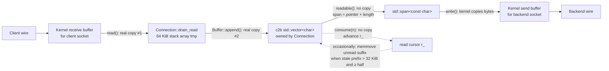

# flowlb: Complete System Architecture and Interview Walkthrough

This document explains the running C++ proxy as one system. It covers what owns what, how one client moves through the process, where every byte goes, why the difficult design choices were made, and where the design stops.

## 1. Elevator pitch

flowlb is a small Linux TCP load balancer. A client opens one TCP connection to flowlb; flowlb chooses a healthy backend, opens a second TCP connection, and copies bytes in both directions. One thread handles every listener, client, backend, health check, signal, and stats request through one `epoll` event loop.

The public port is a Layer 4 byte pipe. “Layer 4” means it makes decisions about TCP connections, not HTTP requests. An HTTP request works through it because the client and backend speak HTTP to each other; flowlb does not inspect the URL. A separate operator port implements a deliberately small HTTP endpoint at `GET /stats`.

## 2. Full system architecture diagram

Two relationships matter in this diagram:

- A solid arrow means ownership or an ordinary function call.
- A dashed arrow into `EventLoop` means that one or more fds are registered for readiness dispatch. The loop stores a non-owning `Handler*`; it does not own or destroy the object.

```mermaid
flowchart TB
    Main["main<br/>chooses config path, ignores SIGPIPE,<br/>loads config, starts Proxy"]
    Proxy["Proxy<br/>composition root; not a Handler"]

    Main -->|"owns unique_ptr"| Proxy

    subgraph Owned["Objects owned by Proxy"]
        Loop["EventLoop<br/>owns epoll fd, signalfd,<br/>fd-to-Handler map, deferred queue"]
        Pool["BackendPool<br/>plain shared state<br/>routing, active counts, health"]
        Stats["Stats<br/>plain shared counters"]
        Config["Config<br/>plain immutable wiring data"]
        PublicListener["Listener<br/>public listen fd + spare fd<br/>Handler"]
        Health["HealthChecker<br/>timerfd + probe slots + closing fds<br/>Handler"]
        StatsServer["StatsServer<br/>stats timerfd + sessions<br/>Handler"]
        ConnMap["unordered_map&lt;id, unique_ptr&lt;Connection&gt;&gt;"]
    end

    Proxy --> Loop
    Proxy --> Pool
    Proxy --> Stats
    Proxy --> Config
    Proxy --> PublicListener
    Proxy --> Health
    Proxy --> StatsServer
    Proxy --> ConnMap

    subgraph StatsOwned["Objects owned inside StatsServer"]
        StatsListener["Listener<br/>stats listen fd + spare fd<br/>Handler"]
        Sessions["unordered_map&lt;fd, Session&gt;<br/>each Session owns one client fd"]
        StatsTimer["stats timerfd<br/>5 second tick"]
    end

    StatsServer --> StatsListener
    StatsServer --> Sessions
    StatsServer --> StatsTimer

    subgraph ConnOwned["Each Connection owns"]
        ClientFd["client socket fd"]
        BackendFd["backend socket fd"]
        C2B["Buffer c2b"]
        B2C["Buffer b2c"]
    end

    ConnMap -->|"owns fixed-address objects"| Connection["Connection instances<br/>one Handler per client/backend pair"]
    Connection --> ClientFd
    Connection --> BackendFd
    Connection --> C2B
    Connection --> B2C

    subgraph HealthOwned["Objects owned inside HealthChecker"]
        HealthTimer["health timerfd"]
        Probes["vector&lt;optional&lt;Probe&gt;&gt;<br/>at most one probe per backend"]
    end

    Health --> HealthTimer
    Health --> Probes

    PublicListener -->|"AcceptFn"| Proxy
    Proxy -->|"pick / acquire / release"| Pool
    Health -->|"record_probe"| Pool
    Proxy -->|"accepted / rejected / closed bytes"| Stats
    StatsServer -->|"RenderFn / TickFn"| Proxy

    Loop -->|"owns"| SignalFd
    PublicListener -.->|"LT: public listen fd → Listener*"| Loop
    StatsListener -.->|"LT: stats listen fd → Listener*"| Loop
    Connection -.->|"ET: client fd and backend fd → same Connection*"| Loop
    Health -.->|"LT timerfd and ET probe fds → HealthChecker*"| Loop
    StatsServer -.->|"LT timerfd and ET session fds → StatsServer*"| Loop
    SignalFd["signalfd<br/>SIGINT / SIGTERM"] -.->|"LT readiness; handled directly,<br/>not through Handler map"| Loop

    classDef plain fill:#eeeeee,stroke:#666666,color:#111111;
    classDef handler fill:#e7f0ff,stroke:#315b96,color:#111111;
    classDef loop fill:#fff1cc,stroke:#8a6500,color:#111111;
    class Pool,Stats,Config,Proxy,ConnMap,C2B,B2C plain;
    class PublicListener,StatsListener,Connection,Health,StatsServer handler;
    class Loop loop;
```



### The component boundaries

**`main`** handles process-level setup. It accepts zero or one config path, ignores `SIGPIPE`, initializes logging, loads and validates config, logs the fd limit, creates `Proxy`, and calls `run()`.

**`Proxy`** is the composition root. It owns the one event loop and all long-lived application objects. It wires components together with callbacks, but it is not a handler and has no fd of its own.

**`EventLoop`** is the generic reactor. A reactor waits for readiness and dispatches callbacks. It knows only that fd `N` maps to some `Handler*`; it does not know whether that object is accepting clients, proxying bytes, checking health, or serving stats.

**`Listener`** owns one listening socket and one spare `/dev/null` fd. The public listener calls `Proxy::on_accept`. The listener inside `StatsServer` calls `StatsServer::on_accept`.

**`Connection`** is the data path. One instance owns one accepted client socket, one newly-created backend socket, and two directional buffers. Both socket fds map to the same handler.

**`BackendPool`** is routing and health state. It has no fd. `Proxy` calls it when connections start and finish; `HealthChecker` reports probe results to it.

**`HealthChecker`** schedules probes with a `timerfd`. It may also own one in-flight non-blocking probe socket per backend.

**`Stats`** holds accepted, rejected, and closed-connection byte counters. It has no fd. `Proxy` combines those counters with live connection byte counts when rendering.

**`StatsServer`** owns the operator listener, a periodic timer, and up to eight HTTP sessions. It knows how to serve a response, but a callback supplied by `Proxy` decides what the JSON body contains.

### What can be in the epoll set

- Public and stats listen sockets: level-triggered.
- Client and backend sockets belonging to `Connection`: edge-triggered.
- Health probe sockets: edge-triggered.
- Stats HTTP session sockets: edge-triggered.
- Health and stats timerfds: level-triggered.
- The signal fd: readiness-based without `EPOLLET`; `EventLoop` handles it directly.

`BackendPool`, `Stats`, `Config`, `Proxy`, and `Buffer` never appear in the fd-to-handler map. They are ordinary objects called synchronously by whichever handler is currently running.

## 3. Full request lifecycle — sequence diagrams

### A. One client connection, start to finish

This is the successful path. If no backend is healthy, `pick()` returns empty, `rejected` is incremented, and the accepted client fd closes when its `Fd` parameter leaves scope. flowlb does not create a `Connection` or queue the client.

```mermaid
sequenceDiagram
    autonumber
    participant Client
    participant Kernel as Linux kernel / accept queue
    participant Loop as EventLoop
    participant Listener
    participant Proxy
    participant Pool as BackendPool
    participant Conn as Connection
    participant Backend
    participant Stats

    Client->>Kernel: Complete TCP handshake to public port
    Kernel-->>Loop: Listen fd is readable
    Loop->>Listener: on_event(listen_fd, EPOLLIN)
    loop Up to 64 accepts this tick
        Listener->>Kernel: accept4(NONBLOCK | CLOEXEC)
        Kernel-->>Listener: Fd client + peer address
        Listener->>Proxy: AcceptFn(move(client), peer)
    end

    Proxy->>Pool: pick()
    Pool-->>Proxy: backend index + resolved sockaddr
    Proxy->>Pool: acquire(index)
    Note over Pool: active++ and total_acquired++
    Proxy->>Stats: on_accepted()
    Proxy->>Conn: construct(client, backend address, id, index, DoneFn)
    Proxy->>Proxy: emplace unique_ptr in conns_[id]

    Conn->>Kernel: socket(AF_INET, TCP, NONBLOCK)
    Conn->>Kernel: connect(backend address)
    alt connect returns EINPROGRESS
        Conn->>Loop: register backend fd ET for EPOLLOUT
        Kernel->>Backend: TCP handshake
        Kernel-->>Loop: backend fd writable/error
        Loop->>Conn: on_event(backend fd)
        Conn->>Kernel: getsockopt(SO_ERROR)
        Kernel-->>Conn: connect success
    else connect completes immediately
        Kernel-->>Conn: connected
    end

    Conn->>Conn: state = Proxying
    Conn->>Loop: register/update client and backend ET interests
    Conn->>Conn: speculative client read
    Note over Conn: Client data may already be readable.<br/>Adding EPOLLIN does not create an ET edge.

    Client->>Kernel: Send bytes
    Kernel-->>Loop: client fd becomes readable
    Loop->>Conn: on_event(client fd, EPOLLIN)
    loop Drain until EAGAIN, EOF, error, or high watermark
        Conn->>Kernel: read(client fd, temp[64 KiB])
        Kernel-->>Conn: bytes copied into temp
        Conn->>Conn: append temp to c2b; bytes_c2b += n
        Conn->>Kernel: write(backend fd, c2b.readable())
        Kernel->>Backend: TCP delivers bytes
        Conn->>Conn: consume bytes successfully written
    end

    Backend->>Kernel: Send response bytes
    Kernel-->>Loop: backend fd becomes readable
    Loop->>Conn: on_event(backend fd, EPOLLIN)
    loop Mirror direction
        Conn->>Kernel: read(backend fd, temp)
        Kernel-->>Conn: bytes copied into temp
        Conn->>Conn: append to b2c; bytes_b2c += n
        Conn->>Kernel: write(client fd, b2c.readable())
        Kernel->>Client: TCP delivers bytes
        Conn->>Conn: consume bytes successfully written
    end

    Client->>Kernel: FIN (client sends no more)
    Kernel-->>Loop: readable / RDHUP
    Loop->>Conn: on_event(client fd)
    Conn->>Kernel: read(client fd) returns 0
    Conn->>Conn: client_read_eof = true<br/>state = HalfClosedClient
    Conn->>Conn: keep flushing c2b
    Conn->>Kernel: shutdown(backend fd, SHUT_WR) after c2b empties
    Note over Conn,Backend: Backend can still send its remaining response.

    Backend->>Kernel: Final response bytes, then FIN
    Kernel-->>Loop: backend readable / RDHUP
    Loop->>Conn: on_event(backend fd)
    Conn->>Conn: drain and flush final b2c bytes
    Conn->>Kernel: read(backend fd) returns 0
    Conn->>Kernel: shutdown(client fd, SHUT_WR) after b2c empties
    Conn->>Conn: both EOF flags true and both buffers empty
    Conn->>Conn: close_now(): state = Closing
    Conn->>Loop: del(client fd), del(backend fd)
    Conn->>Loop: defer DoneFn(id, backend index)

    Note over Loop,Conn: Conn remains alive through the rest of this epoll batch.
    Loop->>Loop: finish dispatching batch; drain_deferred()
    Loop->>Proxy: DoneFn → on_connection_done(id, index)
    Proxy->>Stats: add_closed_bytes(final c2b, final b2c)
    Proxy->>Pool: release(index)
    Note over Pool: active--
    Proxy->>Proxy: conns_.erase(id)
    Proxy-->>Conn: unique_ptr destroys Connection
    Conn->>Kernel: Fd destructors close both sockets
    Proxy->>Proxy: resume_if_paused() for public and stats listeners
```

### The `Connection` state machine

- **`Connecting`**: only the backend socket is registered. Writability means “the connect attempt finished,” not necessarily “it succeeded,” so the code checks `SO_ERROR`.
- **`Proxying`**: both directions may read and write.
- **`HalfClosedClient`**: the client has reached EOF. Client-to-backend input is finished, but backend-to-client traffic may continue.
- **`HalfClosedBackend`**: the mirror case.
- **`Closing`**: both fds are out of epoll and the completion callback has been queued at most once.

The two half-closed enum values record which side ended first. Separate EOF flags hold the full truth. The connection closes only when both flags are set and both userspace buffers are empty.

Byte counters increase when flowlb successfully reads bytes from a source socket. They therefore measure bytes accepted into the proxy, not a cryptographic guarantee that every counted byte reached the destination before a later connection error.

### B. One health-check round for one backend

The health timer fires first after 1 ms, then every `timeout_ms`. A timer tick always expires overdue probes. It starts a new round only when `next_probe_due_` has reached the separately tracked `interval_ms` deadline.

```mermaid
sequenceDiagram
    autonumber
    participant Timer as Health timerfd
    participant Loop as EventLoop
    participant Health as HealthChecker
    participant Kernel
    participant Backend
    participant Pool as BackendPool
    participant Future as Future BackendPool.pick()

    Timer-->>Loop: timerfd readable (LT)
    Loop->>Health: on_event(timerfd, EPOLLIN)
    Health->>Timer: read expiration counter until EAGAIN
    Health->>Health: expire_timeouts(now)
    alt probe round is due and this backend has no probe
        Health->>Health: start_one(index)
        Health->>Kernel: create non-blocking TCP socket
        alt socket creation fails
            Kernel-->>Health: local resource error
            Health->>Health: log; do not blame backend
        else socket created
            Health->>Kernel: connect(backend address)
            alt connect returns EINPROGRESS
                Health->>Loop: add probe fd ET for EPOLLOUT
                Kernel->>Backend: TCP handshake
                Kernel-->>Loop: probe fd writable/error
                Loop->>Health: on_event(probe fd)
                Health->>Kernel: getsockopt(SO_ERROR)
                Kernel-->>Health: final connect status
            else connect returns synchronously
                Kernel-->>Health: final connect status now
            end

            alt final connect status is failure
                Health->>Pool: record_probe(index, false, cfg)
                Health->>Loop: del probe fd if it was registered
                Health->>Health: release fd; defer close if event-dispatched
            else final connect status is success
                alt health type is TCP
                    Health->>Pool: record_probe(index, true, cfg)
                    Note over Health,Backend: A completed TCP handshake is the whole test.
                    Health->>Health: release probe fd
                else health type is HTTP
                    Health->>Health: state = Writing; build HTTP/1.0 GET
                    Health->>Loop: watch probe ET for EPOLLOUT
                    Health->>Kernel: try write immediately; continue until EAGAIN or complete
                    Health->>Health: state = Reading
                    Health->>Loop: watch probe ET for EPOLLIN
                    Health->>Kernel: try read immediately; drain until line/EAGAIN/error
                    Kernel->>Backend: GET configured http_path
                    Backend-->>Kernel: HTTP response
                    Kernel-->>Health: status line, capped at 4096 bytes
                    alt line begins HTTP/1.x and status is 2xx
                        Health->>Pool: record_probe(index, true, cfg)
                    else bad status, I/O error, cap, EOF without valid line, or timeout
                        Health->>Pool: record_probe(index, false, cfg)
                    end
                    Health->>Loop: del(probe fd)
                    Health->>Health: defer actual fd close until after batch
                end
            end
        end
    else round is not due or a probe is already active
        Health->>Health: do not start a duplicate probe
    end

    Pool->>Pool: Update success/failure streak; reset opposite streak
    alt threshold crosses and health changes
        Pool->>Pool: flip healthy; record monotonic transition time
    else threshold not crossed or state already matches
        Pool->>Pool: keep current healthy flag
    end
    Future->>Pool: pick()
    Pool-->>Future: Skip unhealthy backends; include recovered backends
```

All backends start as healthy. That makes startup optimistic: traffic can be sent before the first failing streak marks a backend down. Health transitions affect future picks only. Existing `Connection` objects are not migrated or killed when their backend is marked unhealthy.

One edge case is deliberate in the code: if creating the probe socket itself fails, `HealthChecker` logs the failure but does not record a failed backend probe. That local resource failure does not prove the backend is down.

### C. One `GET /stats` request

```mermaid
sequenceDiagram
    autonumber
    participant Operator
    participant Loop as EventLoop
    participant Listener as Stats Listener
    participant Server as StatsServer
    participant Proxy
    participant Stats
    participant Pool as BackendPool

    Operator->>Listener: TCP connection to stats port
    Listener->>Server: AcceptFn(move(client fd))
    alt already 8 sessions
        Server-->>Operator: Best-effort HTTP 503, then deferred close
    else capacity available
        Server->>Loop: add session fd ET for EPOLLIN
        Server->>Server: drain_read immediately
        Operator->>Server: GET /stats ... headers
        Server->>Server: read until blank line; cap input at 8192 bytes
        Server->>Proxy: RenderFn()
        Proxy->>Proxy: sum bytes from all live Connections
        Proxy->>Stats: snapshot()
        Proxy->>Pool: active, healthy, per-backend counters
        Proxy-->>Server: compact JSON
        Server->>Loop: mod session fd ET for EPOLLOUT
        Server->>Server: flush_write immediately, then on writable events
        Server-->>Operator: HTTP/1.0 200 + JSON + Connection: close
        Server->>Loop: del(session fd)
        Server->>Server: move fd to deferred closing vector; erase Session
    end
```

Any complete request other than `GET /stats` gets 404. An oversized request gets 400. This parser only extracts the first line after waiting for the end of headers. It is intentionally not a general HTTP server.

The stats timer fires every five seconds. It closes old stats sessions, invokes a callback that logs one summary line, and gives paused listeners another chance to resume.

## 4. Data flow: bytes through the system

For client-to-backend traffic, one byte takes this path. Backend-to-client traffic uses the same path in reverse through `b2c_`.



### Where physical copies occur

1. **Kernel receive buffer to `tmp`: copy.** `read_some` wraps `read`. The kernel copies available socket bytes into the 64 KiB stack array.
2. **`tmp` to `Buffer` storage: copy.** `Buffer::append` inserts the bytes into its `std::vector<char>`. Vector growth may also allocate and copy/move existing bytes.
3. **`Buffer::readable`: no copy.** It returns a `std::span<const char>`, which is only a pointer and a length into the vector’s unread suffix.
4. **`write_some`: no extra userspace staging buffer, but a kernel-boundary copy still occurs.** `write` consumes bytes directly from the vector view and the kernel takes them for the destination socket.
5. **`Buffer::consume`: normally no copy.** It advances `r_`. If all bytes were consumed, it clears the logical size. It does not shift the remainder after every short write.
6. **Compaction: occasional userspace copy.** If the consumed prefix is more than 32 KiB and at least half of the vector’s logical contents, `memmove` shifts the unread suffix to index zero. Capacity is retained for reuse.

This is not a zero-copy proxy in the operating-system sense. It does not use `splice`, `sendfile`, or `io_uring` registered buffers. Its “zero-copy view” means only that there is no third userspace copy between `Buffer` and `write`.

The cursor design matters because partial writes are normal. If every successful 2 KiB write erased 2 KiB from the front of a 200 KiB vector, the remaining bytes would be shifted repeatedly. `r_ += n` turns the common consume path into constant-time bookkeeping and pays for compaction only occasionally.

### Backpressure between two separate TCP connections

flowlb terminates one TCP connection and originates another. The client’s TCP flow control does not directly control the backend’s TCP connection, so `Connection` must bridge the two.

- At `c2b_.size() >= 256 KiB`, flowlb stops reading the client.
- At `b2c_.size() >= 256 KiB`, flowlb stops reading the backend.
- It removes `EPOLLIN` from the fast source’s interest mask.
- The source socket’s kernel receive buffer then fills.
- The local TCP stack advertises a smaller receive window to the remote sender.
- The remote sender eventually slows or blocks.
- Once the userspace buffer drains to 64 KiB or less, flowlb resumes reading.

One 64 KiB read can cross the high watermark, so the practical peak of one directional userspace buffer can be above exactly 256 KiB. The design bounds ordinary growth per connection; it does not impose a process-wide memory cap.

## 5. Concurrency model

The production `flowlb` executable has:

- one process;
- one application thread;
- one `EventLoop`;
- one epoll instance;
- one `EventLoop::run()` loop;
- one `epoll_wait()` call active at a time.

`epoll_wait` can return up to 64 ready entries. `EventLoop` dispatches them one by one. No two `on_event` methods run at the same time. A client connection can be waiting while a health probe and a stats session are also alive, so the program is concurrent, but it is not executing those callbacks in parallel.

There is no `std::thread`, thread pool, worker sharding, or `SO_REUSEPORT` in `src/`. CMake links thread support for the old blocking spike and tests; it does not turn the production proxy into a threaded program.

### What this buys

- `BackendPool::active`, health streaks, connection state, buffers, session maps, and stats counters are ordinary fields.
- There are no mutexes around the data path or backend selection.
- Callback ordering is deterministic within one dispatch thread.
- No second health thread can race with `pick()`.
- Per-connection code can use simple state machines instead of cross-thread messages.

The synchronization claim should be precise: the routing and I/O architecture does not need atomics. The source does contain small relaxed atomics for the global logger level/sink and the diagnostic `Fd::live_count`. They are not used to coordinate connection processing.

### What it costs

- One CPU core performs all application work.
- A slow handler delays every other handler. The code caps accepts at 64 per callback and limits speculative I/O passes to reduce starvation, but it has no general scheduler or per-connection byte budget.
- Logger output uses blocking `write`. A blocked stdout or logging pipe can stall the entire proxy.
- Rendering stats walks all live connections and all backends on the event-loop thread.
- CPU-heavy protocol work would not scale in this architecture without sharding or offload.

The kernel, remote peers, and demo backend processes can run in parallel. That does not make flowlb’s own callbacks parallel.

## 6. Design decisions and rationale

### Edge-triggered data sockets; level-triggered listeners, timers, and signal fd

**Decision.** `Connection` sockets, health probe sockets, and stats session sockets use edge-triggered epoll. The two listeners and two timerfds use level-triggered epoll. The signal fd is also registered without `EPOLLET`.

**Problem solved.** ET reduces repeated notifications on the busy data path and matches drain-until-`EAGAIN` loops. LT is a better match for capped listener work: if 100 clients wait and the handler accepts only 64 for fairness, the still-readable listener is reported again. Timer and signal fds remain readable until their records are consumed.

**Alternative.** LT everywhere is simpler but can repeatedly wake for sockets whose data the proxy intentionally stopped reading. ET listeners would require always draining the accept queue or adding a separate re-trigger strategy.

**Cost.** ET is easy to stall if a handler fails to drain or re-enables interest while data is already ready. LT can spin if readable work cannot be consumed; the EMFILE path must explicitly remove `EPOLLIN`.

### `std::expected` for ordinary failures; exceptions at construction boundaries

**Decision.** Runtime operations such as `read`, `write`, `connect`, `accept`, `epoll_ctl`, binding a listener, and opening the stats server return `std::expected`. Constructors that cannot return an error, notably `EventLoop` and `HealthChecker`, throw `std::system_error` if mandatory setup fails.

The JSON parser also throws `ParseError` internally for recursive-descent control flow. `ConfigParser::load` and `parse` catch it and expose an `expected<Config, string>` API. The logger and stats renderer catch their own formatting failures so observability does not take down the proxy.

**Problem solved.** `WouldBlock`, EOF, connection refusal, and invalid config are normal outcomes that callers must branch on. Values make those paths visible in function signatures. Construction failure still cannot leave a half-valid object.

**Alternative.** Throw on every syscall failure, or return raw integers and inspect global `errno` everywhere.

**Cost.** Callers contain explicit branching and error propagation. The policy is not absolute because parser internals and constructor setup still use exceptions.

### RAII `Fd`

**Decision.** Every long-lived raw fd is wrapped in a move-only `Fd`. Destruction closes it. Copying is forbidden; moving transfers the integer and empties the source.

**Problem solved.** There are many early returns: socket creation can succeed before bind fails; connect can fail after a client was accepted; probes and sessions can fail in several states. RAII closes every already-acquired fd during normal return or exception unwinding.

**Alternative.** Pair every successful `open`, `socket`, `accept4`, `epoll_create1`, `signalfd`, and `timerfd_create` with manual cleanup labels.

**Cost.** Ownership must be moved explicitly, and code must distinguish `get()` from `release()`. `close_checked` follows the Linux rule not to retry `close` after `EINTR`, because the fd number may already have been recycled.

### Lazy-cursor `Buffer`

**Decision.** A `std::vector<char>` stores bytes and `r_` marks the first unread byte. `consume` advances the cursor. Compaction occurs only when the consumed prefix is over 32 KiB and at least half the vector.

**Problem solved.** Partial writes should not shift every remaining byte after every syscall.

**Alternative.** Erase from the vector front, use a deque of chunks, or build a ring buffer.

**Cost.** Consumed bytes temporarily retain logical space, and vector capacity remains at its high-water allocation. Occasional `memmove` pauses still occur. A chunk queue or ring could avoid that move but would make contiguous `write` views and indexing more complex.

### High/low watermarks

**Decision.** Pause source reads at 256 KiB and resume only after the destination buffer falls to 64 KiB.

**Problem solved.** A fast source and slow destination must not create an unbounded userspace queue. Two thresholds provide hysteresis: after resuming, there is substantial room before pausing again.

**Alternative.** One threshold causes frequent `EPOLLIN` on/off changes around one boundary. Never pausing risks memory exhaustion. Closing immediately on a full buffer protects memory but punishes temporary slowdowns.

**Cost.** Each connection can hold two sizeable buffers, and aggregate memory still grows with connection count. Pausing also propagates latency back to the sender through TCP flow control.

### The ET re-arm trap and immediate speculative work

**Decision.** When backpressure turns off, `Connection` sets a speculative-read flag for the source and calls `drain_read` from `finish_io` instead of waiting for epoll. It uses the same idea when entering `Proxying`. `HealthChecker` and `StatsServer` immediately attempt the next read or write after changing state and interest.

**Problem solved.** ET reports transitions, not “still ready.” Data can already be in a receive queue when `EPOLLIN` is added again; no new edge is guaranteed. Similarly, a socket can already accept a write immediately after connecting or changing state.

**Alternative.** Use LT sockets or rely on a later unrelated edge.

**Cost.** The control flow is more involved. `Connection::finish_io` uses flags and an eight-pass guard because one speculative drain can unblock the opposite direction and request another pass.

### Deferred destruction and deferred fd close

**Decision.** `Connection::close_now` unregisters fds immediately but defers its `DoneFn`. The callback later erases the owning `unique_ptr`. Health probes and stats sessions similarly unregister now, move their `Fd` into a holding vector, and defer clearing that vector.

**Problem solved.** A handler can finish while its own `on_event` method is on the stack. Worse, the same `epoll_wait` result batch may contain a second event for the same handler. Immediate deletion would leave a dangling `this`; immediate close could recycle the fd number while stale batch entries still exist.

**Alternative.** Reference counting, generation-tagged event data, intrusive lifetime management, or a separate garbage-collection phase.

**Cost.** Resource release is delayed until the end of the batch, and callbacks must capture stable values rather than `this`. The deferred queue must be drained consistently.

### Round robin and least connections

**Decision.** Round robin advances one shared cursor while skipping unhealthy entries. Least connections scans all healthy backends for minimum `active`, but starts at that cursor and moves it past the winner.

**Problem solved.** Round robin gives simple, predictable distribution when backends are similar. Least connections reacts to uneven service time because slow backends keep larger `active` counts. The shared cursor prevents equal-count ties from always selecting index zero.

**Alternative.** Random choice, weighted round robin, latency-aware routing, or always scanning from index zero.

**Cost.** Round robin ignores current load. Least connections is O(number of backends) per accepted connection, has no capacity weights, and is only as correct as the acquire/release invariant. It measures open TCP connections, not requests or CPU load.

### Streak-based backend health

**Decision.** One failed probe resets the success streak; one successful probe resets the failure streak. A configured number of consecutive results is required before changing health.

**Problem solved.** A single lost packet, brief queue spike, or one good result during an outage should not flap a backend in and out of rotation.

**Alternative.** Flip on every result for faster reaction, or use a larger rolling statistical model.

**Cost.** Detection and recovery are intentionally delayed. All backends start healthy, so startup is optimistic until enough failures accumulate.

### Move semantics and stable callback identity

**`Listener` is movable.** Its factory returns by value, so it may change address after its listen fd has been mapped to a `Handler*`. Its move operations transfer fd ownership and call `EventLoop::rebind_handler` for that one listen fd. The moved-from object clears its loop pointer so its destructor does not unregister the transferred fd.

**`Connection` is immovable.** It can have two registered fds and complex in-flight state. `Proxy` puts it behind a `unique_ptr`, so its address stays fixed even when the owning hash map rehashes. There is no need to support relocation.

**`HealthChecker` is immovable.** Its timer and all probe fds map back to the same handler, and it holds references to the loop and pool. `Proxy` constructs it directly inside an `optional`, at its final address.

**`StatsServer` is movable, and has two separate stale-pointer problems.**

1. Its timer and session fds store `StatsServer*` in the event loop. Move operations rebind all of those map entries.
2. Its inner `Listener` stores an accept lambda that must later call the current `StatsServer`. A lambda that captured the original `this` could not be rewritten after a move.

The second problem is solved by `identity_`, a heap-allocated pointer cell:

```text
listener lambda ──captures stable address──> [ pointer cell ] ──contains──> current StatsServer
```

The `unique_ptr<StatsServer*>` owns the cell. Moving the `unique_ptr` does not move the heap allocation, so the lambda’s captured cell address remains valid. The move constructor writes the new `this` into the cell. The lambda dereferences the cell twice and reaches the new object. Destruction writes `nullptr`, so a late callback safely does nothing.

**Alternative.** Heap-allocate `StatsServer` at a fixed address like `Proxy`, forbid moves and change the factory API, or hold a shared state object whose callbacks do not need the outer object.

**Cost.** The identity cell is subtle, every move must update it, and fd handler registrations still need separate rebinding.

### EMFILE and the spare fd

**Decision.** Each `Listener` keeps `/dev/null` open. On `EMFILE` or `ENFILE`, it closes the spare, accepts and drops one queued connection using the freed slot, reopens the spare, removes `EPOLLIN`, and marks itself paused.

**Problem solved.** Without one reserved fd, the process cannot accept even one connection to clear the ready queue. An LT listener with a permanently queued client would wake `epoll_wait` continuously and consume a core while making no progress.

**Alternative.** Reserve no fd and back off with a timer, raise the fd limit only, or stop the process.

**Cost.** One fd per listener is always reserved and one client is deliberately dropped during exhaustion. Resumption depends on later connection/session cleanup or the five-second stats tick.

### Plain shared objects versus handlers

**Decision.** `BackendPool` and `Stats` are plain objects. Components that react to live fd readiness implement `EventLoop::Handler`.

**Problem solved.** Routing, counters, and buffer operations are immediate in-memory work. Pretending they are handlers would require fake fds or asynchronous messages and would obscure ownership.

**Alternative.** An actor/message architecture in which every subsystem has a queue.

**Cost.** Callers are directly coupled to the plain objects’ APIs. This is simple on one thread but would need synchronization or ownership partitioning in a multi-threaded design.

### Startup order, config flow, signals, and shutdown

**Decision.** Config is fully parsed and hostnames are resolved before `Proxy` starts. `Proxy::open` heap-allocates the stable root, binds the public listener, opens the stats server, then constructs health checking. `EventLoop` blocks `SIGINT` and `SIGTERM` and consumes them through `signalfd`. `SIGPIPE` is ignored process-wide.

**Problem solved.** The process does not enter the loop half-configured. A stable `Proxy*` can be captured in every callback. Signals become normal serialized fd events instead of asynchronous handlers interrupting arbitrary code. A write to a closed socket returns `EPIPE` instead of terminating the process.

**Alternative.** Lazy DNS, signal handlers, a movable root object, or partial startup with retry.

**Cost.** A DNS failure prevents startup and addresses do not refresh while running. `Proxy::open` mixes `expected` failures from listeners with constructor exceptions from health setup, so `main` must handle both.

Shutdown is ordered:

1. Stop and destroy `StatsServer`, including its listener, timer, and sessions.
2. Release the backend `active` count for every still-live connection.
3. Clear the connection map, closing client/backend pairs.
4. Destroy `HealthChecker`, its timer, and probes.
5. Destroy the public listener.
6. Let `Proxy` and then `EventLoop` destruct; the loop restores the old signal mask.

This is orderly resource cleanup, not graceful connection draining. Live clients are dropped once the loop stops.

### Fail closed when no backend is healthy

**Decision.** The pool returns `nullopt`; `Proxy` increments `rejected` and closes the accepted client.

**Problem solved.** Waiting clients would form an unbounded queue while an outage is already in progress.

**Alternative.** Queue until a backend recovers, retry another backend after connection failure, or return a protocol-specific error.

**Cost.** The public L4 port cannot explain the failure with an HTTP 503 because it does not know the application protocol. The client observes a closed/reset TCP connection.

## 7. Data structures used, and why each was the right choice

### `std::vector<char>` plus `std::size_t r_`

**Where:** each directional `Buffer` in `Connection`.

**Why:** bytes remain contiguous for one `write` call, append is efficient, and consuming usually advances an index instead of shifting data. It is simpler than a ring buffer for this bounded two-ended use.

### `std::unordered_map<int, EventLoop::Handler*>`

**Where:** `EventLoop::handlers_`.

**Why:** epoll returns an fd; the loop needs fast fd-to-callback lookup. The map is non-owning because `Proxy` and its child objects control lifetimes.

### `std::array<epoll_event, 64>`

**Where:** one stack-local batch in `poll_once`.

**Why:** fixed capacity avoids allocation in each wait cycle and bounds one kernel return batch. The loop still processes all returned entries before deferred cleanup.

### `std::vector<std::function<void()>>`

**Where:** `EventLoop::deferred_`.

**Why:** unrelated components can schedule different cleanup work behind one type-erased interface. Swapping it into a local vector before execution means a deferred function can safely defer more work for the next drain.

### `std::unordered_map<std::uint64_t, std::unique_ptr<Connection>>`

**Where:** `Proxy::conns_`.

**Why:** the monotonically increasing id gives direct completion lookup, while `unique_ptr` keeps immovable handlers at stable addresses even if the hash table rehashes. Erasing one entry expresses destruction clearly.

### `std::vector<Backend>`

**Where:** `BackendPool`.

**Why:** backend count is fixed after config load; contiguous indexed storage makes round-robin, least-connections scans, health slots, and `backend_index` references simple. An index is stable because the vector is never resized after construction.

### `std::vector<std::optional<Probe>>`

**Where:** `HealthChecker`, indexed exactly like the backend vector.

**Why:** backend count is fixed and each backend can have zero or one active probe. Direct indexing avoids a hash lookup and enforces the one-probe-per-backend shape.

### `std::unordered_map<int, Session>`

**Where:** `StatsServer`.

**Why:** stats clients arrive and leave dynamically, and epoll identifies them by fd. A map supports direct event lookup and erase. Unlike probes, there is no fixed config index for a session.

### `std::vector<Fd>` as a closing holding pen

**Where:** `HealthChecker::closing_` and `StatsServer::closing_`.

**Why:** moving an `Fd` here removes active ownership from a probe/session without immediately recycling the kernel fd number. Clearing the vector after the event batch performs the actual closes.

### `std::optional<Listener>`, `std::optional<StatsServer>`, and `std::optional<HealthChecker>`

**Where:** `Proxy`.

**Why:** the root is allocated before fallible two-phase startup. Optionals represent “not opened yet” and permit explicit reverse-order teardown in `run`.

### `std::function` callbacks

**Where:** `Listener::AcceptFn`, `Connection::DoneFn`, `StatsServer::RenderFn`, and `StatsServer::TickFn`.

**Why:** lower layers expose events without depending on `Proxy`. `Listener` does not include routing code; `Connection` does not know its owning map; `StatsServer` does not include `Stats` or `BackendPool`.

**Cost:** type erasure may allocate and hides the exact target from the compiler. Captured lifetimes must be designed carefully.

### `std::unique_ptr<StatsServer*>`

**Where:** `StatsServer::identity_`.

**Why:** it creates a stable heap cell that a buried callback can keep across moves while the pointer stored inside the cell is updated to the current object.

### `std::expected`, `std::optional`, and small enums

**Where:** syscall wrappers, config loading, backend picks, I/O results, connection/probe/session states.

**Why:** they make “success or ordinary failure,” “value may be absent,” and legal state transitions explicit instead of relying on magic integers or null raw pointers.

### `timespec` with `CLOCK_MONOTONIC`

**Where:** health deadlines, transition ages, stats uptime, and stats session age.

**Why:** elapsed time must not jump when the wall clock is corrected. Human log timestamps separately use `CLOCK_REALTIME`.

## 8. Problems solved — the hard parts

### TCP backpressure without unbounded memory

**The problem:** either peer can produce bytes faster than the other TCP connection can send them.

**The fix:** one buffer per direction, partial-write retention, high/low watermarks, removal of source `EPOLLIN`, and reliance on TCP receive-window flow control after the local kernel buffer fills.

### The ET re-arm blind spot

**The problem:** restoring `EPOLLIN` does not create an edge for data that was already readable.

**The fix:** mark the source for a speculative read and drain it immediately from `finish_io`. Try I/O immediately after state changes in health and stats code too.

### Destruction from inside the object’s own callback

**The problem:** completion often happens inside `Connection::on_event`; erasing the owning `unique_ptr` there would delete `this` while its method is still returning.

**The fix:** unregister now, defer a callback containing only copied id/index values, and let `Proxy` erase the object after the entire event batch.

### Stale events and recycled fd numbers

**The problem:** the current epoll result array can still contain another entry for an fd or handler that just finished. Closing immediately also lets Linux reuse that integer.

**The fix:** remove the handler mapping immediately but park health/stats fds in `vector<Fd>` until deferred cleanup.

### Graceful half-close without losing buffered data

**The problem:** EOF from one source does not mean the opposite direction is finished, and unsent bytes may still be queued in userspace.

**The fix:** track EOF independently per source, keep relaying the reverse direction, delay `shutdown(SHUT_WR)` on the destination until that direction’s buffer is empty, and close only after both EOFs and both empty buffers.

### Moving an object referenced by asynchronous callbacks

**The problem:** `StatsServer::open` returns by value after its listener callback and timer registration already refer to the local object.

**The fix:** rebind timer/session `Handler*` entries and make the listener callback capture a stable heap identity cell whose contents are updated on every move.

### File-descriptor exhaustion

**The problem:** `accept` cannot create an fd, while LT readiness keeps reporting the still-queued connection and can cause a CPU spin.

**The fix:** release a spare fd, accept-and-drop one client, restore the spare, pause listener `EPOLLIN`, and resume after cleanup or a periodic retry.

### Fairness under an accept flood

**The problem:** draining an unbounded accept queue in one callback can starve established connections.

**The fix:** accept at most 64 clients per callback and use LT so a non-empty queue is reported again.

### Flapping backend health

**The problem:** one transient probe result can send traffic away from or back to a borderline backend repeatedly.

**The fix:** consecutive success/failure thresholds with the opposite streak reset after each result.

### Least-connections tie bias

**The problem:** a fixed left-to-right minimum scan always picks the first backend when counts are equal.

**The fix:** start the scan at a shared rotating cursor and move it past the selected minimum.

### Non-blocking connect completion

**The problem:** `EINPROGRESS` means the handshake is pending, and later writability can mean either success or failure.

**The fix:** register `EPOLLOUT`, then read `SO_ERROR` before entering `Proxying`.

## 9. What this system does NOT handle

These limits are visible in the production source, not inferred from a generic load-balancer checklist.

- **No multi-threaded or multi-process worker architecture.** There is no production sharding, `SO_REUSEPORT`, or use of more than one application core.
- **No TLS termination.** It has no certificate, TLS handshake, or encryption library. The public TCP pipe can carry already-encrypted TLS bytes unchanged.
- **No request-level routing on the public port.** No host, path, header, cookie, or method affects backend choice. One backend is selected per accepted TCP connection.
- **No HTTP/2 implementation.** HTTP/2 bytes could pass through the public L4 pipe, but flowlb does not understand them. The operator server emits HTTP/1.0 and only parses a minimal first request line.
- **No backend connection pool or reuse across clients.** Every accepted client connection creates a new backend connection. A long-lived client connection keeps its one pairing, but a later client never borrows that backend socket.
- **No retry or mid-connection failover.** If the chosen backend connect or later I/O fails, that client connection closes. `Proxy` does not pick a second backend and does not replay bytes.
- **No application-level connect timeout or idle timeout for proxied connections.** Health probes have configured deadlines and stats sessions expire, but a real `Connection` relies on kernel connect behavior and can otherwise remain idle indefinitely.
- **No graceful shutdown drain.** `SIGINT`/`SIGTERM` stops the loop and drops live connections after releasing their accounting.
- **No dynamic backend reconfiguration or service discovery.** The backend vector is built once. Changing ports, algorithm, or membership requires restart.
- **No DNS refresh.** Hostnames resolve to one IPv4 address during config load.
- **No IPv6 or UDP.** Socket creation and resolution use `AF_INET` and `SOCK_STREAM`.
- **No authentication, authorization, TLS, or network allowlist on `/stats`.** Both listeners bind `0.0.0.0`; anyone who can reach the stats port can read its counters.
- **No general public connection cap, per-IP rate limit, or admission policy.** The stats endpoint has an eight-session cap, but the proxy is bounded mainly by file descriptors and memory.
- **No process-wide buffer budget.** Watermarks bound each direction’s normal growth, not the sum across all connections.
- **No weighted or capacity-aware routing.** The choices are unweighted round robin and unweighted least connections.
- **No persistent counters or health state.** Restart resets stats, active counts, cursor, and health streaks; all backends begin healthy.
- **No zero-copy forwarding.** The implementation uses `read` into a stack array, append into a vector, and `write`.
- **No application success metrics.** Stats report connection counts, bytes read by the proxy, backend probe health, and fd counts. They do not report HTTP status codes or request latency from public traffic because that traffic is opaque.
- **No non-blocking logging pipeline.** Logging writes synchronously to its configured fd and can stall the sole event-loop thread.

## 10. Likely interview questions and strong answers

### 1. Why use one event loop instead of one thread per connection?

Most sockets are waiting most of the time. `epoll` lets one thread sleep until any fd is ready, so a connection costs two fds, state, and buffers rather than a thread stack and scheduler task. It also keeps all mutable routing and connection state on one thread, so the data path needs no locks. The limit is one application core and sensitivity to any blocking or CPU-heavy callback.

### 2. Why are connection sockets edge-triggered but listeners level-triggered?

The data path already drains reads and writes to `EAGAIN`, which is the discipline ET requires and avoids repeated notifications. The listener intentionally stops after 64 accepts for fairness. With ET, stopping early could leave an already-nonempty accept queue without a new edge. LT reports it again. Timerfds and the signal fd also fit LT because they stay readable until their records are consumed.

### 3. What is the easiest ET bug to introduce here?

Re-enabling `EPOLLIN` after backpressure and waiting for another event. The kernel may already have unread data, so no readiness transition occurs and the connection stalls. This code sets a speculative-read flag and immediately drains the source after re-arming.

### 4. How does backpressure work across the proxy?

Each TCP direction has a userspace buffer. At 256 KiB, flowlb removes `EPOLLIN` from the fast source. Its kernel receive buffer fills, then TCP advertises a shrinking receive window and slows the remote sender. Once the userspace buffer drains to 64 KiB, reads resume. Separate thresholds prevent pause/resume flapping.

### 5. Why not close both sockets as soon as one side reaches EOF?

TCP is bidirectional. A client can finish sending a request while still waiting for a backend response. flowlb records source EOF, flushes that direction’s pending bytes, half-closes only the destination write side, and continues relaying the reverse direction. Full close waits for both EOFs and empty buffers.

### 6. Why defer connection destruction if everything is single-threaded?

Single-threaded prevents data races, not re-entrancy or stale events. `close_now` can run inside the object’s own callback, and the same epoll batch may contain another fd for that connection. Deleting immediately would invalidate the current call stack or leave a dangling handler pointer. Deferred completion waits until the batch has unwound.

### 7. How does least-connections avoid always picking backend zero?

It scans from the same rotating cursor used for round-robin. It keeps the first healthy backend with the smallest `active` count in that rotated order, then advances the cursor past the winner. Equal minima therefore rotate. The key invariant is exactly one `acquire` at connection creation and one `release` at teardown.

### 8. What happens when a backend becomes unhealthy?

Probe results update consecutive streaks. Once the failure threshold is reached, `healthy` flips false and future `pick()` calls skip it. Existing connections are left alone; they either finish or fail through normal I/O. After enough consecutive successful probes, it returns to future selection.

### 9. Why use `std::expected` instead of exceptions everywhere?

Outcomes such as `EAGAIN`, EOF, connect refusal, and invalid config are expected branches, so the return type should force the caller to handle them. Constructors such as `EventLoop` cannot return an error and throw if mandatory setup fails. The JSON parser throws internally but `ConfigParser` translates that into an expected error at its public boundary.

### 10. What breaks first under heavy load?

The hard limits are open fds, aggregate per-connection memory, and one core’s callback capacity. The spare-fd path prevents an EMFILE busy loop, and watermarks bound each buffer, but there is no global connection or memory budget. Blocking logger output can also freeze progress. I would add admission limits and metrics first, then shard independent event loops with `SO_REUSEPORT` if one core is measured as the bottleneck.

### 11. How would you scale this beyond one core?

Run N workers, each with its own event loop, listener, connection map, and buffers, using `SO_REUSEPORT` so the kernel distributes accepts. Keep connection state thread-local. Health can be probed per worker or published as small shared atomic flags. Least-connections can remain per worker, which avoids putting a lock on every accept, or use more expensive shared counters if a global minimum is required.

### 12. What would you change before calling this production-ready?

I would add real connection deadlines, graceful draining, global and per-IP admission limits, protected stats access, dynamic discovery/DNS refresh, richer failure metrics, and non-blocking structured logging. Then I would load-test fd, memory, fairness, and tail latency limits. TLS termination and L7 routing would be separate product decisions; they should not be slipped into this L4 state machine accidentally.

---

The shortest accurate mental model is: **`Proxy` owns the world, `EventLoop` decides who runs, handlers react to fd readiness, `BackendPool` decides where new connections go, and `Connection` moves opaque bytes until both TCP directions are finished.**
